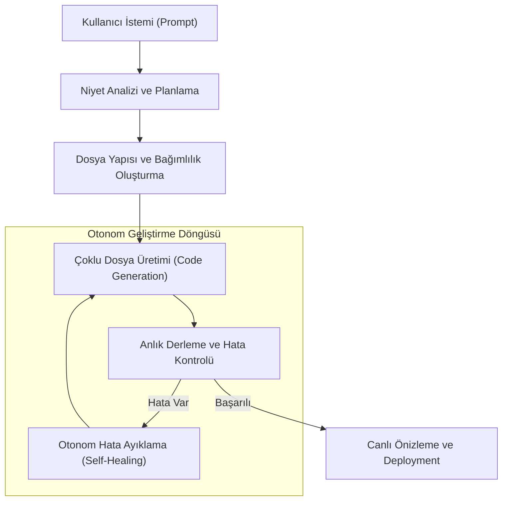

# AI-Generated Software: AppGen ve AI-Native SaaS

Yazılım geliştirme süreci, kod yazmaktan (coding) niyet belirtmeye (intent-based development) doğru evrilmektedir. 2024 sonu ve 2025 başında popülerleşen "AppGen" (Application Generation) platformları, bir prompt ile tam kapsamlı, dağıtıma hazır ve ölçeklenebilir uygulamalar üretme kapasitesine ulaşmıştır. Bu makale; Bolt.new, Lovable, v0.dev ve Replit Agent gibi platformların arkasındaki teknolojiyi ve yazılım dünyasındaki bu yapısal değişimi incelemektedir.

## 1. Kod Yazımından Niyet Belirtmeye Geçiş
Geleneksel yazılım geliştirme, programlama dillerinin sözdizimi (syntax) üzerinde ustalık gerektirir. AI-Native SaaS ve AppGen araçları ise bu bariyeri ortadan kaldırmaktadır.

- **Natural Language to Full-stack:** Kullanıcı "Bana bir abonelik tabanlı spor takip uygulaması yap, Stripe entegrasyonu ve grafiklerle beraber olsun" dediğinde, sistem sadece kod parçacığı değil, tüm bir proje yapısını oluşturur.
- **Context-aware Generation:** Bu araçlar sadece metin üretmez; veri tabanı şemalarını, API uç noktalarını ve UI bileşenlerini birbirleriyle uyumlu bir şekilde tasarlar.

## 2. Popüler AppGen Platformları ve Teknik Altyapıları

### Bolt.new ve WebContainer Teknolojisi
Bolt.new, tarayıcı üzerinde çalışan bir Node.js çalışma ortamı (WebContainer) kullanarak, hiçbir yerel kurulum gerektirmeden tam kapsamlı projeler oluşturur.
- **Instant Preview:** Kod üretildiği anda tarayıcıda canlı olarak önizlenebilir.
- **Multi-file Editing:** Geleneksel LLM'lerin aksine, aynı anda onlarca dosyayı tutarlı bir şekilde güncelleyebilir.

### v0.dev ve UI Odaklı Geliştirme
Vercel tarafından geliştirilen v0, özellikle React ve Tailwind CSS ekosistemine odaklanarak mükemmel UI/UX tasarımları üretir.
- **Copy-Paste Architecture:** Üretilen bileşenler doğrudan mevcut projelere entegre edilebilir.

### Lovable ve Replit Agent
Lovable (eski adıyla GPT Engineer) ve Replit Agent, yazılım geliştirme döngüsünün (SDLC) tamamını yönetir. Hataları ayıklama (debugging), paket yükleme ve canlıya alma (deployment) süreçlerini otonom bir şekilde yürütürler.

## 3. AppGen Yaşam Döngüsü (The AppGen Lifecycle)

Bir AppGen sürecinin teknik aşamaları şu şekildedir:
1. **Prompt Analysis:** Kullanıcının niyeti analiz edilir ve gereksinim dokümanı (SRS) benzeri bir iç yapı oluşturulur.
2. **Scaffolding:** Temel proje yapısı, bağımlılıklar ve yapılandırma dosyaları hazırlanır.
3. **Iterative Generation:** Model, dosya dosya kodu üretir ve her adımda bir "linter" veya "compiler" ile kontrol sağlar.
4. **Instant Build & Run:** Kod, sanal bir ortamda derlenir ve kullanıcıya sunulur.

## 4. Yazılım Mühendisliğinin Geleceği: "The 10x Developer"dan "The AI Architect"e
Bu teknolojiler yazılım mühendislerini işsiz mi bırakacak? Sektördeki genel görüş, mühendislerin rolünün "kod yazmaktan" "sistem mimarlığına ve denetçiliğine" kayacağı yönündedir.

- **Higher Abstraction:** Mühendisler artık `for` döngüleriyle değil, iş mantığı ve kullanıcı deneyimiyle ilgilenmektedir.
- **Rapid Prototyping:** Haftalar süren MVP (Minimum Viable Product) süreci, saatler seviyesine inmiştir.
- **Maintenance (Bakım):** AI-generated kodun bakımı ve güvenliği, geleceğin en kritik mühendislik disiplinlerinden biri olacaktır.

## 5. Riskler ve Zorluklar
- **Hallucination (Halüsinasyon):** AI'nın bazen çalışmayan veya güvensiz kod üretmesi.
- **Vendor Lock-in:** Belirli bir platforma (örneğin Replit veya Bolt) bağımlı kalma riski.
- **Scalability:** Çok büyük ve karmaşık kurumsal sistemlerin (enterprise architectures) hala insan müdahalesine yoğun ihtiyaç duyması.

### Sonuç
AI-Generated Software, yazılımın üretim hızını logaritmik olarak artırmaktadır. Bolt, Lovable ve v0 gibi araçlar, sadece birer yardımcı değil, yazılımın geleceğini şekillendiren temel taşıyıcılardır.

---
**Not:** Bu makale, 2025 yılı başı itibariyle uygulama geliştirme araçlarındaki son trendleri teknik bir dille ele almaktadır.
