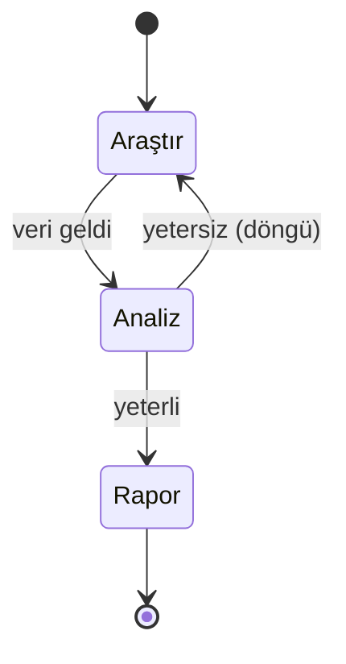

## 📌 Özet

**LangGraph**, LangChain üzerine inşa edilmiş, **durum makinesi (state machine)** tabanlı bir AI agent orkestrasyonu kütüphanesidir. Döngüler, koşullu dallar ve kalıcı durum gerektiren karmaşık iş akışları için tasarlanmıştır.

> Temel fark: LangChain zincirleri doğrusal çalışırken LangGraph yönlü döngüsel grafikler (directed cyclic graphs) kullanır.



---

## 🧠 Detay

### Temel Kavramlar

| Kavram | Açıklama |
|---|---|
| **State** | Düğümler arasında taşınan shared dictionary |
| **Node** | Bir işlemi yapan Python fonksiyonu |
| **Edge** | Düğümler arası geçiş (sabit veya koşullu) |
| **Graph** | Tüm düğümler ve kenarların birleşimi |
| **Checkpoint** | Durumun kalıcılaştırılması (human-in-the-loop için) |

### Basit ReAct Agent

```python
from langgraph.graph import StateGraph, END
from typing import TypedDict, Annotated
import operator

class AgentState(TypedDict):
    messages: Annotated[list, operator.add]
    next: str

def call_llm(state: AgentState):
    # LLM çağrısı
    response = llm.invoke(state["messages"])
    return {"messages": [response]}

def call_tool(state: AgentState):
    last_msg = state["messages"][-1]
    result = tools[last_msg.tool_calls[0]["name"]].invoke(
        last_msg.tool_calls[0]["args"]
    )
    return {"messages": [result]}

def should_continue(state: AgentState):
    last = state["messages"][-1]
    if last.tool_calls:
        return "tool"
    return END

workflow = StateGraph(AgentState)
workflow.add_node("llm", call_llm)
workflow.add_node("tool", call_tool)
workflow.set_entry_point("llm")
workflow.add_conditional_edges("llm", should_continue)
workflow.add_edge("tool", "llm")

app = workflow.compile()
```

### Human-in-the-Loop (Checkpoint)

```python
from langgraph.checkpoint.sqlite import SqliteSaver

memory = SqliteSaver.from_conn_string(":memory:")
app = workflow.compile(checkpointer=memory, interrupt_before=["tool"])

# İlk çalıştırma
config = {"configurable": {"thread_id": "1"}}
result = app.invoke({"messages": [("user", "Haberleri araştır")]}, config)

# İnsan onayı sonrası devam
app.invoke(None, config)  # kaldığı yerden devam eder
```

### LangGraph vs Alternatifler

| Kütüphane | Güçlü Yönü | Zayıf Yönü |
|---|---|---|
| **LangGraph** | Döngü + state + checkpoint | Öğrenme eğrisi |
| **CrewAI** | Kolay multi-agent kurulum | Az esneklik |
| **AutoGen** | Çok-ajan sohbet | Production zorluğu |
| **LlamaIndex Workflows** | RAG entegrasyonu | Yeni/olgun değil |

---

## 💡 Bağlantılar
- [[LLM - Agentic Workflow ve Multi-agent Sistemler]]
- [[LLM - LangChain ve LlamaIndex ile Uygulama Geliştirme]]
- [[MCP - Model Context Protocol ve Tool Use]]
- [[Advanced RAG - GraphRAG ve Knowledge Graphs]]

## ❓ Sorular / Anlamadıklarım

## 🔗 Kaynaklar
- [LangGraph Docs](https://langchain-ai.github.io/langgraph/)
- [LangGraph Tutorials](https://langchain-ai.github.io/langgraph/tutorials/)
