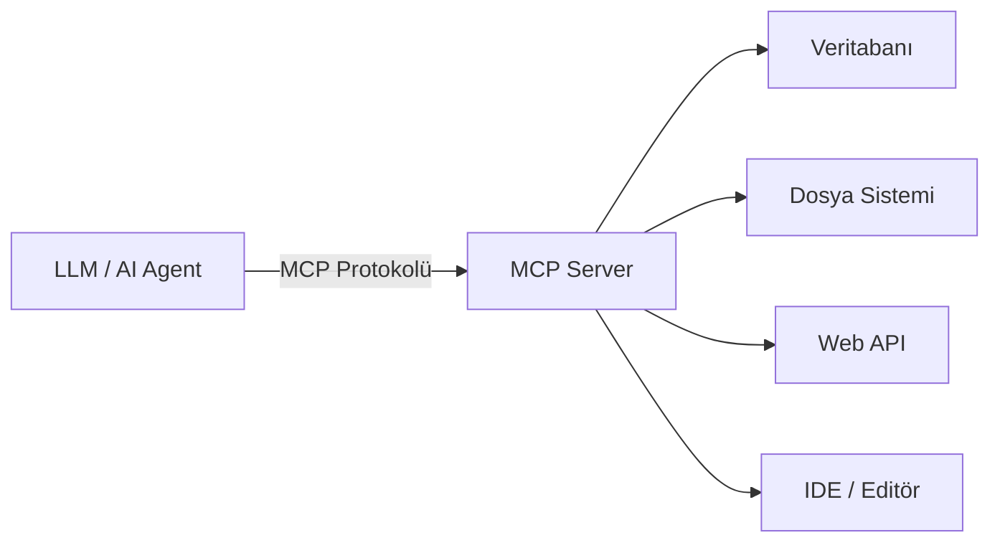

## 📌 Özet

**Model Context Protocol (MCP)**, AI modellerinin harici araçlara, veritabanlarına ve servislere standart bir arayüz üzerinden bağlanmasını sağlayan açık kaynaklı bir protokoldür. 2024 sonunda Anthropic tarafından duyurulan MCP, ajanlar arası entegrasyon için **USB-C standardı** olarak konumlanmaktadır.



---

## 🧠 Detay

### MCP Mimarisi

| Bileşen | Rol |
|---|---|
| **MCP Host** | Claude, GPT-4o gibi LLM uygulaması |
| **MCP Client** | Protokol iletişimini yöneten katman |
| **MCP Server** | Araçları ve kaynakları expose eden servis |

### Temel Kavramlar

**Resources:** Modele sunulan statik ya da dinamik içerik (dosya, DB satırı, API yanıtı)

**Tools:** Modelin çağırabileceği fonksiyonlar (read_file, run_query, send_email)

**Prompts:** Sunucu tarafında tanımlı, yeniden kullanılabilir şablon promptlar

### MCP Server Örneği (Python)

```python
from mcp.server import Server
from mcp.types import Tool, TextContent

app = Server("my-data-server")

@app.list_tools()
async def list_tools():
    return [
        Tool(
            name="query_db",
            description="Veritabanına SQL sorgusu gönderir",
            inputSchema={
                "type": "object",
                "properties": {"query": {"type": "string"}},
                "required": ["query"]
            }
        )
    ]

@app.call_tool()
async def call_tool(name: str, arguments: dict):
    if name == "query_db":
        result = execute_sql(arguments["query"])  # kendi fonksiyonun
        return [TextContent(type="text", text=str(result))]
```

### Neden Önemli?

- **Vendor-agnostic:** Claude, GPT, Gemini — hepsi aynı sunucuya bağlanabilir
- **Güvenlik:** Her araç açıkça beyaz listeye alınır
- **Yeniden kullanım:** Bir MCP server'ı tüm AI araçlarında kullan

### Popüler MCP Server'lar

| Server | Sağladığı Araçlar |
|---|---|
| `mcp-filesystem` | Dosya okuma/yazma |
| `mcp-postgres` | PostgreSQL sorguları |
| `mcp-github` | Issues, PR, repo yönetimi |
| `mcp-brave-search` | Web arama |
| `mcp-slack` | Slack mesajlaşma |

---

## 💡 Bağlantılar
- [[LLM - Agentic Workflow ve Multi-agent Sistemler]]
- [[Autonomous Agents - Hermes, AutoGen ve Özel Agent Yapımı]]
- [[Advanced RAG - GraphRAG ve Knowledge Graphs]]
- [[AI-Driven Coding - IDE ve Terminal Entegrasyonları]]

## ❓ Sorular / Anlamadıklarım

## 🔗 Kaynaklar
- [MCP Resmi Dokümanlar](https://modelcontextprotocol.io)
- [Anthropic MCP Duyurusu](https://www.anthropic.com/news/model-context-protocol)
