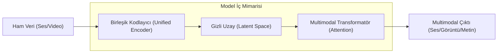

# Real-time Multimodal Agents: Voice, Vision ve Action

Yapay zeka sistemleri, metin tabanlı etkileşimden çıkarak gerçek dünyayı insanlar gibi "gören, duyan ve müdahale eden" multimodal (çok modlu) varlıklara dönüşmektedir. Bu makale, GPT-4o ve Gemini Live gibi yerleşik (native) multimodal modellerin mimarisini ve Anthropic'in "Computer Use" gibi yeni nesil aksiyon yeteneklerini teknik açıdan ele almaktadır.

## 1. Native Multimodality Nedir?
Geleneksel olarak multimodal sistemler, farklı modellerin (bir ses-metin modeli, bir görüntü-metin modeli ve bir ana LLM) birbirine "yama" yapılmasıyla (pipeline approach) oluşturulurdu. Ancak yeni nesil modeller, tek bir sinir ağı üzerinden tüm veri türlerini işleyebilir.

- **Unified Tokenization:** Ses, görüntü ve metin verileri aynı gizli uzayda (latent space) temsil edilen tokenlara dönüştürülür.
- **Low Latency (Düşük Gecikme):** Aracı modellerin (ASR - Automatic Speech Recognition veya TTS - Text-to-Speech) devreden çıkmasıyla, tepki süreleri insan hızına (250-320ms) iner.

## 2. Ses ve Görüntü İşleme: GPT-4o ve Gemini Live
GPT-4o (Omni), ses tonundaki duyguyu, arka plan gürültüsünü ve birden fazla konuşmacıyı aynı anda anlayabilen bir mimariye sahiptir. Gemini Live ise Google'ın ekosistemiyle entegre bir şekilde, gerçek zamanlı video akışı üzerinden çevreyi analiz edebilir.

### Teknik İşleyiş Akışı:
1. **Audio/Video Stream:** Ham veriler modelin encoder katmanına akar.
2. **Unified Encoder:** Görüntü kareleri ve ses dalgaları, modelin anlayabileceği yüksek boyutlu vektörlere çevrilir.
3. **Cross-Modality Attention:** Model, görüntüdeki bir nesne ile o sırada söylenen bir kelime arasındaki ilişkiyi kurar.

## 3. Anthropic Computer Use: AI'nın Bilgisayar Kullanımı
Multimodal ajanların en heyecan verici adımı, sadece analiz etmek değil, "aksiyon" almaktır. Anthropic'in "Computer Use" yeteneği, AI'nın bir bilgisayar ekranını görüp imleci hareket ettirmesine, butonlara tıklamasına ve form doldurmasına olanak tanır.

- **Screen Perception:** Model, ekran görüntüsünü (screenshot) analiz ederek UI elemanlarının koordinatlarını belirler.
- **Action Tokens:** Model, "tıkla", "yaz", "kaydır" gibi komutları işletim sistemine ileten özel tokenlar üretir.
- **Human-in-the-loop:** Bu sistemler, kritik işlemlerde insan onayına ihtiyaç duyan güvenlik katmanlarıyla korunur.

## 4. Gerçek Zamanlı İletişimin Mimari Gereksinimleri
Gerçek zamanlı multimodal sistemler için altyapı zorlukları:
- **Bandwidth (Bant Genişliği):** Yüksek çözünürlüklü video akışının model tarafından işlenmesi devasa veri transferi gerektirir.
- **Compute (Hesaplama):** Saniyede 30 kare video ve 44.1kHz ses verisinin aynı anda işlenmesi, optimize edilmiş GPU kümeleri ve özel NPU (Neural Processing Unit) birimleri gerektirir.
- **Privacy (Gizlilik):** Ses ve görüntü verilerinin uçtan uca şifrelenmesi ve yerel (local) işleme kapasitelerinin artırılması kritik öneme sahiptir.

## 5. Uygulama Alanları
- **Eğitim:** Bir öğrencinin matematik ödevini kameradan izleyip, ona sesli olarak rehberlik eden özel öğretmenler.
- **Müşteri Hizmetleri:** Kullanıcının ekranındaki sorunu görüp anında müdahale eden teknik destek ajanları.
- **Erişilebilirlik:** Görme engelli bireyler için dünyayı betimleyen ve karmaşık dijital arayüzleri onlar adına kullanan yardımcılar.

### Sonuç
Multimodal ajanlar, AI'yı sadece bir "metin kutusu" olmaktan çıkarıp, fiziksel ve dijital dünyada aktif birer partner haline getirmiştir. Gelecek, bu modellerin daha az enerjiyle daha fazla "aksiyon" alabildiği bir noktaya evrilecektir.

---
**Not:** Bu dosya, AI teknolojilerinin 2024 sonu itibariyle ulaştığı multimodal yetenekleri teknik bir perspektifle özetlemektedir.
