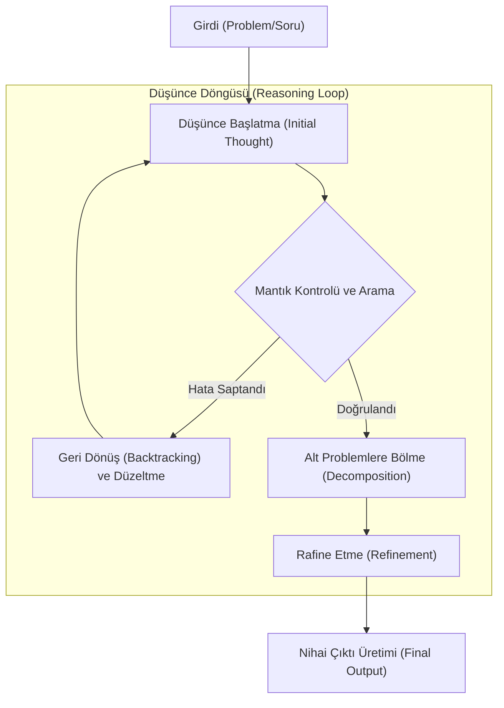

# Reasoning Models: o1, o3 ve DeepSeek-R1 Mimarisi

Yapay zeka dünyasında 2024 ve 2025 yıllarının en büyük kırılma noktası, modellerin sadece bir sonraki kelimeyi tahmin etmesinden (next-token prediction), bir problem üzerinde aktif olarak "düşünmeye" (reasoning) geçiş yapmasıdır. Bu makale, OpenAI'ın o1/o3 serisi ve DeepSeek-R1 gibi modellerin temelindeki teknik mimariyi, Reinforcement Learning (RL) süreçlerini ve "Düşünce Zinciri" (Chain of Thought - CoT) mekanizmalarını incelemektedir.

## 1. Düşünsel Modellerin Temeli: System 1 vs. System 2
Daniel Kahneman'ın "Thinking, Fast and Slow" teorisine paralel olarak, geleneksel LLM'ler (GPT-4, Claude 3.5 Sonnet) genellikle "System 1" yani hızlı, sezgisel ve tepkisel çalışırlar. Reasoning modelleri ise "System 2" yani yavaş, planlı ve mantıksal bir süreç yürütürler. 

Reasoning modelleri, bir çıktı üretmeden önce kendi içlerinde bir "gizli düşünce alanı" (hidden thought space) oluşturur. Bu süreçte model, problemi alt parçalara böler, olası çözüm yollarını simüle eder ve hatalarını kendi kendine düzelterek nihai cevaba ulaşır.

## 2. Teknik Mimari ve Eğitim Metodolojisi

### Reinforcement Learning (RL) ve Büyük Ölçekli Eğitim
Reasoning modellerinin başarısı, denetimli öğrenmeden (Supervised Fine-Tuning) ziyade, büyük ölçekli Reinforcement Learning (Pekiştirmeli Öğrenme) süreçlerine dayanır. DeepSeek-R1 örneğinde görüldüğü gibi, "Cold Start" verisiyle başlayan süreç, modelin binlerce "akıl yürütme adımı" (thinking tokens) üretmesi ve bu adımların doğruluğuna göre ödüllendirilmesiyle devam eder.

- **Process-based Reward Models (PRM):** Modeller sadece sonuca göre değil, her bir düşünce adımı için ayrı ayrı puanlanır. Bu, modelin doğru sonuca yanlış bir mantıkla ulaşmasını engeller.
- **Outcome-based Reward Models (ORM):** Özellikle matematik ve kodlama gibi objektif alanlarda, modelin ulaştığı sonucun doğruluğu üzerinden optimize edilmesidir.

### Internalized Chain of Thought (CoT)
Geleneksel CoT yönteminde kullanıcı modele "adım adım düşün" der. o1 ve R1 gibi modellerde ise bu süreç modelin mimarisine gömülüdür. Model, kullanıcıya göstermediği binlerce ara token üreterek problemleri analiz eder. Bu "düşünce tokenları", modelin çıkarım (inference) maliyetini artırsa da, karmaşık mantık hatalarını %80'e varan oranlarda azaltır.

## 3. Arama Tabanlı Akıl Yürütme (Search-based Reasoning)
Bu modeller sadece lineer bir şekilde düşünmez. Bir satranç motoru gibi, farklı olasılık ağaçlarını (Monte Carlo Tree Search - MCTS benzeri yapılar) keşfederler. Eğer bir düşünce yolu çıkmaza girerse (backtracking), model o yoldan vazgeçip yeni bir mantık silsilesi başlatır.

## 4. o1 vs. DeepSeek-R1: Temel Farklar
OpenAI o1, kapalı kaynaklı ve devasa bir hesaplama gücüyle eğitilmiş bir modelken; DeepSeek-R1, açık kaynaklı topluluğa "saf RL" (pure RL) yoluyla reasoning yeteneğinin nasıl kazandırılabileceğini kanıtlamıştır. R1, özellikle "Aha Moment" olarak adlandırılan, modelin kendi hatasını fark edip "Dur bir saniye, burada bir hata yaptım" dediği anlarla meşhurdur.

## 5. Gelecek: o3 ve Sınırsız Çıkarım Zamanı
OpenAI o3 ile birlikte, "Inference-time scaling" kavramı yeni bir boyuta taşınmaktadır. Bir modele ne kadar çok düşünme süresi verilirse, karmaşık bilimsel problemleri çözme yeteneği o kadar artar. Bu, donanım gereksinimlerini "eğitimden" (training) "çıkarıma" (inference) kaydırmaktadır.

### Sonuç
Reasoning modelleri, yapay zekayı bir sohbet aracından gerçek bir "problem çözücüye" dönüştürmüştür. Matematiksel ispatlar, karmaşık yazılım mimarileri ve stratejik planlama gibi alanlarda bu modeller, insan uzmanlığının sınırlarını zorlamaktadır.

---
**Not:** Bu dosya teknik analiz amaçlı oluşturulmuştur. Reasoning modellerinin kullanımı, standart modellerden daha yüksek gecikme (latency) ve maliyet gerektirir.
