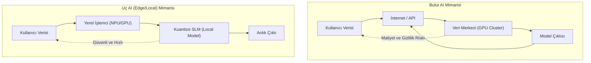

# SLM ve Local AI: Edge Intelligence ve Ollama

Yapay zeka dünyası sadece devasa veri merkezlerinde (cloud) çalışan trilyon parametreli modellerden ibaret değildir. "Küçük Dil Modelleri" (Small Language Models - SLM) ve yerel (local) çıkarım teknolojileri, veri gizliliği, maliyet ve hız avantajlarıyla endüstride yeni bir standart belirlemektedir. Bu makale, Phi-4 ve Llama 3.2 gibi modellerin mimarisini ve Ollama gibi araçların sunduğu yerel ekosistemi incelemektedir.

## 1. SLM Nedir? Parametre Verimliliği ve Bilgi Yoğunluğu
SLM'ler, genellikle 1 milyar ile 15 milyar arasında parametreye sahip olan, mobil cihazlarda veya standart dizüstü bilgisayarlarda çalışabilen modellerdir. Microsoft'un Phi serisi ve Meta'nın Llama 3.2 (1B/3B) modelleri, bu kategorinin öncüleridir.

- **Knowledge Distillation:** Büyük modellerin (teacher) sahip olduğu bilgilerin, daha küçük ve çevik modellere (student) aktarılması sürecidir.
- **High-Quality Training Data:** SLM'lerin başarısı, veri miktarından ziyade verinin kalitesine (sentetik veriler ve yüksek yoğunluklu ders kitapları gibi) dayanır.

## 2. Neden Yerel AI (Local AI)?
Bulut tabanlı modellerin (GPT-4, Claude 3.5) aksine, yerel AI şu avantajları sunar:
- **Privacy (Gizlilik):** Hassas veriler cihazdan asla dışarı çıkmaz. Bu, hukuk, tıp ve savunma sanayii için kritiktir.
- **Cost (Maliyet):** API ücretleri ortadan kalkar. Tek seferlik donanım maliyeti ile sınırsız çıkarım yapılabilir.
- **Latency (Gecikme):** İnternet bağlantısına ihtiyaç duyulmaz; tepki süreleri milisaniye mertebesine iner.

## 3. Donanım Optimizasyonu ve Quantization (Kuantizasyon)
Modellerin yerel cihazlarda çalışabilmesi için "Kuantizasyon" adı verilen bir teknik kullanılır. Bu işlem, modelin ağırlıklarını (weights) 16-bit veya 32-bit hassasiyetinden 4-bit veya 8-bit seviyesine indirger.

- **GGUF Formatı:** CPU ve GPU arasında verimli veri transferi sağlayan, yerel çıkarım için optimize edilmiş bir dosya formatıdır.
- **VRAM Yönetimi:** Modelin bellek kullanımı, parametre sayısı ve bit hassasiyetiyle doğrudan ilişkilidir. Örneğin, 8B parametreli bir model 4-bit kuantizasyon ile yaklaşık 5-6 GB VRAM ile çalışabilir.

## 4. Ollama ve Yerel Ekosistem Araçları
Ollama, Docker benzeri bir yapıyla AI modellerini yerel bilgisayarda çalıştırmayı son derece kolaylaştırır. 

- **Ollama:** Tek bir komutla (`ollama run llama3.2`) model indirme, yapılandırma ve sunma işlemlerini halleder.
- **LM Studio:** Görsel bir arayüz sunarak modellerin test edilmesine ve yerel bir API sunucusu olarak kullanılmasına imkan tanır.
- **Open WebUI:** ChatGPT benzeri bir arayüzü yerel modellerle kullanmanızı sağlayan açık kaynaklı bir projedir.

## 5. Gelecek: NPU (Neural Processing Unit) Devrimi
Intel, AMD ve Apple gibi donanım üreticileri, işlemcilerine özel "AI birimleri" (NPU) ekleyerek yerel AI kapasitesini artırmaktadır. Bu, AI modellerinin sadece bir "uygulama" değil, işletim sisteminin ayrılmaz bir parçası (örneğin Windows Recall veya Apple Intelligence) haline gelmesini sağlayacaktır.

### Sonuç
Küçük Dil Modelleri, yapay zekayı demokratikleştirerek her cihazı akıllı bir asistana dönüştürmektedir. Ollama ve benzeri araçlar sayesinde, AI artık sadece dev teknoloji şirketlerinin tekelinde değil, her geliştiricinin ve kurumun kendi güvenli ortamında çalıştırabileceği bir araçtır.

---
**Not:** Bu dosya, yerel AI teknolojilerinin teknik temellerini ve mevcut araçları özetlemektedir.
