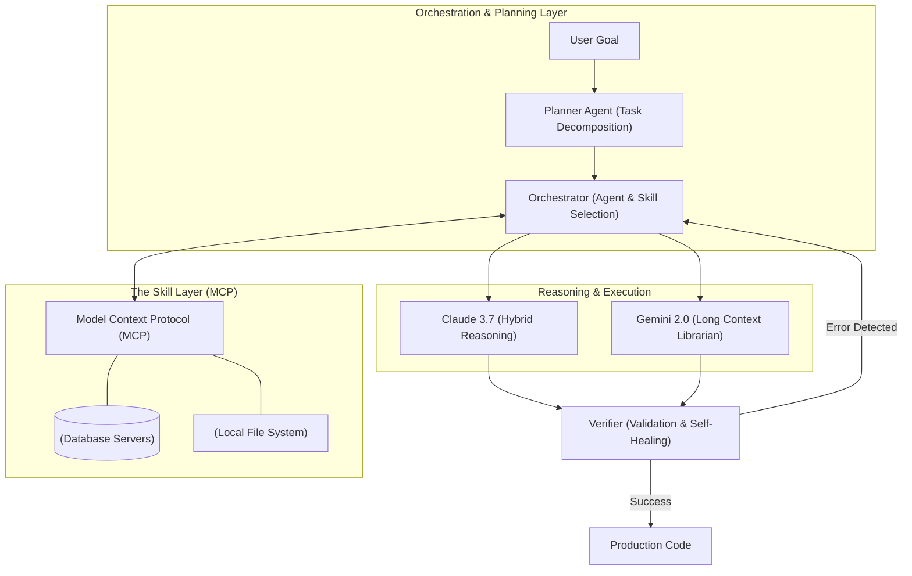

# 📌 00 - AI-Augmented Engineering (Ana Rehber)

## 🧠 Giriş: Statik Prompting'den Otonom Sistemlere Geçiş
Yapay zeka destekli mühendislik (AI-Augmented Engineering), basit kod tamamlama veya metin üretiminin çok ötesine geçerek tüm yazılım geliştirme yaşam döngüsünü (SDLC) baştan aşağı yeniden tanımlayan bir paradigmadır. Geleceğin yazılım mimarisi, statik ve tek seferlik prompt'lardan ziyade; bağlamın farkında olan, kendi hatalarını düzeltebilen ve karmaşık görevleri alt görevlere bölerek otonom şekilde çözebilen "Agentic" (Ajan tabanlı) sistemlere evrilmiştir. Claude 3.7 Sonnet (Thinking Mode), Gemini 2.0 Pro (Long Context) ve geleceğin Claude 4.x vizyonu, bu evrimin lokomotifleridir.

## ⚙️ Orchestration Layer (Orkestrasyon Katmanı) Mimarisini Anlamak
Modern AI-Augmented Engineering'in kalbi, çoklu LLM ajanlarının birbiriyle iletişim kurduğu orkestrasyon katmanıdır. Bu katman, görev dağılımı, bağlam yönetimi, hata ayıklama (debugging) ve sistem entegrasyonu (MCP - Model Context Protocol aracılığıyla) gibi karmaşık süreçleri yönetir. LangGraph, CrewAI veya AutoGen gibi framework'ler bu katmanın inşasında kritik rol oynar.

### Otonom Sistemlerin Temel Bileşenleri:
1.  **Router/Orchestrator Agent:** Gelen kullanıcı isteklerini analiz edip ilgili alt-ajanlara yönlendiren ana karar mekanizması.
2.  **Specialist Agents (Uzman Ajanlar):** Veritabanı sorgulama, API entegrasyonu veya Frontend geliştirme gibi spesifik görevlerde uzmanlaşmış ajanlar.
3.  **Memory & Context Sync:** Ajanlar arası bilgi aktarımını ve sistemin geçmişi hatırlamasını sağlayan kısa/uzun vadeli hafıza birimi (Vector DB'ler, Redis veya doğrudan Long Context pencereleri).
4.  **Tools & Skills (MCP):** Ajanların dış dünyayla (dosya sistemi, veritabanları, GitHub) etkileşime girmesini sağlayan yetenek arayüzleri.

## 📊 Otonom Orkestrasyon Mimarisi (Mermaid)

## 💡 İleri Düzey Senaryolar ve Best Practice'ler
-   **İnsan Döngüde (Human-in-the-Loop):** Otonom sistemlerin belirli kritik noktalarda (örneğin production deploy öncesi) insan onayına başvurması sağlanmalıdır.
-   **Model Çeşitliliği (Model Ensembles):** Düşünme gerektiren karmaşık algoritmik problemler için Claude 3.7 Sonnet'in "Thinking" modu kullanılırken, devasa bir monorepo'nun analiz edilmesi gereken durumlarda Gemini 2.0 Pro'nun 2 Milyonluk token penceresi devreye sokulmalıdır.
-   **Hata Kurtarma (Error Recovery):** Ajanlar, Terminal MCP üzerinden aldıkları derleme veya linting hatalarını kendi içlerinde "Self-Correction" döngülerine sokarak çözmeli, insan müdahalesine gerek kalmadan iterasyon yapabilmelidir.

Bu ana rehber, ekosistemdeki diğer ileri seviye notların (Artifacts, MCP, Autonomous Agents, Advanced Prompting vb.) merkezi sinir sistemini oluşturmaktadır. Tüm diğer modüller bu temel orkestrasyon mantığı üzerine inşa edilmiştir. 🔗
