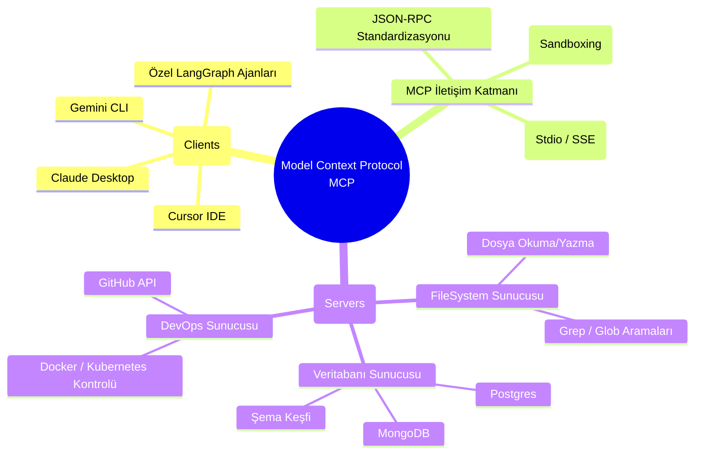

# 🔗 AI Skills - Genişletilmiş Yetenek Yönetimi (MCP & Ötesi)

## 🧠 Model Context Protocol (MCP) Nedir?
Model Context Protocol (MCP), Yapay Zeka modellerinin dış dünya ile güvenli ve standartlaştırılmış bir şekilde iletişim kurmasını sağlayan açık kaynaklı bir protokoldür. Geçmişte, modellerin bir API'ye bağlanması için sisteme özel (ad-hoc) kodlar yazılırken, MCP sayesinde modeller dinamik bir "Yetenek (Skill) Pazarı"na doğrudan bağlanabilir.

MCP, istemci (LLM/Agent) ile sunucu (Tools/Resources) arasında bir köprü görevi görür. Bu köprü sayesinde model; kendi lokal dosya sisteminizi okuyabilir, PostgreSQL veritabanınıza SQL sorgusu atabilir veya GitHub repolarınızda Issue açabilir. AI-Augmented Engineering vizyonunda ajanların eli, kolu ve gözü MCP'dir.

## ⚙️ Skill Servers: Mimarinin Yapı Taşları
AI ajanlarına yeni yetenekler kazandırmak, "Skill Server" adı verilen mikroservisler kurmakla mümkündür.

1.  **FileSystem MCP:** Ajanların lokal veya uzak dosya sistemlerinde okuma, yazma, arama (grep) işlemlerini güvenli bir sandboxing (korumalı alan) içinde yapmasını sağlar. Ajan, repodaki dosyaları analiz edip değiştirebilir.
2.  **Postgres/Database MCP:** Veritabanı şemasını (schema) dinamik olarak okuma ve doğal dili (Natural Language) SQL'e çevirip güvenli sorgular (Read-only kısıtlamalarıyla) çalıştırma yeteneği sunar. Veritabanı optimizasyonu ve veri çekme işlemleri otonom hale gelir.
3.  **GitHub/GitLab MCP:** Otonom kod incelemeleri (Code Review), PR oluşturma, branch yönetimi ve issue takibi süreçlerini ajanların kontrolüne verir. Ajanlar açılan hataları (issue) okuyup doğrudan koda müdahale edebilir.

## 🔍 Dinamik Araç Keşfi (Dynamic Tool Discovery)
Gelişmiş AI orkestrasyonunda ajanlara "İşte kullanabileceğin tüm araçlar" demek yerine, ajan "Şu an x sorununu çözüyorum, sistemde bana uygun hangi yetenekler (tools) var?" diyerek Dinamik Keşif yapar. MCP sunucuları, yeteneklerinin şemalarını JSON-RPC üzerinden modele sunarak modelin duruma uygun aracı kendisinin seçmesini sağlar. Bu self-discovery (kendi kendine keşif) yeteneği sistemin esnekliğini maksimize eder.

## 📊 MCP Mimarisi ve Dinamik Yetenek Akışı (Mermaid)

## 💡 Pratik Senaryo: Otonom Veritabanı Optimizasyonu
1.  **Görev:** "Sistemdeki yavaş çalışan SQL sorgularını bul ve indeksleme önerisi getir."
2.  **Adım 1:** Ajan, **Postgres MCP** üzerinden yavaş sorguları tespit eder (`pg_stat_statements`).
3.  **Adım 2:** İlgili tabloların şemalarını inceler.
4.  **Adım 3:** **FileSystem MCP** kullanarak projedeki ilgili ORM (ör: Prisma veya Hibernate) dosyalarını okur.
5.  **Adım 4:** Eksik indeksleri kod bazında ekler ve **GitHub MCP** ile bir Pull Request oluşturur.

Bu yapı, AI sistemlerini "Cevap Veren" bir sohbet robotundan "İş Yapan" ve uçtan uca problemleri çözen otonom bir mühendise dönüştüren en kritik adımdır. 📌
