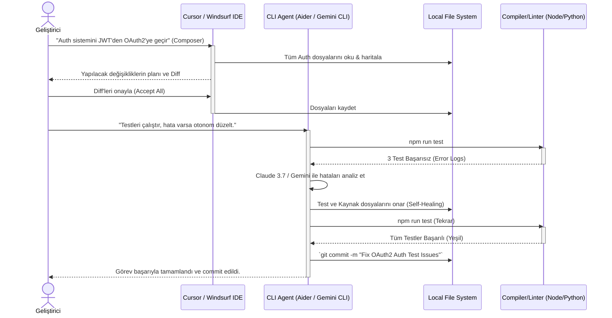

# 💻 AI-Driven Coding - IDE ve Terminal Entegrasyonları

## 🧠 Geliştirici Ortamının (DevEnv) Yeniden Keşfi
AI-Augmented Engineering'in pratikteki uygulama alanı, geliştiricilerin günlük yaşam alanı olan IDE'ler (Entegre Geliştirme Ortamları) ve Terminal/CLI entegrasyonlarıdır. AI destekli kodlama, klasik "Copilot" tarzı satır içi (inline) kod tamamlamalarından, doğrudan proje genelinde değişiklik yapabilen "Agentic IDE" yapısına (Cursor, Windsurf vb.) evrilmiştir. Bu entegrasyonlar, LLM'lerin (Large Language Models) yapay zekasını geliştiricinin yerel makine gücüyle (Dosya Sistemi, Linter, Compiler) birleştirir.

## 🛠️ Yeni Nesil IDE'ler: Cursor ve Windsurf
Geleneksel VS Code üzerine eklenti (extension) kurma mantığı yerini, çekirdeğinde AI barındıran ("AI-Native") IDE fork'larına bırakmıştır.

1.  **Cursor IDE:** VS Code fork'u olan Cursor, şu anki en popüler AI IDE'sidir. En büyük gücü "Composer" ve "Cmd+K" mimarisidir. Composer aracı, çoklu dosyaları (multi-file edit) aynı anda düzenleme, projenin bağlamını anlama ve doğrudan terminal komutlarını izleyerek (örneğin Linter hatalarını otomatik okuyup düzeltme) kendi kendine tamir (self-healing) yeteneklerine sahiptir.
2.  **Windsurf:** Codeium tarafından geliştirilen bu IDE, "Flow" (Akış) kavramına odaklanır. Geliştiricinin niyetini (intent) arka planda analiz eder, sadece yazılan kodu değil, kullanıcının fare hareketlerini, dosya geçişlerini ve imleç (cursor) pozisyonunu da bağlama katarak daha derin ve kesintisiz bir "eşli programlama" (pair programming) deneyimi sunar.

Bu IDE'ler, arka planda Claude 3.7 Sonnet veya GPT-4o gibi güçlü modelleri kullanarak, proje genelindeki bağımlılıkları (Dependencies) mükemmel şekilde yönetirler.

## ⚙️ Terminal ve Komut Satırı Ajanları (CLI) Entegrasyonu
IDE'ler mükemmel bir görsel deneyim ve mikro-müdahaleler sunsa da, gerçek "Otonom İş Akışı" CLI tabanlı ajanlarla sağlanır. Aider, Gemini CLI ve OpenHands gibi araçlar, doğrudan kabuk (shell) ortamında çalışır.

-   **Özellikleri:** Git entegrasyonu (Değişiklikleri otomatik diff'leme ve commit'leme), test suite'lerini çalıştırma (örn: `pytest`, `npm run test`) ve "Test Driven Development" (TDD) döngüsünü otonom yönetme. Ajan terminalde kodu yazar, testleri koşturur, hata çıkarsa konsol logunu okur, kodu düzeltir ve testler yeşile dönene kadar (pass) bu döngüyü ısrarla sürdürür.

## 📊 IDE ve CLI Entegrasyon Akışı (Mermaid)

## 💡 Kurumsal Çözümler İçin Best Practices
-   **Kural Dosyaları (Rule Files):** IDE ve CLI ajanlarını projenin kodlama standartlarına (Naming conventions, mimari kalıplar) uymaya zorlamak için proje kök dizininde muhakkak detaylı `.cursorrules`, `GEMINI.md` veya `.windsurfrules` dosyaları barındırılmalıdır.
-   **Context Limitasyonları:** İster IDE ister CLI kullanılsın, modeli gereksiz verilerle boğmamak (ve maliyeti kontrol altında tutmak) adına gereksiz klasörler (`node_modules`, `build`, `dist`) daima ignore edilmelidir.
-   **Hibrit Çalışma Model:** Tasarım, UI revizyonları ve anlık mimari kurgular IDE'ler üzerinden; veri tabanı migrasyonları, büyük refactoring'ler ve otonom test onarımları ise CLI ajanları üzerinden koordine edildiğinde maksimum mühendislik verimine ulaşılır. 🔗
