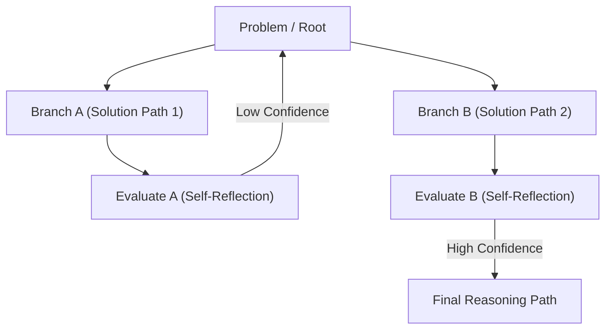

# 🧠 Advanced Prompting - CoT, ToT ve Medprompt

## 🎯 İleri Düzey İstem Mühendisliğine (Prompt Engineering) Giriş
AI-Augmented Engineering süreçlerinde, modellere (özellikle uzun bağlamlı veya doğrudan düşünme (Thinking) yeteneği olmayan modellere) doğru yönlendirmeler yapmak, halüsinasyonu (uydurmayı) önlemek ve algoritmik doğruluğu maksimuma çıkarmak için ileri düzey prompt teknikleri (Advanced Prompting) kullanılır. Statik "Bana bu kodu yaz" komutlarından, modelin adım adım çıkarım yapmasını zorlayan, kendi kendini düzelten (Self-Correction) karmaşık mantıksal yapılara geçiş şarttır.

## ⛓️ Chain-of-Thought (CoT) - Düşünce Zinciri
Chain-of-Thought (CoT), modelden nihai cevabı vermeden veya kodu yazmadan önce izlediği mantıksal adımları ("Düşünme" sürecini) açıkça metne dökmesini isteme tekniğidir. Bu, modelin "sıfır-noktası" (zero-shot) hatalarını dramatik şekilde azaltır çünkü model her kelimede bir önceki düşüncesine dayanarak ilerler. Claude 3.7 Sonnet gibi modellerde bu özellik yerleşik gelse de, standart promptlarda `Önce bir <thought_process> bloğu oluştur ve adım adım düşün, ardından kodu <final_code> bloğuna yaz.` şeklinde manuel olarak tetiklenebilir.

## 🌳 Tree-of-Thought (ToT) - Düşünce Ağacı
Tree-of-Thought, CoT'nin bir üst seviyesidir. Çizgisel (doğrusal) bir düşünce yerine, modelden problemi çözerken **farklı yollar (dallar) keşfetmesini**, bu yolları kendi içinde değerlendirmesini ve en optimal yolu seçmesini isteriz. Özellikle sistem mimarisi tasarımı, kompleks refactoring görevleri veya performans optimizasyonlarında mükemmel sonuç verir.

**ToT İstem Örneği:**
1. Problemi çözmek için birbirinden farklı 3 mimari yaklaşım (A, B, C) öner.
2. Her bir yaklaşımın avantajlarını, dezavantajlarını ve Big O (Zaman/Alan Karmaşıklığı) analizini yap.
3. Bellek kullanımı ve hız açısından en uygun olanı seç, nedenini açıkla ve sadece seçtiğin o yolu kodla.

## 🏥 Medprompt Teknigi ve İleri RAG Kombinasyonları
Orijinal olarak tıp alanındaki LLM değerlendirmeleri için Microsoft tarafından geliştirilen **Medprompt**, birkaç tekniğin ustaca harmanlanmasıdır: Dinamik Örnek Seçimi (Dynamic Few-Shot Selection), Zincirleme Akıl Yürütme (CoT) ve Seçenek Karıştırma (Choice Shuffling). Yazılım mühendisliğinde bu teknik şu şekilde evrilir: Modele şirket standartlarına uygun spesifik, doğrulanmış kod örneklerini (Few-Shot), hatasız düşünce zincirleriyle (CoT) birlikte RAG veya Long-Context üzerinden besleyerek, modelin sadece kodu değil, "Şirketin Kod Yazma Tarzını" da benimsemesini sağlamaktır.

## 📊 Reasoning Pattern'leri (Mermaid Mimarisi)

## 💡 Hangi Teknik Ne Zaman Kullanılmalı?
-   **Standart Prompting (Zero/Few-Shot):** Basit API dokümantasyonu çevirileri, küçük regex yazımları, boilerplate (şablon) kod üretimi.
-   **Chain-of-Thought (CoT):** Bug fixing (hata ayıklama), karmaşık SQL sorgu optimizasyonu, tekil bir fonksiyonun detaylı refactoring işlemi.
-   **Tree-of-Thought (ToT):** Veritabanı şema tasarımı, Monolithic'ten Microservices mimarisine geçiş stratejisi, yüksek performanslı algoritmaların seçimi ve proje temellerinin atılması.

Bu teknikleri sistem promptlarına (System Instructions) veya projelerin `GEMINI.md` gibi kural dosyalarına kalıcı olarak gömmek, ajanların istikrarlı, halüsinasyonsuz ve güvenilir çalışmasının en büyük anahtarıdır. ❓
