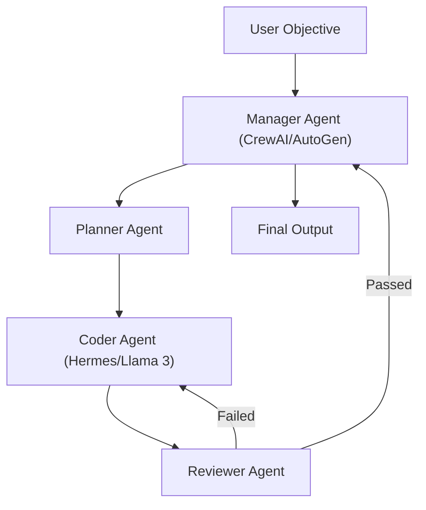

# 🤖 Autonomous Agents - Hermes, AutoGen ve Özel Agent Yapımı

## 🧠 Çoklu Ajan (Multi-Agent) Sistemlerinin Yükselişi
Yapay zeka asistanları, tekil bir sohbet arayüzünün ötesine geçerek görevleri modüler bir şekilde birbirine devreden, tartışan ve işbirliği yapan ajan sistemlerine dönüştü. "Autonomous Agents" (Otonom Ajanlar), kendilerine verilen geniş hedefleri (örn: "Yeni bir e-ticaret sitesinin backend'ini yaz") planlayan, koda döken, test eden ve hataları kendi kendine düzelten yazılım varlıklarıdır.

Bu alandaki temel mimariler LangGraph, CrewAI ve Microsoft AutoGen etrafında şekillenmektedir. Ajan orkestrasyonu, yapay zekanın endüstriyel ölçekte yazılım geliştirmesinin omurgasıdır.

## ⚙️ Mimariler: LangGraph vs. CrewAI vs. AutoGen

1.  **LangGraph:** Ajanların davranışlarını "Graf" (Graph) ve durum (State) makineleri olarak modelleyen bir sistem. Döngüsel işlemler (cyclic workflows) ve durum yönetimi (state management) için mükemmeldir. "Yaz -> Test Et -> Hata Varsa Başa Dön" döngüleri en iyi LangGraph ile kurulur. LLM çağrılarını yönlendirilmiş bir ağaç gibi yönetir.
2.  **CrewAI:** Rol tabanlı işbirliğine odaklanır. Her ajan bir mesleğe (örn: Senior Developer, QA Engineer, Product Manager) sahipmiş gibi davranır ve "Crew" (Mürettebat) olarak bir görevi tamamlamak üzere senkronize çalışırlar. Ajan delegasyonu (bir ajanın diğerine iş ataması) CrewAI'ın en güçlü yanıdır.
3.  **Microsoft AutoGen:** Ajanlar arası "Sohbet" (Conversational) üzerinden programlama mantığına dayanır. Ajanlar birbirleriyle mesajlaşarak kod yazar, çalıştırır ve düzeltirler. İnsan (Human) ajan olarak döngüye kolayca dahil edilebilir; modelin tıkandığı yerde insan devreye girer.

## 🛡️ Açık Kaynak Modeller ve Hermes'in Rolü
OpenAI (GPT-4), Anthropic (Claude 3.7), Google (Gemini 2.0) gibi devlerin tescilli modellerinin yanı sıra, açık kaynak (Open Source) dünyasında NousResearch'ün **Hermes** gibi modelleri özel bir yere sahiptir. Hermes, özellikle "Function Calling" (Araç Kullanımı) ve ajan davranışları (Agentic Behaviors) konusunda ince ayar (fine-tuning) yapılmış, Llama veya Mixtral tabanlı mükemmel modellerdir. Kendi donanımınızda veya yerel bulutta uygun maliyetle "Worker Agent" (İşçi Ajan) olarak çalıştırılabilirler. Büyük karar verici süreçler için kapalı modeller kullanılırken, rutin refactoring ve test işlemleri için Hermes otonom orkestrasyonun kalbini oluşturur.

## 📊 Çoklu Ajan İşbirliği Mimarisi (Mermaid Flowchart)

## 💡 Özel Ajan Geliştirme (Custom Agent Creation) Prensipleri
Bir ajan tasarlarken 3 ana unsur hayati önem taşır:
1.  **Persona (Karakter):** "Sen 10 yıllık bir Rust güvenlik uzmanısın. Her zaman bellek güvenliğine odaklan." (Sistem talimatları ve rol tanımlama)
2.  **Tools (Araçlar):** "Sadece kod okuyabilirsin ve statik analiz (clippy) aracı çalıştırabilirsin." (Görev sınırlandırma, halüsinasyonu engeller)
3.  **Memory (Hafıza):** Pinecone, Milvus veya Redis kullanılarak ajanın geçmiş PR'ları, şirketin kodlama standartlarını (Guidelines) ve yaptığı hataları hatırlaması sağlanmalıdır.

Bu prensipler doğrultusunda inşa edilen otonom ajanlar, standart bir yazılım ekibinin yorulmak bilmeyen, 7/24 çalışan sanal mesai arkadaşları haline gelir. 🚀

