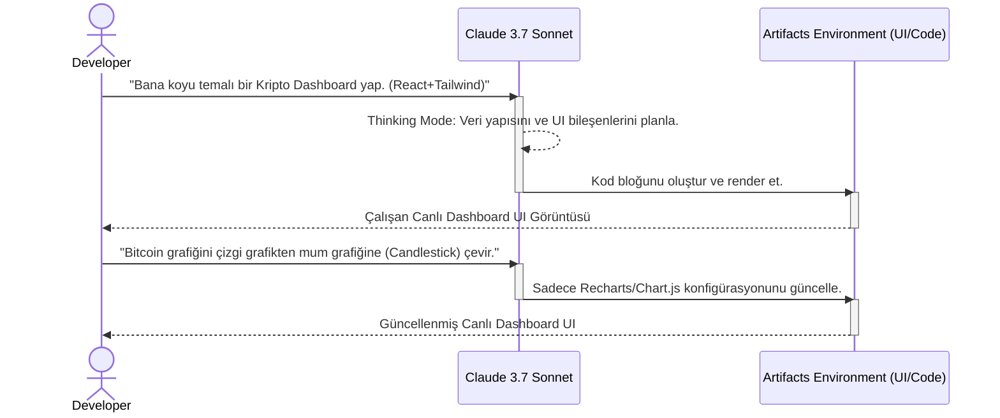

# 💡 Claude - Artifacts ve Profesyonel İş Akışları

## 🧠 Hybrid Reasoning: Thinking Modu ve Hızlı Yanıt (Fast) Arasındaki Geçiş
Anthropic'in Claude 3.7 Sonnet modeli ile hayatımıza giren en büyük yeniliklerden biri "Hybrid Reasoning" (Hibrit Akıl Yürütme) yeteneğidir. Model, kendisine verilen görevin karmaşıklığına göre "Thinking" (Düşünme/Planlama) modunda uzun uzadıya içsel çıkarımlar yapabilir veya basit görevlerde standart hızlı yanıt (Fast) modunu kullanabilir.

-   **Thinking Mode (Düşünme Modu):** Mimari kararlar, zorlu algoritma optimizasyonları ve "Edge Case" (uç durum) analizleri için kullanılır. Model bu modda "Chain-of-Thought" (Düşünce Zinciri) sürecini açıkça işletir ve adım adım mantık yürütür. Bu sayede sıfır noktası (zero-shot) hataları neredeyse ortadan kalkar.
-   **Fast Mode:** Hızlı kod açıklamaları, küçük syntax düzeltmeleri veya önceden düşünülmüş planların uygulanması için idealdir. Sistem kaynaklarını ve token maliyetini minimize eder.

Profesyonel iş akışlarında, prompt'larımızı modelin hangi modu kullanması gerektiğini yönlendirecek şekilde tasarlamak sistem performansını doğrudan etkiler.

## 🏗️ XML Tabanlı Yapılandırma ve Prompt Mimarisinde Standartlaşma
Claude modelleri, prompt yapısında XML etiketlerine son derece duyarlıdır. İleri seviye bir prompt mühendisi, modeli spesifik kurallara hapsetmek ve halüsinasyon riskini en aza indirmek için `<system_instructions>`, `<user_context>`, `<thought_process>` ve `<final_output>` gibi belirgin XML blokları kullanır.

### Profesyonel XML Prompt Örneği:
```xml
<task>Verilen React bileşenini performans açısından optimize et.</task>
<context>Bileşen 10.000 satırlık bir tabloyu render ediyor. Context API kullanılıyor.</context>
<constraints>
  <constraint>Memoization kullanılmalı (useMemo, React.memo).</constraint>
  <constraint>Virtualization (ör: react-window) entegre edilmeli.</constraint>
</constraints>
<instructions>Önce <thought_process> içinde adım adım düşün, sonra kodu yaz.</instructions>
```

## 🎨 Artifacts: Canlı Prototipleme ve UI Geliştirme
Claude'un "Artifacts" özelliği, kod bloklarının statik metinler olmaktan çıkıp, doğrudan izole bir ortamda (iframe benzeri) çalıştırılabilir ve görüntülenebilir bileşenlere dönüşmesini sağlar. Bu, özellikle Frontend mühendisliğinde ve veri görselleştirmede çığır açan bir yeniliktir.

-   **React Component Prototip:** Claude'dan bir Dashboard çizmesini istersiniz ve o anında TailwindCSS ve React (Recharts vb.) kullanarak çalışan bir UI sunar.
-   **İteratif Tasarım:** Artifact üzerinde "Renkleri koyulaştır" veya "Tabloya bir filtre ekle" dediğinizde, kodun tamamını baştan yazdırmadan, sadece ilgili Artifact güncellenir.

## 📊 Artifacts İş Akışı (Mermaid Sequence Diagram)



Gelecekte Claude 4.x vizyonu ile Artifacts, sadece izole frontend bileşenleri değil, arkaplan veritabanlarına (Mock veya MCP üzerinden gerçek DB'ler) bağlanan full-stack mikro-uygulamalar haline gelecektir. Bu sayede bütün bir uygulamanın demosu doğrudan sohbet arayüzünden test edilebilecektir. ❓
