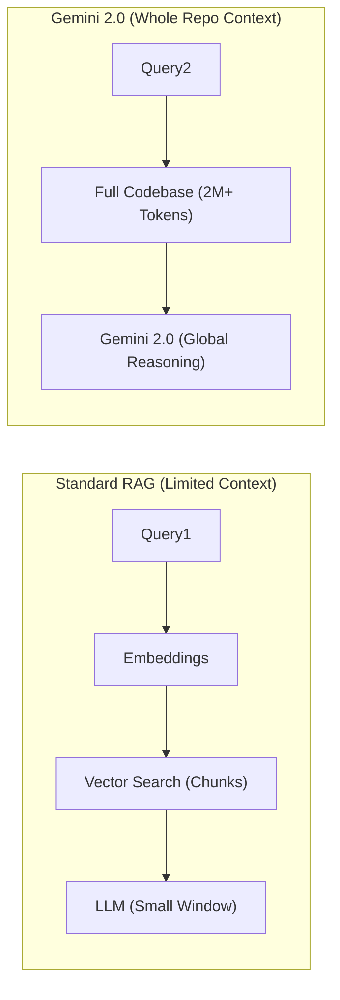

# 🌌 Gemini - Long Context ve Repo Management

## 🧠 Dev Context Penceresi: RAG (Retrieval-Augmented Generation) Ölüm Döşeğinde mi?
Google'ın Gemini 1.5 Pro ve güncel **Gemini 2.0 Pro** modelleri, yapay zeka alanında devrim niteliğinde bir yetenek sundu: **2 Milyon (ve ötesi) Token Context Window (Bağlam Penceresi)**. Bu devasa bağlam kapasitesi, yapay zeka ile kod etkileşimini, yazılım mühendisliğini ve büyük veri setlerinin analizini kökten değiştirdi.

Geçmişte, yapay zekanın tüm kod tabanını "anlaması" için dosyaların küçük parçalara (chunks) bölündüğü, vektör veritabanlarında (Pinecone, Milvus) saklandığı ve RAG (Retrieval-Augmented Generation) yöntemiyle sadece "ilgili olduğu düşünülen" parçaların modele sunulduğu karmaşık sistemler kurulurdu. RAG sistemleri genellikle bağlam kaybına, hatalı birleştirmelere ve mimarinin genel resminin (big picture) kaçırılmasına yol açar.
Gemini 2.0 Pro ile artık **"Tüm Repoyu Tek Seferde Yükle" (Whole-Repo Contexting)** dönemi başlamıştır. RAG yok, veri kaybı yok; her şey bellekte.

## 📂 Bütünsel Analiz (Whole-Repo Analysis)
Milyonluk token sınırı, tüm projenizin kaynak kodlarını, binlerce satırlık sistem log dosyalarını, bağımlılık listelerini (package.json, Cargo.toml, requirements.txt) ve hatta proje mimari dokümantasyonlarını tek bir prompt ile modele göndermenize olanak tanır.
Bu kapasite, şu tür "İmkansız" görevleri sıradan hale getirir:
-   "Tüm projeyi analiz et ve birbirine sıkı sıkıya bağlı (tightly coupled) olan ancak farklı mikroservislere (Microservices) ayrılabilecek modülleri tespit et."
-   "Tüm uygulamanın güvenlik zafiyetlerini, veri sızıntılarını ve OWASP kurallarına uymayan noktalarını uçtan uca tara."
-   "Bu devasa monorepo'daki tüm frontend React bileşenleri ve backend API response'ları arasındaki Tip (Type / Interface) uyumsuzluklarını bul ve düzeltme planı oluştur."

## 🎥 Multimodalite (Çoklu Modalite) ve Video Kodlama
Gemini 2.0 Pro'nun bir diğer eşsiz ve rakipsiz yeteneği doğal (native) multimodal olmasıdır. Sonradan eklenmiş OCR veya Speech-to-Text motorları değil; doğrudan modeli eğitirken ses, görüntü, video ve metin kullanılmıştır. Sadece metin veya kod değil, aynı anda bu formatların tamamı aynı bağlam penceresine dahil edilebilir.
-   **Kullanım Senaryosu:** Model içerisine uygulamanızın çöktüğü anı gösteren bir kullanıcı ekran kaydı (Video), tarayıcının veya sunucunun console log'ları (Metin) ve uygulamanın tüm kaynak kodu (Kod) aynı anda verilir. "Videodaki 12. saniyede butona tıklandığında uygulamanın çökmesine sebep olan koddaki hatayı bul ve düzelt" isteği şaşırtıcı bir doğrulukla sonuçlanır.

## 📊 Long Context Mimari Akışı (Mermaid)

## 🛠️ Repo Yönetimi İçin Best Practices
-   **İgnore Dosyalarının Önemi:** Modelin gereksiz yere devasa `node_modules`, `.git` klasörü, derlenmiş `.exe` dosyaları veya büyük veritabanı dump'larını okumasını engellemek için `.geminiignore` veya `.gitignore` konfigürasyonu hayati önem taşır. Aksi takdirde 2 Milyon token bile dolabilir.
-   **Context Caching (Bağlam Ön Bellekleme):** 2 Milyon token'ı her seferinde modele API üzerinden göndermek hem maliyetli hem de yavaş olabilir. Gemini'nin "Context Caching" özelliği kullanılarak, tüm proje dosyaları modele bir kez yüklenir, Google sunucularında önbelleğe alınır. Sonraki promptlarda sadece yeni istekler ve küçük delta (değişen kod) değişiklikleri yollanarak inanılmaz bir hız (düşük latency) ve maliyet tasarrufu elde edilir. 🚀
