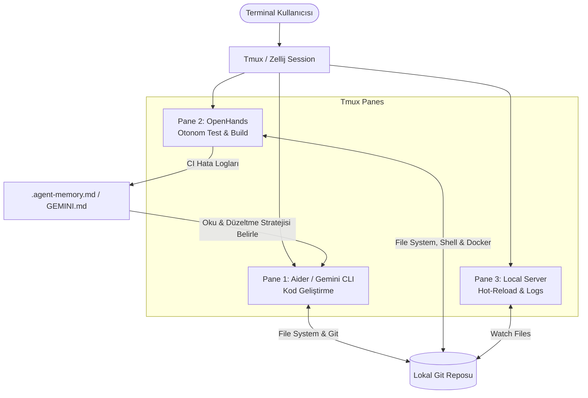

# 💻 Multi-AI Terminal Management - CLI Orchestration

## 🧠 CLI Tabanlı AI Yönetimine Giriş
Yazılım geliştiriciler için en doğal ortam olan Terminal/CLI, yapay zeka ajanlarının entegrasyonu için de en güçlü oyun alanıdır. IDE eklentileri (Cursor, Windsurf, Copilot) harika görsel arayüzler ve satır içi (inline) kodlamalar sunsa da, gerçek otonomi ve tam sistem entegrasyonu CLI ajanları üzerinden gerçekleşir. Aider, OpenHands ve özel CLI asistanları (ör: Gemini CLI); arka planda sessizce çalışan, repoyu ctags ile indeksleyen, bash komutları çalıştırabilen ve doğrudan Git versiyon kontrolü ile entegre olan güçlü "Mühendis Ajanlar"dır.

## 🛠️ CLI Ajanları: Aider ve OpenHands
-   **Aider:** Doğrudan terminalde çalışan, "Pair-Programming" (eşli programlama) odaklı bir ajandır. Git ile o kadar derin bir entegrasyonu vardır ki, yaptığı tüm değişiklikleri anında küçük, anlamlı commit'ler halinde kaydeder. Ctags kullanarak tüm repoyu hızlıca haritalayabilir ve büyük projelerde bile (Gemini 2.0 Pro veya Claude 3.7 Sonnet eşliğinde) hatasız ve etkili kod değişiklikleri yapar.
-   **OpenHands (Eski adıyla OpenDevin):** Aider'dan daha otonom, uçtan uca bir yapıya sahiptir. Kendi içinde izole bir Docker ortamı çalıştırarak; kod yazar, npm install gibi komutları çalıştırır, sunucuyu ayağa kaldırır ve tarayıcıda oluşan hataları analiz edip kodda bağımsız düzeltmeler yapar. İnsan müdahalesine daha az ihtiyaç duyar.

## 🔄 Çoklu Ajan ve Bağlam Senkronizasyonu (Context Syncing)
Gelişmiş bir mühendislik akışında, birden fazla terminal ajanı aynı projede eşzamanlı olarak çalıştırılabilir. Örneğin, Terminal 1'de testleri sürekli koşturan ve logları inceleyen bir ajan bulunurken, Terminal 2'de aktif olarak kod yazan bir Aider çalışabilir. Bu ajanların birbirini ezmemesi veya durumdan haberdar olması için "Bağlam Senkronizasyonu" (Context Sync) kritik bir sorundur.
**Çözüm:** Merkezi bir "Kurallar ve Notlar" dizini (ör: `GEMINI.md`, `MEMORY.md` veya `.agent-memory/`) kullanılarak ajanların bu dosyaları düzenli olarak okuyup yazması sağlanır, böylece ajanlar asenkron olarak dosya sistemi üzerinden birbirleriyle iletişim kurmuş ve strateji belirlemiş olur.

## 🪟 Tmux ve Screen ile Gelişmiş İş Akışları
CLI ajanlarını verimli kullanmanın ve çoklu-ajan mimarisini orkestre etmenin yolu Terminal Çoklayıcılardan (Terminal Multiplexers) geçer. Tmux veya Zellij, farklı oturumları bölerek (split-pane) AI ajanlarının çalışmalarını tek bir ekranda organize etmeyi sağlar.

### Tmux Örnek İş Akışı:
-   **Pane 1 (Sol Üst):** Aktif Aider/Gemini CLI oturumu (Geliştirici direktifleri girer).
-   **Pane 2 (Sol Alt):** Arka planda logları izleyen ve hata düştüğünde bağlam dosyasına (GEMINI.md) yazan otonom bir script.
-   **Pane 3 (Sağ Taraf):** Uygulamanın canlı çalışan sunucusu (Live Server) ve CI/CD pipeline görüntüleyicisi.

## 📊 CLI Orchestration Mimarisi (Mermaid)

## 💡 Güvenlik ve İzolasyon (Best Practices)
CLI ajanları muazzam güçlüdür çünkü makinenizde doğal "Bash/PowerShell" komutları çalıştırabilirler (örn: `rm -rf`, `docker rm`). Bu nedenle güvenlik en üst seviyede tutulmalıdır:
1.  **İzolasyon:** OpenHands gibi ajanlar daima bir Docker Container, DevContainer veya sanal makine içinde (Sandboxed) çalıştırılmalıdır.
2.  **Onay Mekanizmaları:** Ajanlar kabuk komutları veya yıkıcı işlemler çalıştırmadan önce `AskUser` (Kullanıcıya Sor) protokolünü izlemeli ve tehlikeli işlemlerde manuel onay beklemelidir.
3.  **Secrets (Gizli Veriler):** Hiçbir ajanın `.env` dosyalarını okumaması veya LLM bağlamına (context window) API anahtarlarını, AWS Secret'larını göndermemesi için katı `.geminiignore`, `.gitignore` veya `.aiderignore` kısıtlamaları getirilmelidir. 🔒
