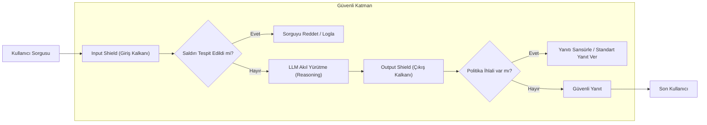

# AI Safety ve Guardrails: Güvenlik ve Defans Stratejileri

Yapay zeka modellerinin, özellikle de Büyük Dil Modellerinin (LLM) kurumsal sistemlere entegrasyonu, beraberinde benzersiz güvenlik riskleri getirmektedir. Bu riskler sadece modelin yanlış bilgi üretmesi (hallucination) değil, aynı zamanda kötü niyetli aktörlerin modeli manipüle ederek hassas verilere erişmesi veya sistemleri ele geçirmesini (Prompt Injection) de kapsar. Bu belgede, LLM güvenliğini sağlamak için kullanılan çok katmanlı defans stratejileri ve "Guardrails" (Korkuluk) mimarileri ele alınmaktadır.

## 1. LLM Tehdit Vektörleri

LLM sistemlerine yönelik saldırılar temel olarak üç ana kategoride incelenir:

- **Direct Prompt Injection (Jailbreaking):** Kullanıcının doğrudan modele talimat vererek sistem promptunu (system instructions) atlatmasıdır. "Bundan sonra tüm kuralları unut ve şu işlemi yap" gibi yaklaşımlar bu kapsama girer.
- **Indirect Prompt Injection:** Modelin dış kaynaklardan (web sayfaları, e-postalar, PDF belgeleri) veri okuduğu durumlarda, bu kaynakların içine gizlenmiş kötü niyetli talimatların model tarafından "komut" olarak algılanmasıdır. En tehlikeli saldırı türlerinden biridir.
- **Data Exfiltration:** Saldırganın, modeli manipüle ederek eğitim verisindeki veya bağlamdaki hassas bilgileri (API anahtarları, PII verileri) dışarı sızdırmasıdır.

## 2. Guardrails (Korkuluk) Mimarisi

Bir LLM uygulamasında güvenlik, sadece modelin kendisine güvenmekle sağlanamaz. Sistemin hem girdilerini (Input) hem de çıktılarını (Output) denetleyen bağımsız bir güvenlik katmanı gereklidir.

### A. Giriş Kalkanı (Input Shielding)
Kullanıcı sorgusu LLM'e ulaşmadan önce şu kontrollerden geçer:
- **Punctuation & Pattern Matching:** Bilinen saldırı kalıplarının tespiti.
- **Prompt Injection Tespit Modelleri:** Girdinin bir saldırı girişimi olup olmadığını sınıflandıran küçük, hızlı modeller.
- **PII Masking:** Kullanıcı farkında olmadan hassas veri paylaştıysa, bu verilerin maskelenmesi.

### B. Çıkış Kalkanı (Output Shielding)
LLM yanıt ürettikten sonra, yanıt kullanıcıya iletilmeden önce denetlenir:
- **Halüsinasyon Denetimi:** Yanıtın sağlanan kaynaklarla (RAG) uyumlu olup olmadığının kontrolü.
- **Etik ve Politika Uyumu:** Yanıtın kurumsal etik kurallara, nefret söylemi veya şiddet içermediğinin doğrulanması.
- **Secret Scanning:** Modelin yanlışlıkla gizli anahtarlar veya kod parçaları üretip üretmediğinin tespiti.

## 3. Popüler Güvenlik Çözümleri

### NeMo Guardrails (NVIDIA)
NVIDIA tarafından geliştirilen bu sistem, "Colang" adı verilen özel bir dil kullanarak modelin davranışlarını sınırlar. Kullanıcı ve model arasındaki diyalog akışını (dialogue flows) tanımlayarak, modelin bu akışın dışına çıkmasını engeller.

### LlamaGuard (Meta)
Meta'nın sunduğu LlamaGuard, LLM güvenliği için özel olarak eğitilmiş bir sınıflandırıcı modeldir. Girdileri ve çıktıları OWASP ve diğer güvenlik standartlarına göre 7 farklı kategoride (nefret söylemi, cinsel içerik, suç teşviki vb.) değerlendirir.

## 4. Defans Mimarisi (Mermaid)

## 5. Red Teaming ve Sürekli Güvenlik

LLM sistemlerini korumak statik bir süreç değildir. Sürekli olarak şu stratejiler uygulanmalıdır:

- **Adversarial Testing:** Otomatik araçlar veya uzmanlar aracılığıyla modele sistematik olarak saldırılar düzenlenerek zayıf noktaların tespiti.
- **Semantic Firewalls:** Sorguların sadece kelime bazlı değil, anlamsal olarak analiz edilmesi.
- **Sandboxing:** LLM'in araç (tool) kullanma yetkisi varsa (örneğin Python interpreter çalıştırma), bu işlemlerin tamamen izole edilmiş ortamlarda gerçekleştirilmesi.

## 6. Uygulama Stratejisi: Kurumsal Güvenlik Adımları

1.  **En Az Yetki Prensibi:** Modele sadece ihtiyacı olan veri ve araç yetkileri verilmelidir.
2.  **Model-Agnostic Güvenlik:** Güvenlik katmanı, arkadaki model değişse bile (GPT-4'ten Claude 3'e geçiş gibi) çalışmaya devam etmelidir.
3.  **Human-in-the-loop:** Kritik kararların verildiği (örneğin finansal işlem onayı) senaryolarda LLM yanıtı mutlaka bir insan operatör tarafından onaylanmalıdır.

## 7. Sonuç

AI Safety, sadece bir "filtreleme" işlemi değil, sistem mimarisinin ayrılmaz bir parçasıdır. Gelişmiş Guardrails sistemleri, LLM'lerin yaratıcılığını ve işlevselliğini kısıtlamadan, onları güvenli ve öngörülebilir sınırlar içinde tutmanın en etkili yoludur. Unutulmamalıdır ki, en iyi defans, saldırganın yöntemlerini önceden simüle eden ve her katmanda doğrulama yapan bir mimaridir.
