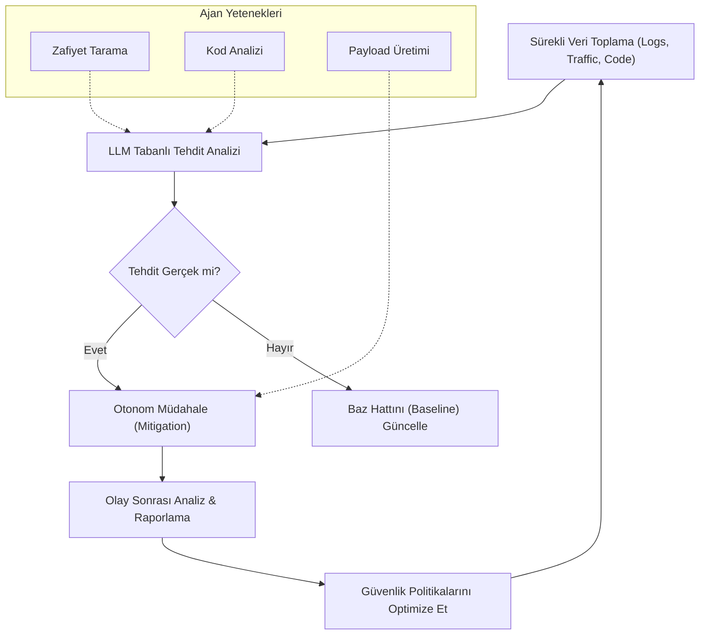

# AI-Driven Cyber Security: Otonom Tehdit Avcılığı ve Pentesting

Siber güvenlik alanı, Büyük Dil Modelleri (LLM) ve otonom ajanların (Autonomous Agents) gelişiyle köklü bir değişim yaşamaktadır. Geleneksel güvenlik araçları kural tabanlı (rule-based) çalışırken, AI tabanlı sistemler "akıl yürütme" yeteneği sayesinde sıfırıncı gün (zero-day) açıklarını bulma, karmaşık zararlı yazılımları analiz etme ve otonom sızma testleri gerçekleştirme kapasitesine sahiptir.

## 1. Ofansif Güvenlikte LLM Kullanımı: Otonom Pentesting

Sızma testi (Pentesting), geleneksel olarak uzman insan emeği gerektiren, keşif, tarama, istismar ve raporlama aşamalarından oluşan bir süreçtir. LLM tabanlı ajanlar bu süreci şu şekilde otonomlaştırır:

- **Keşif (Reconnaissance):** AI ajanları, açık kaynak istihbaratı (OSINT) yaparak hedefin dijital ayak izini çıkarır. Shodan, Whois ve DNS kayıtlarını bir insan gibi analiz ederek saldırı yüzeyini belirler.
- **Zafiyet Analizi:** Statik analiz araçlarının (SAST) çıktılarını yorumlar. Kod içindeki mantıksal hataları (logic flaws), sadece kalıp eşleştirme ile değil, kodun akışını anlayarak tespit eder.
- **Otonom İstismar (Exploitation):** Tespit edilen bir açık için (örneğin SQL Injection) özel "payload"lar geliştirir ve bunları deneme-yanılma (reinforcement learning benzeri bir mantıkla) yöntemiyle optimize eder.

## 2. Defansif Güvenlik ve Tehdit Avcılığı (Threat Hunting)

Savunma tarafında AI, SOC (Security Operations Center) ekiplerinin üzerindeki yükü %80 oranında azaltabilmektedir.

- **Real-time Anomaly Detection:** Ağ trafiği veya sistem loglarındaki anomaliyi tespit etmek için sadece eşik değerlere bakmaz. "Bu kullanıcının normal davranışı ile bu eylemi arasındaki semantik fark nedir?" sorusuna yanıt arar.
- **AI-Powered Malware Analysis:** Zararlı yazılımların kaynak kodunu veya tersine mühendislik (reverse engineering) çıktılarını analiz ederek, yazılımın ne yapmaya çalıştığını (örneğin "veri sızdırma", "şifreleme") doğal dilde açıklar.
- **Automated Incident Response:** Bir saldırı tespit edildiğinde, AI ajanı otomatik olarak ilgili portları kapatabilir, etkilenen kullanıcıları izole edebilir ve olay müdahale (incident response) raporunu anında oluşturabilir.

## 3. AI Security Operations (SecOps) Döngüsü

Modern bir yapay zeka destekli güvenlik mimarisi, sürekli bir öğrenme ve müdahale döngüsü üzerine kuruludur.

## 4. Uygulama Stratejileri ve Teknik Yaklaşımlar

Güvenlik ekiplerinin AI entegrasyonunda izlediği temel yaklaşımlar:

- **RAG for Security Knowledge:** Güncel CVE (Common Vulnerabilities and Exposures) veritabanları ve güvenlik makaleleri bir RAG sistemiyle modele bağlanır. Böylece model, en yeni saldırı türlerinden haberdar olur.
- **Multi-Agent Systems:** Bir ajan "Saldırgan" (Red Team), diğeri "Savunmacı" (Blue Team) rolünü üstlenerek kendi aralarında simülasyonlar yapar. Bu süreç (Purple Teaming), sistemin zayıf noktalarının daha hızlı keşfedilmesini sağlar.
- **Explainable AI (XAI):** Güvenlik kararlarının neden alındığının şeffaf olması kritiktir. AI, bir IP'yi neden engellediğini "Bu IP, daha önce X saldırısında görülen karakteristik yanal hareketleri (lateral movement) sergiliyor" şeklinde açıklamalıdır.

## 5. Etik Sorunlar ve İkili Kullanım (Dual-Use) Riski

AI'nın siber güvenlikteki gücü, aynı zamanda büyük bir risk taşır. Saldırganlar da aynı teknolojileri kullanarak;
- Daha inandırıcı otonom "phishing" e-postaları yazabilir.
- Güvenlik yazılımlarını (AV/EDR) atlatabilen "polimorfik" zararlı yazılımlar geliştirebilir.
- Büyük ölçekli ve hedefli sosyal mühendislik saldırıları düzenleyebilir.

Bu nedenle, LLM sağlayıcılarının (OpenAI, Anthropic vb.) modellerine ofansif güvenlik kısıtlamaları getirmesi ile güvenlik araştırmacılarının bu araçlara erişimi arasında hassas bir denge kurulmalıdır.

## 6. Sonuç

AI-Driven Cyber Security, kedi-fare oyununu yeni bir boyuta taşımıştır. Geleceğin güvenlik mimarileri, sadece "duvarlar" ören değil, tehdidi daha oluşmadan sezen, analiz eden ve otonom olarak etkisiz hale getiren yaşayan organizmalar gibi olacaktır. Güvenlik profesyonelleri için yeni görev, bu otonom sistemleri yönetmek, denetlemek ve stratejik yönlerini belirlemek olacaktır.
