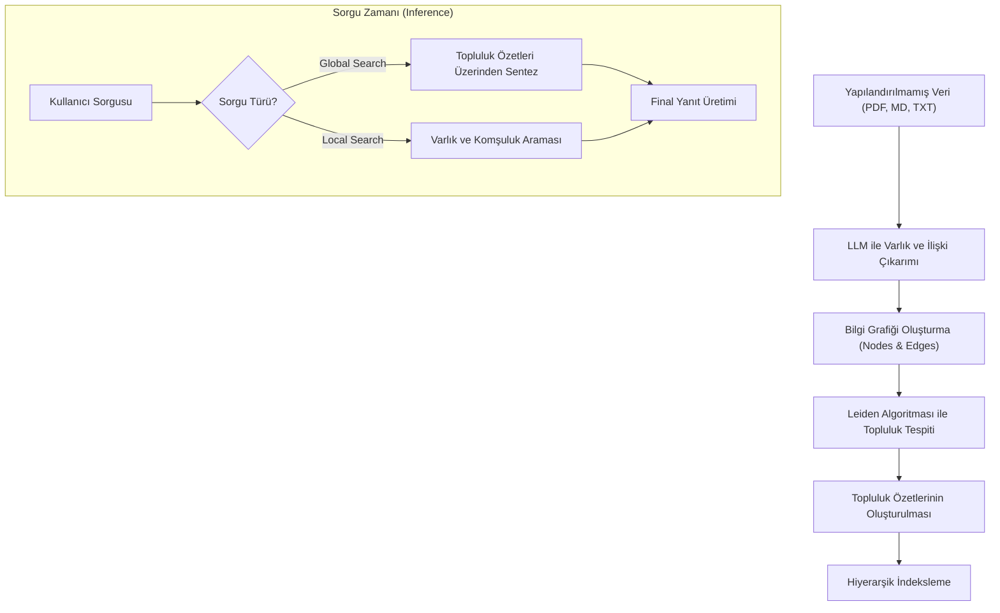

# Advanced RAG: GraphRAG ve Knowledge Graphs (Bilgi Grafitleri)

Geleneksel RAG (Retrieval-Augmented Generation) sistemleri, metinleri sabit boyutlu parçalara (chunks) ayırarak vektör uzayında semantik benzerlik üzerinden arama yapar. Ancak bu yaklaşım, "Bu veri kümesindeki ana temalar nelerdir?" gibi global anlama gerektiren sorularda veya birbiriyle doğrudan semantik bağı olmayan ancak mantıksal olarak ilişkili uzak kavramları birleştirmede (multi-hop reasoning) yetersiz kalır. İşte bu noktada **GraphRAG** ve **Knowledge Graphs** devreye girer.

## 1. Vektör RAG'ın Sınırları ve GraphRAG Gereksinimi

Vektör tabanlı RAG, yerel bağlamda (local context) mükemmel çalışır. Eğer sorunuz "X belgesindeki Y parametresi nedir?" ise, vektör arama ilgili paragrafı hızla bulur. Ancak veri seti genişledikçe ve sorular karmaşıklaştıkça şu sorunlar ortaya çıkar:
- **Bağlamsal Parçalanma:** İlgili bilgiler farklı belgelerdeyse, vektör arama bunları birleştirmekte zorlanır.
- **Global Özetleme Eksikliği:** Tüm veri kümesini kapsayan içgörüler üretmek için binlerce parçanın LLM'e beslenmesi gerekir ki bu hem maliyetli hem de bağlam penceresi (context window) açısından imkansızdır.
- **İlişkisel Kayıp:** Veri içindeki "kim, neyle, nasıl ilişkili" bilgisi, düz metin parçalarında kaybolur.

## 2. GraphRAG Mimari Yaklaşımı (Microsoft GraphRAG)

Microsoft tarafından geliştirilen GraphRAG, yapılandırılmamış metin verilerinden otomatik olarak bir bilgi grafiği (Knowledge Graph) oluşturur. Süreç şu adımlardan oluşur:

### A. Varlık ve İlişki Çıkarımı (Entity & Relation Extraction)
LLM, metni tarayarak varlıkları (kişiler, kurumlar, kavramlar) ve bu varlıklar arasındaki ilişkileri (A, B'yi destekliyor; C, D'nin alt dalıdır) çıkarır. Bu aşamada "Claims" (İddialar) da çıkarılarak bilginin doğruluğu ve kaynağı takip edilir.

### B. Topluluk Tespiti (Community Detection)
Graf oluşturulduktan sonra, **Leiden Algoritması** gibi algoritmalar kullanılarak birbirine sıkıca bağlı düğümler "topluluklar" (communities) halinde gruplanır. Bu, verinin hiyerarşik bir yapıda organize edilmesini sağlar. Graf teorisi bağlamında bu, modülerlik optimizasyonudur.

### C. Hiyerarşik Özetleme (Hierarchical Summarization)
Her topluluk için LLM tarafından bir özet oluşturulur. Bu özetler, en alt seviyedeki detaylardan en üst seviyedeki genel temalara kadar bir "özet ağacı" oluşturur. Sorgu anında, ilgili seviyedeki topluluk özetleri bağlama eklenir.

## 3. Uygulama Stratejileri ve Algoritmik Detaylar

GraphRAG uygularken iki ana sorgu modu kullanılır:

1.  **Global Search:** "Veri kümesindeki temel riskler nelerdir?" gibi sorular için topluluk özetleri üzerinden paralel bir tarama yapılır. Map-Reduce mekanizması ile her topluluğun yanıtı alınır ve LLM tarafından sentezlenir. Bu, verinin "büyük resmini" çizer.
2.  **Local Search:** Belirli bir varlık veya kavram hakkındaki detaylı sorular için o varlığın komşu düğümleri, ilişkili "claims" ve ilgili orijinal metin parçaları birleştirilerek yanıt üretilir.

## 4. Pipeline Mimarisi (Mermaid)

## 5. Teknik Uygulama ve Implementasyon Önerileri

GraphRAG'ı kendi altyapınızda kurarken şu adımları izlemek kritiktir:

- **Graph Storage:** Graf yapısını saklamak için **Neo4j** veya **Azure Managed Instance for Apache Cassandra** gibi ölçeklenebilir veritabanları tercih edilmelidir.
- **Deduplication:** Farklı chunklarda geçen aynı varlıkların (örneğin "Elon Musk" ve "Musk") tek bir düğümde birleştirilmesi (Entity Resolution) için cross-encoder modelleri veya LLM tabanlı doğrulama adımları kullanılmalıdır.
- **Index Optimization:** Topluluk özetleri oluşturulurken "root" topluluktan en küçük alt topluluklara kadar olan hiyerarşi, sorgunun kapsamına göre (breadth vs depth) dinamik olarak seçilmelidir.

## 6. Teknik Zorluklar ve Çözümler

- **Yüksek Token Tüketimi:** Graf oluşturma süreci on binlerce token tüketebilir. Çözüm olarak, varlık çıkarımı için daha hızlı ve ucuz olan **GPT-4o-mini** veya **Llama 3.1 70B** gibi modeller kullanılabilir.
- **Dynamic Data:** Veri sürekli değişiyorsa, tüm grafı yeniden oluşturmak yerine sadece etkilenen alt grafların (subgraphs) ve onun bağlı olduğu topluluk özetlerinin güncellenmesi gerekir.
- **Noisy Relationships:** Metinden yanlış çıkarılan ilişkileri temizlemek için ağırlıklı kenarlar (weighted edges) kullanılmalı ve düşük ağırlıklı (az frekansta geçen) ilişkiler budanmalıdır.

## 7. Sonuç

GraphRAG, sadece bir arama tekniği değil, verinin semantik yapısını anlamsal bir ağa dönüştüren bir veri mühendisliği disiplinidir. Karmaşık kurumsal belgelerin analizinde, hukuk ve tıp gibi dikey alanlarda global anlayış kapasitesiyle standart RAG sistemlerinin çok ötesinde bir performans sergiler. Veri arasındaki gizli bağlantıları ortaya çıkararak, yapay zekanın "akıl yürütme" kapasitesini yapısal bir temel üzerine oturtur.
