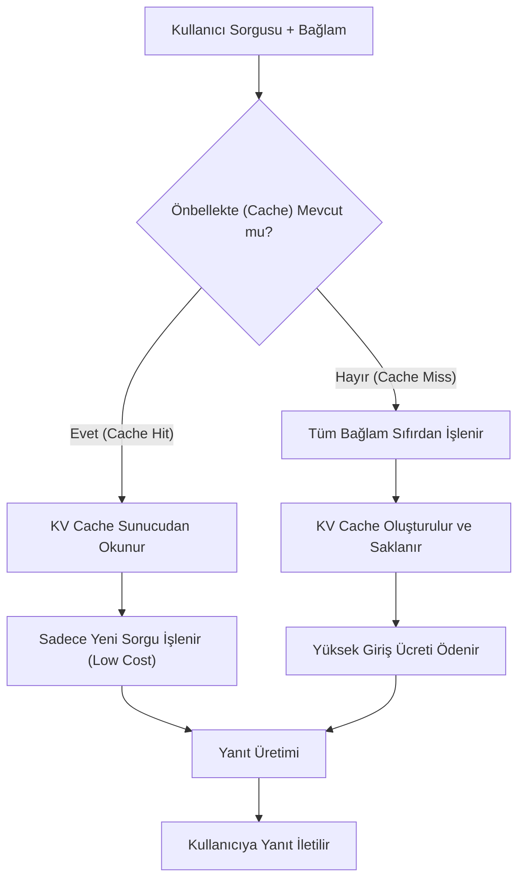

# Context Caching ve AI Economics: Maliyet Optimizasyonu

Büyük Dil Modelleri (LLM) geliştikçe, bağlam penceresi (context window) kapasiteleri 128K'dan 2M token seviyelerine kadar çıktı. Ancak, her sorguda bu devasa bağlamın yeniden işlenmesi hem ciddi bir gecikme (latency) hem de yüksek maliyet (token cost) yaratır. **Context Caching** (Bağlam Önbelleğe Alma), bu sorunu çözmek için geliştirilen ve AI ekonomisini kökten değiştiren bir teknolojidir.

## 1. Context Caching Nedir?

Normal bir LLM çağrısında, sağladığınız her token için "input cost" ödersiniz. Eğer 100 sayfalık bir dokümanı her seferinde farklı sorularla sorguluyorsanız, o 100 sayfayı her seferinde tekrar "tokenize" edip modelin dikkat (attention) mekanizmasından geçirmeniz gerekir.

Context Caching, bu statik bağlamın işlenmiş halini (KV Cache - Key-Value Cache) sunucu tarafında geçici olarak saklar. Bir sonraki sorguda, model bu işlenmiş veriyi sıfırdan hesaplamak yerine önbellekten okur.

## 2. Teknik Çalışma Prensibi

Context Caching şu adımlardan oluşur:
1.  **Cache Creation:** Statik veri (örneğin bir kütüphanedeki tüm dokümanlar veya uzun bir kod deposu) modele gönderilir ve "pre-filled" edilir. Bu aşamada KV Cache oluşturulur.
2.  **Cache Identification:** Oluşturulan önbelleğe bir `cache_id` atanır.
3.  **Inference with Cache:** Kullanıcı yeni bir soru sorduğunda, `cache_id` referans verilerek sadece yeni sorunun (query) tokenları işlenir.
4.  **TTL (Time To Live):** Önbellek, maliyet verimliliği için belirli bir süre (genellikle 1 saat ile 24 saat arası) saklanır ve sonra silinir.

## 3. AI Economics ve Maliyet Karşılaştırması

Context Caching'in ekonomik etkisi üç ana başlıkta toplanır:

- **Input Token İndirimi:** Anthropic ve Google gibi sağlayıcılar, önbelleğe alınmış tokenlar için standart giriş ücretinden %90'a varan indirimler sunar.
- **Latency Reduction:** Tokenların yeniden hesaplanması gerekmediği için ilk tokenın üretim süresi (TTFT - Time To First Token) milisaniyeler seviyesine iner.
- **Scalability:** Aynı doküman havuzunu binlerce kullanıcıya sunan uygulamalarda, marjinal maliyet sıfıra yaklaşır.

## 4. Cache Hit/Miss Mantığı (Mermaid)

## 5. İleri Seviye Optimizasyon Stratejileri

Maliyetleri daha da düşürmek için kullanılan diğer teknikler:

### Speculative Decoding
Küçük ve hızlı bir model (Draft Model), ana modelin (Target Model) ne diyeceğini tahmin eder. Eğer ana model bu tahmini onaylarsa, tek seferde birden fazla token üretilmiş olur. Bu, GPU kullanım süresini ve dolayısıyla maliyeti düşürür.

### Token Quantization (Kuantizasyon)
Model ağırlıklarının ve KV Cache verilerinin 16-bit (FP16) yerine 8-bit (INT8) hatta 4-bit (NF4) olarak saklanmasıdır. Bu, bellek ihtiyacını %50-75 oranında azaltarak daha ucuz donanımlarda yüksek performans sağlar.

### Prefix Caching
Eğer tüm kullanıcılar aynı sistem promptuyla başlıyorsa ("Sen profesyonel bir yazılımcısın..."), bu ortak başlangıç kısmı otomatik olarak önbelleğe alınır.

## 6. Uygulama Örneği: Teknik Detaylar

Bir hukuk otomasyon sisteminde 10.000 sayfalık bir mevzuatın sorgulandığını varsayalım:
- **Standart RAG:** Her sorgu için mevzuattan ilgili 10 parça çekilir. İlişkisel bilgi kaybolur.
- **Context Caching:** Tüm mevzuat bir kez önbelleğe alınır. Kullanıcı "Bu kanunun X maddesi Y maddesiyle nasıl çelişiyor?" diye sorduğunda, model tüm 10.000 sayfayı "görerek" saniyeler içinde yanıt verir. Maliyet, her seferinde 10.000 sayfa ödemek yerine, sadece 1 saatlik önbellek ücreti ve yeni sorunun token ücretidir.

## 7. Sonuç

Context Caching, LLM uygulamalarını "pahalı oyuncaklar" olmaktan çıkarıp, gerçek zamanlı ve devasa veri setleriyle çalışan ekonomik sistemlere dönüştürür. Geliştiriciler için en kritik yetkinlik, hangi verinin statik (cacheable) hangisinin dinamik olduğunu belirleyip, token yaşam döngüsünü (lifecycle) optimize etmektir.
