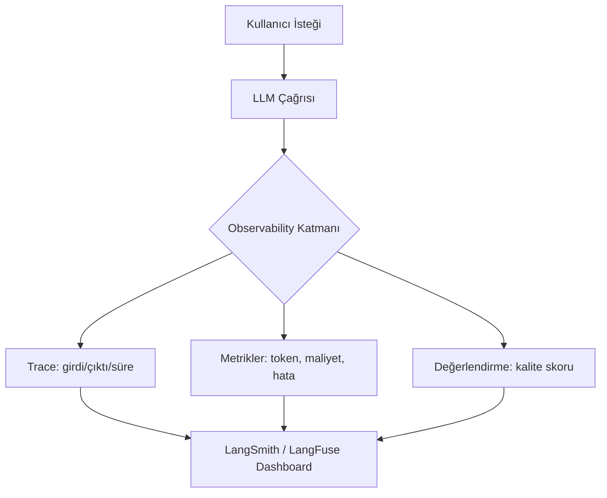

## 📌 Özet

**LLM Observability**, production'daki dil modellerinin davranışını izleme, hata ayıklama ve iyileştirme pratiğidir. Klasik yazılım izlemenin LLM ekvivalentidir: log yerine **trace**, metrik yerine **token maliyeti + gecikme + kalite skoru**.



---

## 🧠 Detay

### LangSmith (LangChain ekosistemi)

```python
import os
os.environ["LANGCHAIN_TRACING_V2"] = "true"
os.environ["LANGCHAIN_API_KEY"] = "<api-key>"
os.environ["LANGCHAIN_PROJECT"] = "my-rag-app"

# Bu kadar — LangChain otomatik trace eder
from langchain_openai import ChatOpenAI
llm = ChatOpenAI()
response = llm.invoke("Python'da async nedir?")
# Trace otomatik LangSmith'e gider
```

**LangSmith Özellikleri:**
- Run explorer: her LLM çağrısı için tam girdi/çıktı
- Dataset & evaluation: golden dataset üzerinde regresyon testi
- Playground: production trace'i yeniden oynatma
- Hub: paylaşılabilir promptlar

### LangFuse (Self-hosted / Open Source)

```python
from langfuse import Langfuse
from langfuse.decorators import observe, langfuse_context

langfuse = Langfuse(
    public_key="pk-...",
    secret_key="sk-...",
    host="http://localhost:3000"
)

@observe()
def rag_pipeline(query: str):
    # Retrieval
    with langfuse_context.observe_step("retrieval"):
        docs = vector_store.similarity_search(query)
    
    # Generation
    with langfuse_context.observe_step("generation"):
        response = llm.invoke(f"Context: {docs}\nSoru: {query}")
    
    return response
```

### Temel Metrikler

| Metrik | Açıklama | Araç |
|---|---|---|
| **Latency** | İstek → yanıt süresi | Her ikisi |
| **Token kullanımı** | Input/output token sayısı | Her ikisi |
| **Maliyet** | $ cinsinden API maliyeti | Her ikisi |
| **Hata oranı** | Başarısız çağrı yüzdesi | Her ikisi |
| **Kalite skoru** | İnsan/LLM-as-judge değerlendirme | LangSmith Eval |
| **Hallucination oranı** | Uydurma tespiti | Custom evals |

### LLM-as-Judge Değerlendirme

```python
from langsmith.evaluation import evaluate

def correctness_evaluator(run, example):
    """LLM başka bir LLM'i değerlendirir"""
    evaluator_llm = ChatOpenAI(model="gpt-4o")
    
    prompt = f"""
    Soru: {example.inputs["question"]}
    Beklenen: {example.outputs["answer"]}
    Üretilen: {run.outputs["answer"]}
    
    Doğruluk skorunu 0-1 arasında ver. Sadece sayı yaz.
    """
    score = float(evaluator_llm.invoke(prompt).content)
    return {"score": score, "key": "correctness"}

results = evaluate(
    rag_pipeline,
    data="my-golden-dataset",
    evaluators=[correctness_evaluator]
)
```

### LangSmith vs LangFuse

| Özellik | LangSmith | LangFuse |
|---|---|---|
| Hosting | SaaS | Self-hosted / SaaS |
| Fiyat | Ücretsiz tier var | Open source + SaaS |
| LangChain enteg. | Native | Wrapper gerekir |
| LangChain dışı | Sınırlı | Tam destek |
| Evaluation | Gelişmiş | Orta düzey |

---

## 💡 Bağlantılar
- [[LLM - Değerlendirme (Evaluation) ve İzleme]]
- [[LLM - RAG (Retrieval Augmented Generation) Mimarisi]]
- [[MO - Prometheus ile Metrik Toplama]]
- [[Context Caching ve AI Economics - Maliyet Optimizasyonu]]

## ❓ Sorular / Anlamadıklarım

## 🔗 Kaynaklar
- [LangSmith Docs](https://docs.smith.langchain.com/)
- [LangFuse GitHub](https://github.com/langfuse/langfuse)
