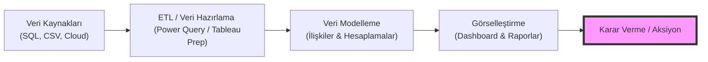

## 📌 Özet
İş Zekası (Business Intelligence - BI), ham veriyi anlamlı ve aksiyon alınabilir içgörülere dönüştürmek için kullanılan stratejiler, teknolojiler ve uygulamalar bütünüdür. BI araçları; veri toplama, temizleme, modelleme ve görselleştirme süreçlerini birleştirerek karar vericilerin verilere dayalı (data-driven) kararlar almasını sağlar. Modern BI platformları, geçmiş verilerin analizinin ötesinde, gerçek zamanlı izleme ve tahminleme yetenekleriyle işletmelerin rekabet avantajı kazanmasına yardımcı olur.

---

## 🧠 Detay

### 🗺️ İş Zekası Süreç Akışı (End-to-End)

### 1. BI Temel Bileşenleri
- **Veri Ambarı (Data Warehouse):** Farklı kaynaklardan gelen verilerin yapılandırılmış bir şekilde saklandığı merkezi depo.
- **ETL (Extract, Transform, Load):** Verinin çekilmesi, dönüştürülmesi ve yüklenmesi süreci.
- **Veri Modelleme:** Tablolar arasındaki ilişkilerin kurulması ve yeni metriklerin (KPI) hesaplanması.
- **Görsel Analitik:** Verinin grafikler, haritalar ve özet tablolar aracılığıyla sunulması.

### 2. Neden BI Araçları Kullanmalıyız?
- **Hız:** Milyonlarca satırlık veriyi saniyeler içinde analiz edebilme.
- **Otomasyon:** Manuel raporlama süreçlerini ortadan kaldırarak zaman tasarrufu sağlama.
- **Etkileşim:** Statik raporlar yerine, kullanıcının filtreleme yapabildiği dinamik ekranlar sunma.
- **Tek Doğruluk Kaynağı (Single Source of Truth):** Herkesin aynı, güncel ve doğrulanmış veriye erişmesi.

### 3. Popüler BI Araçları
| Araç | Geliştirici | Öne Çıkan Özellik |
|------|-------------|-------------------|
| **Power BI** | Microsoft | Excel entegrasyonu, düşük maliyet, DAX dili. |
| **Tableau** | Salesforce | Esnek görselleştirme, büyük veri hızı, estetik grafikler. |
| **Looker** | Google | Bulut tabanlı, güçlü SQL modelleme (LookML). |

---

## 💡 Bağlantılar
- [[Power BI - Veri Modelleme (DAX)]]
- [[Tableau - Temel Kavramlar ve Görselleştirme]]
- [[DS - Veri Görselleştirme İlkeleri]]

## ❓ Sorular / Anlamadıklarım
- BI ile Veri Bilimi (Data Science) arasındaki temel fark nedir? (Cevap: BI geçmişe/şimdiye odaklanır, DS geleceği tahmin eder).
- Self-Service BI ne anlama gelir?

## 🔗 Kaynaklar
- [Gartner BI Magic Quadrant](https://www.gartner.com/en/documents/4000305)
- [Microsoft Power BI Learning](https://learn.microsoft.com/en-us/power-bi/)
