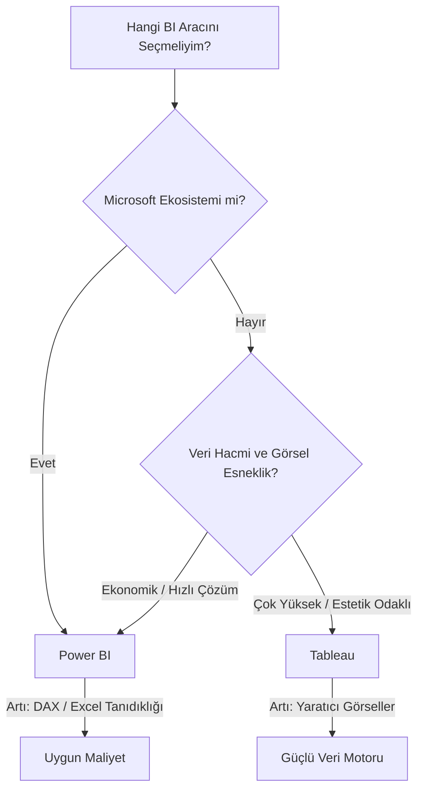

## 📌 Özet
Power BI ve Tableau, iş zekası pazarının iki dev ismidir. Hangi aracın seçileceği genellikle işletmenin mevcut ekosistemine, veri hacmine ve bütçesine bağlıdır. Power BI, Microsoft ekosistemiyle (Excel, Azure) olan sıkı entegrasyonu ve uygun fiyatıyla öne çıkarken; Tableau, görselleştirme esnekliği, estetik grafik yetenekleri ve büyük veri kümelerindeki hızıyla bilinir. Her iki araç da benzer sonuçlar üretebilse de, öğrenme eğrileri ve topluluk destekleri farklılık gösterir.

---

## 🧠 Detay

### 🗺️ BI Aracı Seçim Karar Ağacı

### 1. Temel Karşılaştırma Tablosu

| Özellik | Power BI | Tableau |
|---------|----------|---------|
| **Fiyat** | Daha uygun (Kullanıcı başı ~10$) | Daha pahalı (Kullanıcı başı ~70$) |
| **Görsel Esneklik** | Şablon bazlı, sınırlı esneklik. | Sınırsız yaratıcılık, tamamen özelleştirilebilir. |
| **Öğrenme Eğrisi** | Kolay (Excel/Pivot bilenler için). | Orta (VizQL mantığını kavramak gerekir). |
| **Veri Modelleme** | Güçlü (Star Schema & DAX). | Orta (İlişkiler var ama DAX kadar derin değil). |
| **Bağlantılar** | Microsoft odaklı (Office 365, Azure). | Çok geniş (Salesforce, Big Data, Cloud). |

### 2. Ne Zaman Power BI Seçilmeli?
- Şirketinizde halihazırda Microsoft 365 kullanılıyorsa.
- Raporları hızlıca oluşturmak ve düşük maliyetli bir çözüm istiyorsanız.
- Veri modelleme ve karmaşık DAX hesaplamaları önceliğiniz ise.

### 3. Ne Zaman Tableau Seçilmeli?
- Veriyi bir sanat eserine dönüştürmek, çok özgün görseller tasarlamak istiyorsanız.
- Milyarlarca satırlık büyük veri kümelerinde yüksek performans gerekiyorsa.
- Veri keşfi (Data Discovery) süreçleri en ön plandaysa.

---

## 💡 Bağlantılar
- [[Power BI - Veri Modelleme (DAX)]]
- [[Tableau - Temel Kavramlar ve Görselleştirme]]
- [[BI - Giriş ve Temel Kavramlar]]

## ❓ Sorular / Anlamadıklarım
- Python ve R entegrasyonu hangi araçta daha başarılı?
- Cloud deployment maliyetleri hangisinde daha avantajlı?

## 🔗 Kaynaklar
- [Gartner: Power BI vs Tableau Overview](https://www.gartner.com/reviews/market/analytics-business-intelligence-platforms/compare/microsoft-vs-tableau)
