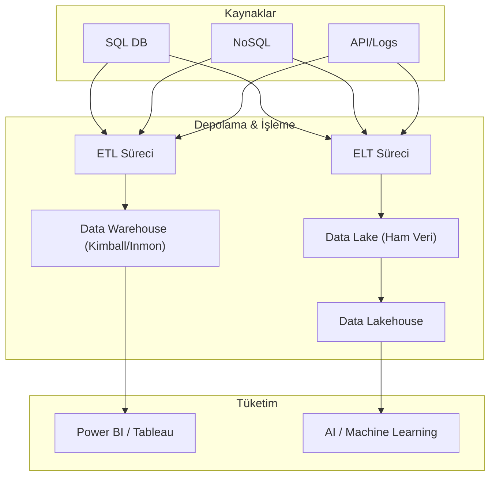

## 📌 Özet
Veri Ambarı ve ETL stratejileri, modern iş zekası mimarisinin temelini oluşturarak ham verinin analiz edilebilir, güvenilir ve tutarlı bir yapıya dönüştürülmesini sağlar. Geleneksel Veri Ambarı (Data Warehouse) yapılandırılmış veriye odaklanırken, Veri Gölü (Data Lake) her türlü formatta ham veriyi barındırarak daha esnek bir depolama sunar. Bu mimarilerin inşasında Bill Inmon'un merkeziyetçi yaklaşımı ile Ralph Kimball'un departman bazlı "Data Mart" odaklı boyut modellemesi (Dimensional Modeling) günümüzde hala en çok tartışılan ve uygulanan iki temel metodolojidir.

---

## 🧠 Detay

### 🏗️ Veri Mimarisi ve Akış Modelleri



### 1. Veri Ambarı (Data Warehouse) vs. Veri Gölü (Data Lake)
| Özellik | Veri Ambarı | Veri Gölü |
| :--- | :--- | :--- |
| **Veri Yapısı** | Yapılandırılmış (Schema-on-write) | Yapılandırılmamış/Yarı-yapılandırılmış (Schema-on-read) |
| **Kullanıcılar** | İş Analistleri, Karar Vericiler | Veri Bilimciler, Veri Mühendisleri |
| **Maliyet** | Yüksek (Depolama + İşleme) | Düşük (S3/Azure Blob gibi ucuz depolama) |
| **Amacı** | Raporlama ve KPI Analizi | Keşifsel Analiz, ML, Arşivleme |

### 2. Kimball vs. Inmon Metodolojileri
- **Ralph Kimball (Bottom-Up):** Veri ambarını, spesifik iş süreçlerini temsil eden **Data Mart**'ların birleşimi olarak görür. "Star Schema" ve "Dimensional Modeling" kavramlarını savunur. Hızlı sonuç verir ve kullanıcı odaklıdır.
- **Bill Inmon (Top-Down):** Veri ambarını, tüm kurumsal verilerin normalize edilmiş (3NF) bir şekilde tutulduğu merkezi bir depo olarak tanımlar. Daha sağlam ve ölçeklenebilirdir ancak kurulumu daha uzun sürer.

### 3. ETL (Extract-Transform-Load) vs. ELT (Extract-Load-Transform)
Modern bulut mimarilerinde (Snowflake, BigQuery), dönüşüm işlemlerinin veri tabanı içinde yapıldığı **ELT** modeli popülerleşmiştir.
- **ETL:** Veri, hedef sisteme girmeden önce bir staging alanında dönüştürülür.
- **ELT:** Veri önce ham haliyle yüklenir, ardından bulut veritabanının hesaplama gücü kullanılarak dönüştürülür.

### 📊 Boyut Modelleme (Star Schema) Örneği
```sql
-- Fact Table (Gerçek Tablosu)
CREATE TABLE Fact_Satis (
    Satis_ID INT PRIMARY KEY,
    Tarih_ID INT,
    Urun_ID INT,
    Musteri_ID INT,
    Satis_Miktari DECIMAL(18,2),
    Gelir DECIMAL(18,2)
);

-- Dimension Table (Boyut Tablosu)
CREATE TABLE Dim_Urun (
    Urun_ID INT PRIMARY KEY,
    Urun_Adi VARCHAR(255),
    Kategori VARCHAR(100),
    Birim_Fiyat DECIMAL(18,2)
);
```

---

## 💡 Bağlantılar
- [[BI - Giriş ve Temel Kavramlar]]
- [[Power BI - Veri Modelleme (DAX)]]
- [[Azure - Blob Storage ve Veri Gölü]]

## ❓ Sorular / Anlamadıklarım
- Medallion Architecture (Bronze, Silver, Gold) Data Lakehouse yapısında nasıl uygulanır?
- Kimball modelinde "Slowly Changing Dimensions (SCD)" yönetimi nasıl yapılır?

## 🔗 Kaynaklar
- Ralph Kimball - The Data Warehouse Toolkit
- Bill Inmon - Building the Data Warehouse
