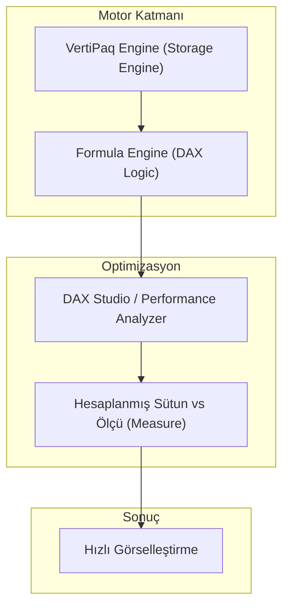

## 📌 Özet
İleri DAX ve Performans Optimizasyonu, karmaşık iş mantıklarını hızlı ve ölçeklenebilir raporlara dönüştürmenin anahtarıdır. "Filter Context" ve "Row Context" arasındaki etkileşimi (Context Transition) anlamak, doğru hesaplamalar yapabilmek için kritik öneme sahiptir. VertiPaq motorunun çalışma prensiplerine hakim olmak, DAX Studio gibi araçlarla performans profillemesi yapmak, özellikle milyonlarca satırlık büyük veri setlerinde raporların milisaniyeler içinde yanıt vermesini sağlar.

---

## 🧠 Detay

### ⚡ Power BI Performans Katmanları



### 1. Context Transition (Bağlam Geçişi)
`CALCULATE` veya `CALCULATETABLE` fonksiyonları kullanıldığında, mevcut "Row Context" otomatik olarak "Filter Context"e dönüştürülür. Bu, özellikle iteratif fonksiyonlar (SUMX, FILTER) içinde ölçü (measure) çağrıldığında ortaya çıkan ve performansı etkileyebilen en temel kavramdır.

### 2. İleri Filtreleme Stratejileri
- **KEEPFILTERS:** Mevcut filtreleri ezmek yerine onlarla kesişim (AND mantığı) kurar.
- **ALL vs ALLSELECTED:** Filtre temizleme işlemlerinde görseldeki seçimleri koruma veya tamamen temizleme farkını belirler.
- **TREATAS:** İlişkisiz tablolar arasında sanal ilişkiler kurarak filtre aktarımı sağlar.

### 3. Performans Optimizasyon İpuçları
- **Sütun Kardinalitesi:** Yüksek kardinaliteye sahip (Unique ID gibi) sütunlar VertiPaq motorunda çok yer kaplar. Gereksiz sütunları silin.
- **Measure Kullanımı:** Mümkünse "Calculated Column" yerine "Measure" tercih edin; çünkü sütunlar RAM tüketirken, ölçüler çalışma anında (CPU) hesaplanır.
- **Hatalı Fonksiyonlar:** `FILTER(ALL(Table), ...)` yerine `CALCULATE` içindeki direkt filtre argümanlarını kullanın.

### 🛠️ Örnek: Performans Odaklı YTD ve Önceki Yıl Karşılaştırması
```dax
-- Hatalı (Yavaş olabilir)
Satis_YTD = CALCULATE(SUM(Sales[Amount]), FILTER(ALL('Date'), 'Date'[Year] = MAX('Date'[Year])))

-- Doğru (Performanslı - Time Intelligence)
Satis_YTD_Opt = TOTALYTD([Toplam_Satis], 'Date'[Date])

-- Context Transition Örneği
Satis_Büyük_Islemler = 
    SUMX(
        Sales,
        IF([Toplam_Satis] > 1000, Sales[Amount], 0) -- Buradaki [Toplam_Satis] CALCULATE içerir.
    )
```

### 🔍 DAX Studio ile Profilleme
DAX Studio kullanarak bir sorgunun ne kadarının **Storage Engine (SE)** ne kadarının **Formula Engine (FE)** tarafından harcandığını görebilirsiniz. FE tek çekirdekli çalışırken, SE çok çekirdekli çalışabilir; bu yüzden mantığı SE'ye (VertiPaq) itmek performansı artırır.

---

## 💡 Bağlantılar
- [[Power BI - Veri Modelleme (DAX)]]
- [[BI - Veri Ambarı ve ETL Stratejileri]]
- [[DS - Büyük Veri ile Çalışma (Polars ve Dask)]]

## ❓ Sorular / Anlamadıklarım
- `CALCULATE` içindeki `USERELATIONSHIP` performansı nasıl etkiler?
- "Shadow Filter Context" nedir ve neden önemlidir?

## 🔗 Kaynaklar
- SQLBI (Marco Russo & Alberto Ferrari) - The Definitive Guide to DAX
- Microsoft Power BI Performance Best Practices
