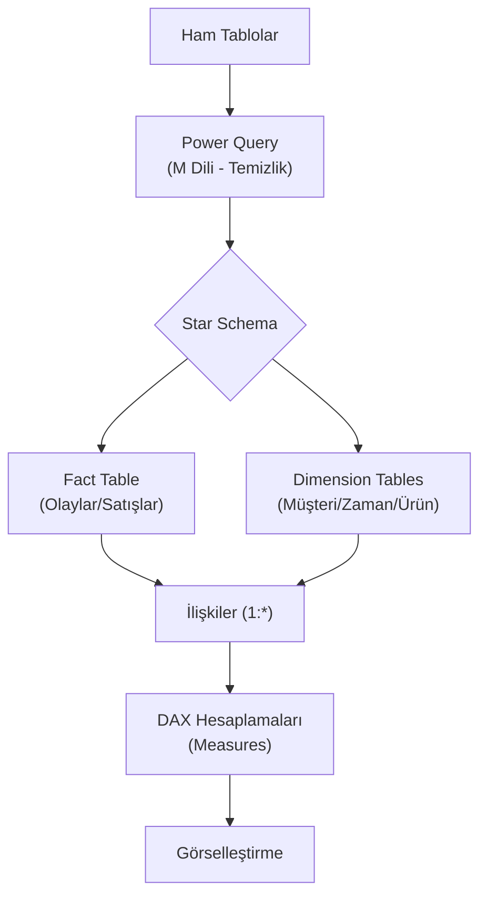

## 📌 Özet
Power BI'da başarılı bir raporun temeli, görsellerden ziyade güçlü bir veri modelidir. Veri modelleme süreci; farklı kaynaklardan gelen tabloları birbirine bağlamayı (İlişkiler) ve DAX (Data Analysis Expressions) diliyle karmaşık iş zekası hesaplamaları yapmayı kapsar. İyi bir model, raporların performansını artırırken, "Star Schema" gibi yapılar sayesinde verinin hem daha anlaşılır olmasını hem de hatasız filtrelenmesini sağlar.

---

## 🧠 Detay

### 🗺️ Power BI Modelleme Mimarisi



### 1. Star Schema (Yıldız Şeması) ⭐
BI projelerinde en çok tercih edilen veri modelleme yapısıdır.
- **Fact Table (Gerçeklik Tablosu):** Sayısal verilerin (miktar, tutar) bulunduğu merkezi tablo.
- **Dimension Tables (Boyut Tabloları):** Fact tablosundaki veriyi tanımlayan (kim, ne zaman, nerede) açıklayıcı tablolar.

### 2. DAX (Data Analysis Expressions) Nedir?
Power BI içinde hesaplanmış sütunlar ve ölçüler (measures) oluşturmak için kullanılan fonksiyonel dildir.
- **Calculated Columns:** Satır bazında hesaplanır, model boyutunu artırır.
- **Measures (Ölçüler):** Dinamik olarak hesaplanır, performansı korur. Filtre değiştikçe sonucu güncellenir.

### 3. Temel DAX Fonksiyonları

| Fonksiyon | Açıklama |
|-----------|----------|
| **SUMX** | Satır bazında işlem yapıp sonucu toplar. |
| **CALCULATE** | Mevcut filtre bağlamını değiştirerek hesaplama yapar. (En güçlü fonksiyon!) |
| **TOTALYTD** | Yıl başından bugüne kümülatif toplam alır. |
| **RELATED** | İlişkili başka bir tablodan veri getirir. |

```dax
// Örnek Satış Ölçüsü
Toplam Satis = SUM(Satislar[Tutar])

// Geçen Yıl Satış (Time Intelligence)
Gecen Yil Satis = CALCULATE([Toplam Satis], SAMEPERIODLASTYEAR('Takvim'[Tarih]))
```

---

## 💡 Bağlantılar
- [[BI - Giriş ve Temel Kavramlar]]
- [[DS - SQL ve Veritabanı Kullanımı]]
- [[İstatistik - Betimsel İstatistik]]

## ❓ Sorular / Anlamadıklarım
- Power BI'da "Many-to-Many" ilişkiler neden tehlikelidir?
- M Dili ile DAX arasındaki temel fark nedir? (Cevap: M veri temizliği, DAX analiz içindir).

## 🔗 Kaynaklar
- [DAX Guide](https://dax.guide/)
- [SQLBI - Star Schema Guide](https://www.sqlbi.com/articles/star-schema-revisited/)
