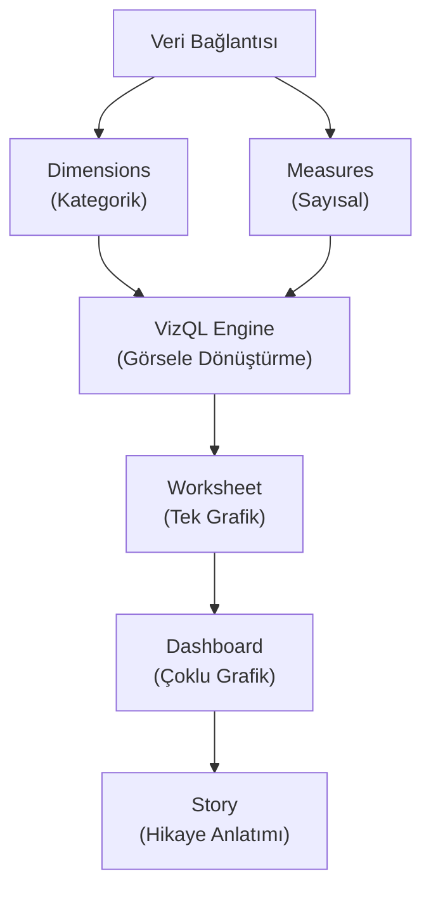

## 📌 Özet
Tableau, veri görselleştirme odaklı bir iş zekası aracıdır ve "Görsel Analitik" kavramının öncülerinden biridir. Sürükle-bırak mantığına dayanan arayüzü sayesinde, karmaşık veri setlerinden dakikalar içinde etkileyici grafikler ve interaktif dashboardlar üretilmesini sağlar. Tableau'nun en güçlü yanı, veriyi sadece sunmak değil, keşfetmek (Exploratory Data Analysis) için tasarlanmış olmasıdır. Büyük veri setlerine hızlıca bağlanabilmesi ve geniş grafik kütüphanesiyle veri hikayeleştirme (data storytelling) için idealdir.

---

## 🧠 Detay

### 🗺️ Tableau Çalışma Mantığı

### 1. Temel Bileşenler
- **Dimensions (Boyutlar):** Mavi renkle gösterilen, veriyi gruplandıran kategorik sütunlar (örn: Bölge, Kategori).
- **Measures (Ölçüler):** Yeşil renkle gösterilen, matematiksel işlem yapılabilen sayısal sütunlar (örn: Satış, Kar).
- **VizQL:** Tableau'nun patentli teknolojisidir; yapılan her sürükle-bırak işlemini arka planda veritabanı sorgusuna dönüştürür.

### 2. Hesaplamalar (Calculations)
Tableau'da üç ana hesaplama türü vardır:
- **Basic Expressions:** Satır bazlı veya basit agregasyonlar.
- **LOD Expressions (Level of Detail):** Belirli bir detay seviyesinde (örn: sadece şehre göre) sabitlenmiş hesaplamalar. `FIXED`, `INCLUDE`, `EXCLUDE` anahtar kelimeleriyle kullanılır.
- **Table Calculations:** Tablodaki mevcut hücreler üzerinden yapılan hesaplamalar (örn: Yüzde payı, Sıralama).

### 3. Tableau Dashboard Tasarım İlkeleri
- **Filtreler:** Kullanıcının veriyi manipüle etmesini sağlayan interaktif kutucuklar.
- **Actions (Aksiyonlar):** Bir grafiğe tıklandığında diğer grafiklerin de otomatik güncellenmesini sağlar.
- **Tiled vs Floating:** Grafiklerin ekrana sabitlenmiş (tiled) veya serbest (floating) yerleştirilmesi.

---

## 💡 Bağlantılar
- [[BI - Giriş ve Temel Kavramlar]]
- [[BI - Power BI vs Tableau Karşılaştırması]]
- [[DS - Veri Görselleştirme İlkeleri]]

## ❓ Sorular / Anlamadıklarım
- LOD Expressions ne zaman tercih edilmelidir?
- Tableau Public ve Desktop sürümleri arasındaki temel farklar nelerdir?

## 🔗 Kaynaklar
- [Tableau Learning Path](https://www.tableau.com/learn/training)
- [VizSQL Technology](https://www.tableau.com/about/blog/2014/12/vizql-tableau-35432)
