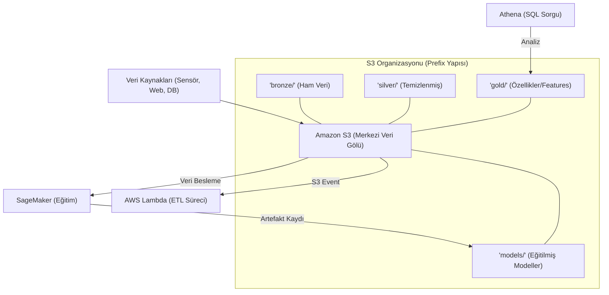

## 📌 Özet
Amazon S3 (Simple Storage Service), internetin her yerinden istenilen miktarda veriyi depolamak ve geri çağırmak için tasarlanmış; yüksek dayanıklılığa sahip, ölçeklenebilir ve güvenli bir nesne depolama servisidir. Makine öğrenmesi yaşam döngüsünde S3, ham veri setleri, işlenmiş öznitelikler (features) ve versiyonlanmış model çıktıları (artifacts) için merkezi bir "Veri Gölü" (Data Lake) görevi görür. SageMaker ve Lambda gibi diğer AWS servisleriyle olan derin entegrasyonu sayesinde, dosya yüklemelerinin otomatik olarak veri işleme boru hatlarını veya model yayına alma süreçlerini tetiklemesine olanak tanır. Yaşam döngüsü politikaları (lifecycle policies) ile otomatik maliyet optimizasyonu ve hassas erişim kontrolü (IAM/Bucket Policy) gibi özellikleri, S3'ü sağlam ve maliyet etkin veri odaklı bulut mimarileri oluşturmak için vazgeçilmez bir araç haline getirir.

## 🧠 Detay



### Temel Kavramlar
```
Bucket    → Konteynır (benzersiz global isim)
Object    → Depolanan dosya/veri
Prefix    → Klasör yapısı simülasyonu
Region    → Verinin tutulduğu bölge
Versioning → Dosya versiyonlama
Lifecycle  → Otomatik arşiv/silme kuralı
```

### Kurulum ve Kimlik Doğrulama
```bash
pip install boto3
aws configure   # AWS CLI ile kimlik ayarla
# AWS Access Key ID
# AWS Secret Access Key
# Region: eu-west-1
```

### Temel Operasyonlar
```python
import boto3
from botocore.exceptions import ClientError

# Client oluştur
s3 = boto3.client("s3", region_name="eu-west-1")

# Bucket oluştur
s3.create_bucket(
    Bucket="ml-veri-golum",
    CreateBucketConfiguration={"LocationConstraint": "eu-west-1"}
)

# Dosya yükle
s3.upload_file(
    Filename="yerel/egitim.parquet",
    Bucket="ml-veri-golum",
    Key="data/egitim/2026/05/egitim.parquet"
)

# Büyük dosya (multipart)
s3.upload_file(
    Filename="buyuk_model.pkl",
    Bucket="ml-veri-golum",
    Key="models/buyuk_model.pkl",
    Config=boto3.s3.transfer.TransferConfig(
        multipart_threshold=1024*25,  # 25 MB üzeri multipart
        max_concurrency=10
    )
)

# İndir
s3.download_file("ml-veri-golum", "data/egitim.parquet", "indirildi.parquet")

# Listele
response = s3.list_objects_v2(Bucket="ml-veri-golum", Prefix="data/")
for obj in response.get("Contents", []):
    print(obj["Key"], obj["Size"])

# Sil
s3.delete_object(Bucket="ml-veri-golum", Key="data/eski_veri.csv")
```

### Pandas ile Doğrudan S3
```python
import pandas as pd
import s3fs

# s3fs ile pandas entegrasyonu
fs = s3fs.S3FileSystem(anon=False)

# Oku
df = pd.read_parquet("s3://ml-veri-golum/data/egitim.parquet")
df = pd.read_csv("s3://ml-veri-golum/data/egitim.csv")

# Yaz
df.to_parquet("s3://ml-veri-golum/data/islenmis.parquet", index=False)
df.to_csv("s3://ml-veri-golum/data/cikti.csv", index=False)
```

### Resource API (Nesne Yönelimli)
```python
s3_resource = boto3.resource("s3")
bucket = s3_resource.Bucket("ml-veri-golum")

# Tüm dosyaları listele
for obj in bucket.objects.filter(Prefix="data/"):
    print(obj.key)

# İçeriği string olarak oku
obj = s3_resource.Object("ml-veri-golum", "data/config.json")
icerik = obj.get()["Body"].read().decode("utf-8")

# BytesIO ile belleğe oku
from io import BytesIO
import pickle

obj = s3_resource.Object("ml-veri-golum", "models/rf_model.pkl")
model_bytes = BytesIO(obj.get()["Body"].read())
model = pickle.load(model_bytes)
```

### Presigned URL
```python
# Geçici erişim URL'i oluştur
url = s3.generate_presigned_url(
    "get_object",
    Params={"Bucket": "ml-veri-golum", "Key": "raporlar/sonuc.pdf"},
    ExpiresIn=3600   # 1 saat
)
print(f"Paylaşılabilir URL: {url}")

# PUT için presigned URL (yükleme izni)
put_url = s3.generate_presigned_url(
    "put_object",
    Params={"Bucket": "ml-veri-golum", "Key": "yuklemeler/veri.csv"},
    ExpiresIn=1800
)
```

### S3 Event ile Lambda Tetikleme
```python
# S3 bucket policy - yeni dosya gelince Lambda tetikle
# (AWS Console'da veya CDK/Terraform ile ayarlanır)
# Konfigürasyon örneği:
event_config = {
    "LambdaFunctionConfigurations": [{
        "LambdaFunctionArn": "arn:aws:lambda:...",
        "Events": ["s3:ObjectCreated:*"],
        "Filter": {"Key": {"FilterRules": [
            {"Name": "prefix", "Value": "bronze/"},
            {"Name": "suffix", "Value": ".parquet"}
        ]}}
    }]
}
```

### S3 Lifecycle Policy
```python
lifecycle_config = {
    "Rules": [{
        "ID": "veri-arsivleme",
        "Status": "Enabled",
        "Filter": {"Prefix": "bronze/"},
        "Transitions": [
            {"Days": 30, "StorageClass": "STANDARD_IA"},   # 30 gün sonra ucuz
            {"Days": 90, "StorageClass": "GLACIER"}         # 90 gün sonra arşiv
        ],
        "Expiration": {"Days": 365}                         # 1 yıl sonra sil
    }]
}
s3.put_bucket_lifecycle_configuration(
    Bucket="ml-veri-golum",
    LifecycleConfiguration=lifecycle_config
)
```

## 💡 Bağlantılar
- [[Cloud - Bulut Bilişime Giriş]]
- [[AWS - SageMaker ile ML]]
- [[AWS - Lambda ile Serverless]]
- [[DS - Pandas Veri Okuma ve Yazma]]

## ❓ Sorular / Anlamadıklarım
- S3 Intelligent-Tiering ne zaman kullanılır?
- Cross-region replication nasıl kurulur?

## 🔗 Kaynaklar
- https://boto3.amazonaws.com/v1/documentation/api/latest/reference/services/s3.html
