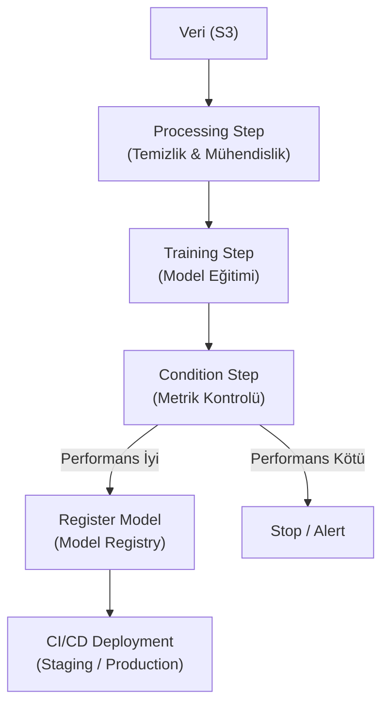

## 📌 Özet
Amazon SageMaker Pipelines, makine öğrenmesi iş akışlarını otomatize etmek ve ölçeklendirmek için kullanılan ilk yerel (native) CI/CD hizmetidir. Veri hazırlama, model eğitimi, hiperparametre optimizasyonu ve model kaydı (registry) gibi adımları tek bir boru hattı (pipeline) altında birleştirir. SageMaker Pipelines sayesinde, veri bilimciler Python SDK kullanarak karmaşık iş akışlarını tanımlayabilir ve bu akışların her adımını bulut üzerinde izlenebilir, tekrarlanabilir ve yönetilebilir hale getirebilirler. Bu araç, MLOps prensiplerini AWS ekosisteminde hayata geçirmek için temel taşıdır.

---

## 🧠 Detay

### 🗺️ SageMaker Pipeline İş Akışı

### 1. Temel Bileşenler (Pipeline Steps)
- **ProcessingStep:** Veri temizleme ve özellik mühendisliği (FE) için scriptlerin çalıştırıldığı adım.
- **TrainingStep:** Modelin eğitildiği adım. Kaynak yönetimi ve Docker konteyner kullanımı otomatikleşir.
- **TuningStep:** En iyi hiperparametreleri bulmak için çoklu eğitim süreçlerini yönetir.
- **ModelStep:** Eğitilen modeli AWS Model Registry'ye kaydeder.
- **ConditionStep:** "Eğer RMSE < 0.5 ise devam et" gibi mantıksal kontrol noktaları sağlar.

### 2. SageMaker Model Registry ⭐
Modellerin versiyonlanmasını ve onay süreçlerini yönetir.
- **Model Groups:** Aynı probleme ait model versiyonlarını gruplar.
- **Approval Status:** "Pending Manual Approval" seçeneği ile insan onayından sonra deployment'ı tetikleyebilir.

### 3. Deployment Seçenekleri
- **Real-time Inference:** Düşük gecikmeli tahminler için kalıcı uç noktalar (Endpoints).
- **Serverless Inference:** Trafiğe göre otomatik ölçeklenen, kullanım yokken maliyet yaratmayan çözüm.
- **Batch Transform:** Tüm bir veri kümesi üzerinde toplu tahmin yürütme.

### 4. İzlenebilirlik (Lineage)
SageMaker, bir modelin hangi veriyle eğitildiğini, hangi kodu kullandığını ve hangi artifact'leri ürettiğini otomatik olarak izler. Bu, özellikle regülasyonun yoğun olduğu sektörlerde (finans, sağlık) denetim için hayati önem taşır.

---

## 💡 Bağlantılar
- [[MLflow - Giriş ve Temel Kavramlar]]
- [[MLOps - Giriş ve Temel Kavramlar]]
- [[AWS - SageMaker ile ML]]

## ❓ Sorular / Anlamadıklarım
- SageMaker Studio içinden boru hatları nasıl görselleştirilir?
- Pipeline içindeki adımlar arası veri aktarımı (Property Files) nasıl yapılır?

## 🔗 Kaynaklar
- [AWS SageMaker Pipelines Official Docs](https://aws.amazon.com/sagemaker/pipelines/)
- [SageMaker Immersion Day - MLOps Module](https://catalog.us-east-1.prod.workshops.aws/workshops/6306959c-461f-431a-9860-5a4d38274546/en-US)
