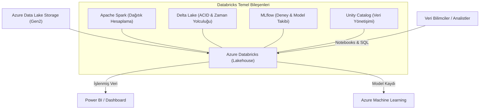

## 📌 Özet
Azure Databricks, Apache Spark üzerine kurulu, büyük veri analitiği ve makine öğrenmesi süreçlerini hızlandırmak için optimize edilmiş tam yönetilen bir bulut platformudur. Delta Lake teknolojisi aracılığıyla "Lakehouse" mimarisini destekleyerek; veri göllerinin esnekliği ve düşük maliyetini, veri ambarlarının sunduğu ACID işlem garantisi ve güvenilirlik ile birleştirir. MLflow entegrasyonu sayesinde deney takibi ve model yönetimini kolaylaştırırken, Azure ekosistemindeki Data Lake Storage ve Power BI gibi servislerle kusursuz bir uyum içinde çalışır. Petabayt ölçeğindeki verileri işleyebilen otomatik ölçeklenebilir hesaplama kümeleri (clusters) ve işbirlikçi çalışma ortamı (notebooks), Databricks'i modern veri mühendisliği ve büyük ölçekli yapay zeka projeleri için endüstri lideri bir çözüm haline getirir.

## 🧠 Detay



### Temel Kavramlar
```
Cluster      → Spark hesaplama kümesi
Notebook     → Etkileşimli kod ortamı
Job          → Zamanlanmış veya tetiklenen çalışma
Delta Lake   → ACID destekli veri gölü formatı
Unity Catalog → Merkezi veri yönetimi
MLflow       → Entegre deney takibi
```

### PySpark ile Veri İşleme
```python
from pyspark.sql import SparkSession
from pyspark.sql import functions as F
from pyspark.sql.types import *

spark = SparkSession.builder.appName("ML Pipeline").getOrCreate()

# Blob Storage'dan oku
df = spark.read.parquet("abfss://bronze@storageaccount.dfs.core.windows.net/satislar/")

# Temel işlemler
print(f"Satır sayısı: {df.count()}")
df.printSchema()
df.show(5)

# Filtreleme ve dönüştürme
temiz_df = df \
    .filter(F.col("tutar") > 0) \
    .filter(F.col("tarih").isNotNull()) \
    .withColumn("yil", F.year("tarih")) \
    .withColumn("ay", F.month("tarih")) \
    .withColumn("log_tutar", F.log(F.col("tutar") + 1)) \
    .dropDuplicates(["siparis_id"])

# Gruplama
ozet = temiz_df.groupBy("musteri_id", "yil", "ay") \
    .agg(
        F.sum("tutar").alias("aylik_toplam"),
        F.count("siparis_id").alias("siparis_sayisi"),
        F.avg("tutar").alias("ort_tutar")
    )
```

### Delta Lake
```python
# Delta table oluştur
temiz_df.write \
    .format("delta") \
    .mode("overwrite") \
    .partitionBy("yil", "ay") \
    .save("abfss://silver@storageaccount.dfs.core.windows.net/satislar/")

# Delta table oku
delta_df = spark.read.format("delta") \
    .load("abfss://silver@storageaccount.dfs.core.windows.net/satislar/")

# MERGE (upsert)
from delta.tables import DeltaTable

delta_tablo = DeltaTable.forPath(spark, "abfss://silver@.../satislar/")
delta_tablo.alias("hedef").merge(
    yeni_df.alias("kaynak"),
    "hedef.siparis_id = kaynak.siparis_id"
).whenMatchedUpdateAll() \
 .whenNotMatchedInsertAll() \
 .execute()

# Time travel
df_dun = spark.read.format("delta") \
    .option("versionAsOf", 5) \
    .load("abfss://silver@.../satislar/")

# VACUUM (eski dosyaları temizle)
delta_tablo.vacuum(168)  # 7 gün
```

### MLflow ile Eğitim
```python
import mlflow
import mlflow.spark
from pyspark.ml.classification import RandomForestClassifier
from pyspark.ml.feature import VectorAssembler
from pyspark.ml.evaluation import BinaryClassificationEvaluator

# Feature vector
assembler = VectorAssembler(
    inputCols=["yas", "gelir", "kredi_skoru"],
    outputCol="features"
)
df_ml = assembler.transform(temiz_df)

train_df, test_df = df_ml.randomSplit([0.8, 0.2], seed=42)

with mlflow.start_run():
    rf = RandomForestClassifier(
        numTrees=100,
        maxDepth=5,
        labelCol="onay",
        featuresCol="features"
    )

    model = rf.fit(train_df)
    tahminler = model.transform(test_df)

    evaluator = BinaryClassificationEvaluator(labelCol="onay")
    auc = evaluator.evaluate(tahminler)

    mlflow.log_metric("auc", auc)
    mlflow.spark.log_model(model, "model")
    print(f"AUC: {auc:.4f}")
```

### Databricks Connect (Lokal Geliştirme)
```bash
pip install databricks-connect==13.3.*

databricks configure --token
# Host: https://adb-xxxx.azuredatabricks.net
# Token: dapi...
```

```python
from databricks.connect import DatabricksSession

spark = DatabricksSession.builder.getOrCreate()
# Artık lokal bilgisayardan remote cluster kullanabilirsin
```

### Notebook'tan Job Oluşturma
```python
# Databricks API ile job tetikle
import requests

headers = {"Authorization": f"Bearer {DATABRICKS_TOKEN}"}
job_config = {
    "name": "Haftalik ML Pipeline",
    "schedule": {"quartz_cron_expression": "0 0 2 * * ?"},
    "tasks": [{
        "task_key": "egitim",
        "notebook_task": {"notebook_path": "/ML/egitim_notebook"},
        "existing_cluster_id": "CLUSTER_ID"
    }]
}
requests.post(f"{DATABRICKS_HOST}/api/2.1/jobs/create",
              json=job_config, headers=headers)
```

## 💡 Bağlantılar
- [[Azure - Blob Storage ve Veri Gölü]]
- [[Azure - Azure Machine Learning]]
- [[MLOps - MLflow ile Deney Takibi]]
- [[DS - Zaman Serisi Analizi]]

## ❓ Sorular / Anlamadıklarım
- Databricks ne zaman Azure ML'den daha iyi?
- Delta Live Tables ne zaman kullanılır?

## 🔗 Kaynaklar
- https://docs.databricks.com/
- https://delta.io/
