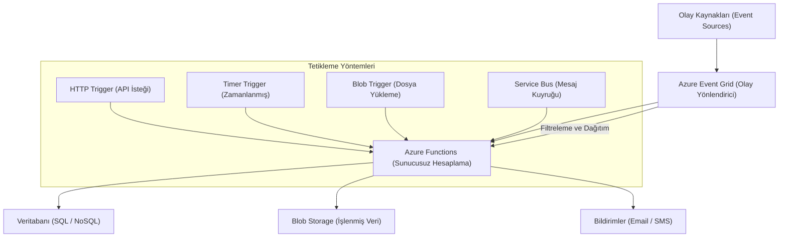

## 📌 Özet
Azure Functions, altyapı yönetimi ve sunucu bakımı gerektirmeden "fonksiyon" adı verilen küçük kod parçacıklarını çalıştırmanıza olanak tanıyan olay tabanlı bir sunucusuz (serverless) hesaplama servisidir. Event Grid ile olan güçlü entegrasyonu sayesinde; farklı Azure servisleri arasında gevşek bağlı (decoupled) ve tepkisel (reactive) mimariler kurarak, sistem genelindeki olaylara anında yanıt verilmesini sağlar. Makine öğrenmesi projelerinde bu yapı; veri gölüne yeni veri eklendiğinde ön işleme adımlarını başlatmak, hafif modelleri ölçeklenebilir HTTP API'leri olarak sunmak veya model performans düşüşü gibi uyarılara göre MLOps iş akışlarını otomatik olarak tetiklemek için idealdir. Yalnızca kodun çalıştığı işlem süresi kadar maliyet yansıtması, Functions'ı hem ekonomik hem de yüksek oranda ölçeklenebilir bir otomasyon ve mikroservis aracı haline getirir.

## 🧠 Detay



### Azure Functions Tetikleyicileri
```
HTTP Trigger     → REST API olarak çalışır
Timer Trigger    → Zamanlanmış çalışma (cron)
Blob Trigger     → Blob oluşturulunca tetikle
Queue Trigger    → Kuyruğa mesaj gelince tetikle
Event Grid       → Event gelince tetikle
Service Bus      → Mesaj kuyruğu
```

### HTTP Trigger (ML API)
```python
# function_app.py
import azure.functions as func
import json
import joblib
import numpy as np

app = func.FunctionApp()

# Model bir kez yükle
model = joblib.load("model/rf_model.pkl")
scaler = joblib.load("model/scaler.pkl")

@app.route(route="tahmin", methods=["POST"])
def tahmin_func(req: func.HttpRequest) -> func.HttpResponse:
    try:
        body = req.get_json()
        veri = np.array([[
            body["yas"], body["gelir"], body["kredi_skoru"]
        ]])

        veri_scaled = scaler.transform(veri)
        tahmin = int(model.predict(veri_scaled)[0])
        olasilik = float(model.predict_proba(veri_scaled)[0].max())

        sonuc = {"tahmin": tahmin, "olasilik": olasilik}
        return func.HttpResponse(
            json.dumps(sonuc),
            status_code=200,
            mimetype="application/json"
        )
    except Exception as e:
        return func.HttpResponse(str(e), status_code=400)
```

### Timer Trigger (Zamanlanmış İş)
```python
@app.timer_trigger(
    schedule="0 0 2 * * 1",   # Her Pazartesi 02:00
    arg_name="timer"
)
def haftalik_egitim(timer: func.TimerRequest):
    """Her hafta modeli yeniden eğit"""
    from src.retraining import main
    sonuc = main()

    # Log gönder
    import logging
    logging.info(f"Haftalık eğitim tamamlandı: {sonuc}")
```

### Blob Trigger (Veri Pipeline)
```python
@app.blob_trigger(
    arg_name="myblob",
    path="bronze/{name}",
    connection="AzureWebJobsStorage"
)
def yeni_veri_isle(myblob: func.InputStream):
    """Bronze'a yeni dosya gelince Silver'a işle"""
    import pandas as pd
    from io import BytesIO

    # Ham veriyi oku
    ham_veri = pd.read_parquet(BytesIO(myblob.read()))

    # Temizle ve dönüştür
    temiz_veri = ham_veri.dropna().drop_duplicates()

    # Silver'a yaz
    from azure.storage.blob import BlobServiceClient
    blob_client = BlobServiceClient.from_connection_string(CONN_STR)
    # ...
```

### local.settings.json
```json
{
  "IsEncrypted": false,
  "Values": {
    "AzureWebJobsStorage": "UseDevelopmentStorage=true",
    "FUNCTIONS_WORKER_RUNTIME": "python",
    "API_KEY": "gizli-anahtar",
    "MODEL_PATH": "/app/model/rf_model.pkl"
  }
}
```

### Deploy
```bash
# Azure Functions Core Tools
npm install -g azure-functions-core-tools@4

# Lokal test
func start

# Azure'a deploy
func azure functionapp publish my-ml-functions
```

### requirements.txt (Functions için)
```
azure-functions
scikit-learn==1.4.2
numpy==1.26.4
joblib==1.4.0
pandas==2.2.2
azure-storage-blob==12.19.0
```

### Event Grid ile Tetikleme
```python
# Başka bir servis event publish ettiğinde tetiklenir
@app.event_grid_trigger(arg_name="event")
def model_yenile(event: func.EventGridEvent):
    event_data = event.get_json()

    if event_data.get("tip") == "drift_tespit_edildi":
        from src.retraining import main
        main()
```

## 💡 Bağlantılar
- [[Cloud - Bulut Bilişime Giriş]]
- [[Azure - Blob Storage ve Veri Gölü]]
- [[MLOps - Otomatik Yeniden Eğitim]]
- [[API - FastAPI Async ve Background Tasks]]

## ❓ Sorular / Anlamadıklarım
- Functions Premium Plan ile Consumption Plan ne zaman hangisi?
- Cold start problemi nasıl çözülür?

## 🔗 Kaynaklar
- https://learn.microsoft.com/tr-tr/azure/azure-functions/
