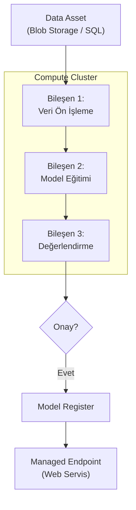

## 📌 Özet
Azure Machine Learning (AML) Pipelines, karmaşık makine öğrenmesi görevlerini birleştiren ve otomatize eden bir orkestrasyon aracıdır. Her bir adımın (veri çekme, eğitim, test vb.) bağımsız bir birim olarak tanımlandığı bu yapı, hem kaynak verimliliğini (sadece değişen adımları çalıştırarak) hem de işbirliğini artırır. Azure ML SDK v2 ile birlikte "bileşen tabanlı" (component-based) mimari ön plana çıkmıştır; bu sayede oluşturulan bir eğitim kodu, farklı boru hatları içerisinde tekrar tekrar kullanılabilir. Azure, hem kod yazarak (Python) hem de sürükle-bırak yöntemiyle (Designer) boru hattı tasarlanmasına olanak tanır.

---

## 🧠 Detay

### 🗺️ Azure ML Pipeline ve Deployment Yapısı

### 1. Azure ML SDK v2 ve İşler (Jobs)
Modern Azure ML mimarisinde her şey bir "Job" (İş) olarak tanımlanır:
- **Command Job:** Tek bir script çalıştırır.
- **Sweep Job:** Hiperparametre optimizasyonu yapar.
- **Pipeline Job:** Birden fazla işi birbirine bağlar.

### 2. Bileşenler (Components) ⭐
Bileşenler, bir pipeline adımının mantığını, ortamını (Docker image) ve giriş/çıkışlarını tanımlayan yeniden kullanılabilir yapılardır. Bir ekip arkadaşınızın yazdığı "Veri Temizleme" bileşenini kendi boru hattınıza kolayca dahil edebilirsiniz.

### 3. Model Dağıtımı (Serving)
Azure ML, modelleri servis etmek için iki ana yol sunar:
- **Online Endpoints:** Gerçek zamanlı tahminler için. Trafiği iki model arasında paylaştırabilme (Blue-Green Deployment) özelliği sunar.
- **Batch Endpoints:** Büyük veri setleri üzerinde periyodik olarak çalışan tahmin işleri için.

### 4. Azure DevOps & GitHub Actions Entegrasyonu
Azure ML, CI/CD süreçlerine tam entegre olur. Kod GitHub'a yüklendiğinde otomatik olarak bir Pipeline tetiklenebilir ve model başarılı olursa Azure Kubernetes Service (AKS) üzerine otomatik deploy edilebilir.

---

## 💡 Bağlantılar
- [[Azure - Azure Machine Learning]]
- [[MLOps - GitHub Actions ile CI-CD]]
- [[MLOps - Giriş ve Temel Kavramlar]]

## ❓ Sorular / Anlamadıklarım
- "Compute Instance" ile "Compute Cluster" arasındaki fark pipeline yönetimi için neden önemlidir?
- Azure ML Designer (Sürükle-Bırak) ile oluşturulan modeller kod ile nasıl yönetilir?

## 🔗 Kaynaklar
- [Azure Machine Learning Pipelines Overview](https://learn.microsoft.com/en-us/azure/machine-learning/concept-ml-pipelines)
- [AML SDK v2 GitHub Examples](https://github.com/Azure/azureml-examples)
