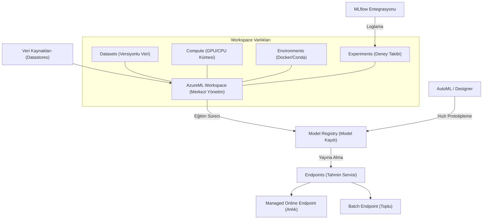

## 📌 Özet
Azure Machine Learning (AzureML), makine öğrenmesi modellerinin geliştirilmesi, eğitilmesi, yayına alınması ve yönetilmesi süreçlerini uçtan uca kapsayan kurumsal düzeyde bir bulut servisidir. Veri bilimciler ve geliştiriciler için; ölçeklenebilir hesaplama kümeleri, otomatik makine öğrenmesi (AutoML) ve MLflow entegrasyonu gibi güçlü araçlar sunarak deney takibini ve model yönetimini standartlaştırır. "Workspace" yapısı altında toplanan veri setleri, yazılım ortamları (environments) ve modeller, projelerin tam olarak yeniden üretilebilirliğini ve takımlar arası işbirliğini sağlar. Modern MLOps pratiklerini destekleyen yapısıyla; model performansını izleme, versiyonlama ve CI/CD süreçlerine entegrasyon gibi kritik operasyonel gereksinimleri profesyonel bir düzeyde karşılayan kapsamlı bir ekosistem sunar.

## 🧠 Detay



### Temel Kavramlar
```
Workspace    → Tüm AzureML kaynaklarının konteyneri
Compute      → Eğitim için hesaplama kaynağı
Datastore    → Veri bağlantıları (Blob, SQL vs)
Dataset      → Versiyonlanmış veri setleri
Environment  → Python ortamı (bağımlılıklar)
Experiment   → Deney grubu
Run          → Tek bir eğitim çalışması
Model        → Kaydedilmiş model
Endpoint     → Deploy edilmiş model servisi
Pipeline     → Adım adım ML iş akışı
```

### Python SDK ile Bağlantı
```python
pip install azure-ai-ml azure-identity

from azure.ai.ml import MLClient
from azure.identity import DefaultAzureCredential

# Kimlik doğrulama
credential = DefaultAzureCredential()

ml_client = MLClient(
    credential=credential,
    subscription_id="SUBSCRIPTION_ID",
    resource_group_name="ml-resource-group",
    workspace_name="ml-workspace"
)

print(f"Workspace: {ml_client.workspace_name}")
```

### Compute Cluster Oluşturma
```python
from azure.ai.ml.entities import AmlCompute

compute_config = AmlCompute(
    name="cpu-cluster",
    type="amlcompute",
    size="Standard_DS3_v2",      # VM boyutu
    min_instances=0,              # Boşta sıfıra in
    max_instances=4,              # Maksimum düğüm
    idle_time_before_scale_down=120
)

ml_client.begin_create_or_update(compute_config).result()
```

### Eğitim Script'i Çalıştırma
```python
# train.py (eğitim script'i)
import argparse
import mlflow
from sklearn.ensemble import RandomForestClassifier
from sklearn.metrics import accuracy_score

parser = argparse.ArgumentParser()
parser.add_argument("--n_estimators", type=int, default=100)
parser.add_argument("--max_depth", type=int, default=5)
args = parser.parse_args()

mlflow.autolog()

# Veri yükle ve eğit
model = RandomForestClassifier(
    n_estimators=args.n_estimators,
    max_depth=args.max_depth
)
model.fit(X_train, y_train)
mlflow.log_metric("accuracy", accuracy_score(y_test, model.predict(X_test)))
```

```python
# Azure'da çalıştır
from azure.ai.ml import command, Input
from azure.ai.ml.entities import Environment

# Ortam tanımla
env = Environment(
    name="ml-env",
    conda_file="conda.yaml",
    image="mcr.microsoft.com/azureml/openmpi4.1.0-ubuntu20.04"
)

# Job tanımla
job = command(
    code="./src",
    command="python train.py --n_estimators ${{inputs.n_est}} --max_depth ${{inputs.depth}}",
    inputs={
        "n_est": Input(type="integer", default=100),
        "depth": Input(type="integer", default=5)
    },
    environment=env,
    compute="cpu-cluster",
    display_name="rf-egitim",
    experiment_name="kredi-onay-deneyleri"
)

returned_job = ml_client.jobs.create_or_update(job)
ml_client.jobs.stream(returned_job.name)  # Log izle
```

### Model Kaydetme ve Deploy
```python
from azure.ai.ml.entities import Model, ManagedOnlineEndpoint, ManagedOnlineDeployment
from azure.ai.ml.constants import AssetTypes

# Modeli kaydet
model = Model(
    path="outputs/model/",
    type=AssetTypes.MLFLOW_MODEL,
    name="kredi-onay-modeli",
    description="Random Forest kredi onay modeli"
)
ml_client.models.create_or_update(model)

# Online endpoint oluştur
endpoint = ManagedOnlineEndpoint(
    name="kredi-onay-endpoint",
    auth_mode="key"
)
ml_client.online_endpoints.begin_create_or_update(endpoint).result()

# Deployment oluştur
deployment = ManagedOnlineDeployment(
    name="mavi",
    endpoint_name="kredi-onay-endpoint",
    model="kredi-onay-modeli:1",
    instance_type="Standard_DS2_v2",
    instance_count=1
)
ml_client.online_deployments.begin_create_or_update(deployment).result()
```

### Tahmin İsteği Gönderme
```python
import json

istek = {"input_data": {"columns": ["yas","gelir","kredi_skoru"],
                         "data": [[35, 8000, 720]]}}

yanit = ml_client.online_endpoints.invoke(
    endpoint_name="kredi-onay-endpoint",
    request_file=json.dumps(istek)
)
print(yanit)
```

### AutoML
```python
from azure.ai.ml import automl, Input

automl_job = automl.classification(
    compute="cpu-cluster",
    experiment_name="automl-kredi",
    training_data=Input(type="mltable", path="./data/egitim"),
    target_column_name="onay",
    primary_metric="accuracy",
    n_cross_validations=5,
    enable_model_explainability=True,
    timeout_minutes=60
)

returned_job = ml_client.jobs.create_or_update(automl_job)
```

## 💡 Bağlantılar
- [[Cloud - Bulut Bilişime Giriş]]
- [[Azure - Blob Storage ve Veri Gölü]]
- [[MLOps - MLflow ile Deney Takibi]]
- [[MLOps - Kubernetes ile ML Deploy]]

## ❓ Sorular / Anlamadıklarım
- Managed endpoint vs AKS endpoint ne zaman hangisi?
- AutoML sonuçlarını nasıl yorumlamalıyım?

## 🔗 Kaynaklar
- https://learn.microsoft.com/tr-tr/azure/machine-learning/
