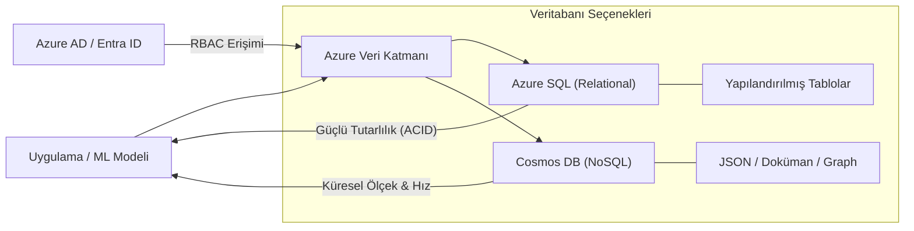

## 📌 Özet
Azure SQL Database, ilişkisel veri iş yükleri için yüksek erişilebilirlik, otomatik yamalama ve yapay zeka destekli performans optimizasyonu sunan tam yönetilen bir platform servisidir (PaaS). Azure Cosmos DB ise modern NoSQL iş yükleri için tasarlanmış; SQL, MongoDB ve Cassandra gibi farklı API'leri destekleyen, küresel ölçekte dağıtılmış ve milisaniye altı gecikme sunan çok modelli bir veritabanı servisidir. Bu iki servis, bulut tabanlı uygulamalar için kapsamlı bir veri stratejisi sunar: Azure SQL, güçlü tutarlılık ve karmaşık tablolar arası ilişkiler gerektiren yapılandırılmış veriler için idealdir; Cosmos DB ise gerçek zamanlı yüksek hacimli veri akışları ve dünya çapında yaygınlık gerektiren senaryolarda öne çıkar. `pyodbc` ve `azure-cosmos` gibi Python kütüphaneleriyle olan derin entegrasyonları, geliştiricilerin veri yoğunluklu uygulamaları ve makine öğrenmesi boru hatlarını güvenli ve performanslı bir şekilde inşa etmelerine olanak tanır.

## 🧠 Detay



### Azure SQL Database

#### Bağlantı
```bash
pip install pyodbc sqlalchemy azure-identity
```

```python
import pyodbc
import pandas as pd
from sqlalchemy import create_engine
import urllib

# Connection string
server = "server-adi.database.windows.net"
database = "veritabanim"
username = "admin"
password = "Sifre123!"

conn_str = (
    f"DRIVER={{ODBC Driver 18 for SQL Server}};"
    f"SERVER={server};"
    f"DATABASE={database};"
    f"UID={username};"
    f"PWD={password};"
    "Encrypt=yes;"
    "TrustServerCertificate=no;"
)

# SQLAlchemy engine
params = urllib.parse.quote_plus(conn_str)
engine = create_engine(f"mssql+pyodbc:///?odbc_connect={params}")

# Pandas ile oku
df = pd.read_sql("SELECT TOP 1000 * FROM Musteriler WHERE Aktif = 1", engine)

# Yaz
df.to_sql("TahminSonuclari", engine, if_exists="append", index=False)
```

#### Managed Identity ile Bağlantı (Önerilen)
```python
from azure.identity import DefaultAzureCredential
import struct

credential = DefaultAzureCredential()
token = credential.get_token("https://database.windows.net/.default")

token_bytes = token.token.encode("UTF-16-LE")
token_struct = struct.pack(f"<I{len(token_bytes)}s", len(token_bytes), token_bytes)

conn = pyodbc.connect(
    f"DRIVER={{ODBC Driver 18 for SQL Server}};SERVER={server};DATABASE={database}",
    attrs_before={1256: token_struct}
)
```

#### Bulk Insert
```python
# Hızlı toplu insert
import pyodbc

conn = pyodbc.connect(conn_str)
conn.autocommit = False
cursor = conn.cursor()
cursor.fast_executemany = True

data = df.values.tolist()
cursor.executemany(
    "INSERT INTO TahminLog (MusteriID, Tahmin, Olasilik) VALUES (?, ?, ?)",
    data
)
conn.commit()
```

### Azure Cosmos DB

#### Kurulum
```bash
pip install azure-cosmos
```

#### Temel İşlemler
```python
from azure.cosmos import CosmosClient, PartitionKey

# Bağlan
endpoint = "https://cosmos-account.documents.azure.com:443/"
key = "COSMOS_KEY"

client = CosmosClient(endpoint, key)

# Database ve container
db = client.get_database_client("ml-veritabani")
container = db.get_container_client("tahmin-loglar")

# Veri yaz (upsert)
tahmin_log = {
    "id": "log-001",
    "musteri_id": 12345,
    "tahmin": 1,
    "olasilik": 0.92,
    "model_versiyonu": "v1.0",
    "tarih": "2026-05-28T14:30:00"
}
container.upsert_item(tahmin_log)

# Veri oku
item = container.read_item(item="log-001", partition_key=12345)

# SQL sorgu
sorgu = "SELECT * FROM c WHERE c.tahmin = 1 AND c.olasilik > 0.9"
sonuclar = list(container.query_items(query=sorgu, enable_cross_partition_query=True))

# Toplu yazma
batch_data = [...]
for item in batch_data:
    container.upsert_item(item)
```

#### Pandas ile Cosmos DB
```python
def cosmos_sorgu_df(container, sorgu: str) -> pd.DataFrame:
    sonuclar = list(container.query_items(
        query=sorgu,
        enable_cross_partition_query=True
    ))
    return pd.DataFrame(sonuclar)

df = cosmos_sorgu_df(container,
    "SELECT c.musteri_id, c.tahmin, c.olasilik FROM c WHERE c.tarih > '2026-01-01'")
```

### Karşılaştırma
| | Azure SQL | Cosmos DB |
|---|---|---|
| Model | İlişkisel | NoSQL (JSON) |
| Ölçek | Dikey | Yatay (global) |
| Gecikme | Milisaniye | Milisaniye altı |
| Kullanım | OLTP, raporlama | Gerçek zamanlı, IoT |
| Fiyat | Orta | Yüksek |

## 💡 Bağlantılar
- [[Cloud - Bulut Bilişime Giriş]]
- [[MSSQL - Python ile MSSQL Bağlantısı]]
- [[Azure - Blob Storage ve Veri Gölü]]

## ❓ Sorular / Anlamadıklarım
- Azure SQL Serverless ne zaman kullanılır?
- Cosmos DB partition key nasıl seçilir?

## 🔗 Kaynaklar
- https://learn.microsoft.com/tr-tr/azure/azure-sql/
- https://learn.microsoft.com/tr-tr/azure/cosmos-db/
