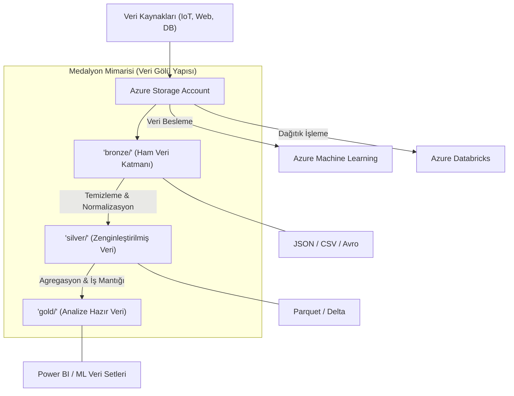

## 📌 Özet
Azure Blob Storage; dokümanlar, medya dosyaları ve ikili büyük nesneler (blobs) gibi yapılandırılmamış verileri devasa ölçeklerde güvenle depolamak için tasarlanmış bir nesne depolama çözümüdür. Azure Data Lake Storage (ADLS) Gen2 ise, bu sağlam altyapının üzerine hiyerarşik dizin yapısı ve büyük veri analitiği iş yükleri için özel performans optimizasyonları ekleyerek modern veri gölü (data lake) ihtiyaçlarını karşılar. Makine öğrenmesi ve veri mühendisliği süreçlerinde bu servisler; verinin ham halden (Bronze), temizlenmiş (Silver) ve analize hazır (Gold) seviyelere taşındığı "Medalyon Mimarisi"nin merkezi deposu olarak kritik bir rol oynar. Paylaşımlı Erişim İmzaları (SAS) ile güvenli veri paylaşımı ve Azure Databricks veya Pandas gibi popüler veri araçlarıyla olan doğrudan entegrasyonu, Azure bulutunda veri odaklı projelerin ölçeklenebilir omurgasını oluşturur.

## 🧠 Detay



### Temel Kavramlar
```
Storage Account → En üst düzey kaynak
Container       → Klasör gibi, blob'ları gruplar
Blob            → Gerçek veri dosyası

Blob Türleri:
  Block Blob  → Dosyalar (CSV, Parquet, resim)
  Append Blob → Log dosyaları
  Page Blob   → VM disk dosyaları
```

### Kurulum
```bash
pip install azure-storage-blob azure-identity
```

### Bağlantı
```python
from azure.storage.blob import BlobServiceClient
from azure.identity import DefaultAzureCredential

# Connection string ile
conn_str = "DefaultEndpointsProtocol=https;AccountName=...;AccountKey=...;"
client = BlobServiceClient.from_connection_string(conn_str)

# Managed Identity ile (önerilen)
account_url = "https://storageaccount.blob.core.windows.net"
credential = DefaultAzureCredential()
client = BlobServiceClient(account_url, credential=credential)
```

### Container ve Blob İşlemleri
```python
# Container oluştur
container_client = client.create_container("veri-golum")

# Dosya yükle
blob_client = client.get_blob_client(container="veri-golum", blob="data/egitim.csv")

with open("yerel/egitim.csv", "rb") as f:
    blob_client.upload_blob(f, overwrite=True)

# Büyük dosya yükleme (chunk)
from azure.storage.blob import BlobBlock
blob_client.upload_blob(
    data=open("buyuk_dosya.parquet", "rb"),
    blob_type="BlockBlob",
    overwrite=True,
    max_concurrency=4   # paralel yükleme
)

# İndir
with open("indirilen.csv", "wb") as f:
    download = blob_client.download_blob()
    download.readinto(f)

# Listele
container = client.get_container_client("veri-golum")
for blob in container.list_blobs(name_starts_with="data/"):
    print(blob.name, blob.size)

# Sil
blob_client.delete_blob()
```

### Pandas ile Doğrudan Okuma
```python
import pandas as pd
from azure.storage.blob import BlobServiceClient

def blob_oku(container: str, blob_yolu: str) -> pd.DataFrame:
    blob_client = client.get_blob_client(container=container, blob=blob_yolu)
    veri = blob_client.download_blob().readall()

    if blob_yolu.endswith(".csv"):
        from io import StringIO
        return pd.read_csv(StringIO(veri.decode("utf-8")))
    elif blob_yolu.endswith(".parquet"):
        from io import BytesIO
        return pd.read_parquet(BytesIO(veri))
    elif blob_yolu.endswith(".json"):
        from io import StringIO
        return pd.read_json(StringIO(veri.decode("utf-8")))

df = blob_oku("veri-golum", "data/egitim.parquet")
```

### SAS Token ile Güvenli Paylaşım
```python
from azure.storage.blob import generate_blob_sas, BlobSasPermissions
from datetime import datetime, timedelta

sas_token = generate_blob_sas(
    account_name="storageaccount",
    container_name="veri-golum",
    blob_name="data/rapor.pdf",
    account_key="STORAGE_KEY",
    permission=BlobSasPermissions(read=True),
    expiry=datetime.utcnow() + timedelta(hours=24)
)

sas_url = f"https://storageaccount.blob.core.windows.net/veri-golum/data/rapor.pdf?{sas_token}"
print(f"Paylaşılabilir URL: {sas_url}")
```

### ADLS Gen2 (Veri Gölü)
```python
from azure.storage.filedatalake import DataLakeServiceClient

adls_client = DataLakeServiceClient(
    account_url="https://storageaccount.dfs.core.windows.net",
    credential=DefaultAzureCredential()
)

# Klasör oluştur
file_system = adls_client.get_file_system_client("bronze")
file_system.create_directory("satislar/2026/05")

# Dosya yaz
file_client = file_system.get_file_client("satislar/2026/05/gun_01.parquet")
with open("gun_01.parquet", "rb") as f:
    file_client.upload_data(f, overwrite=True)
```

### Veri Gölü Katmanları (Medallion)
```
Bronze (Ham Veri):
  → API/DB'den gelen ham veri
  → Hiç dönüştürülmemiş
  → containers/bronze/

Silver (Temizlenmiş):
  → Temizlenmiş, doğrulanmış
  → containers/silver/

Gold (İş Verisi):
  → Aggregate, analiz hazır
  → containers/gold/
```

## 💡 Bağlantılar
- [[Cloud - Bulut Bilişime Giriş]]
- [[Azure - Azure Machine Learning]]
- [[Azure - Azure Databricks]]
- [[DS - Pandas Veri Okuma ve Yazma]]

## ❓ Sorular / Anlamadıklarım
- Blob Storage ile ADLS Gen2 ne zaman hangisi?
- Lifecycle policy ile eski verileri nasıl arşivlerim?

## 🔗 Kaynaklar
- https://learn.microsoft.com/tr-tr/azure/storage/blobs/
