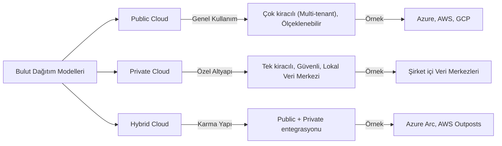
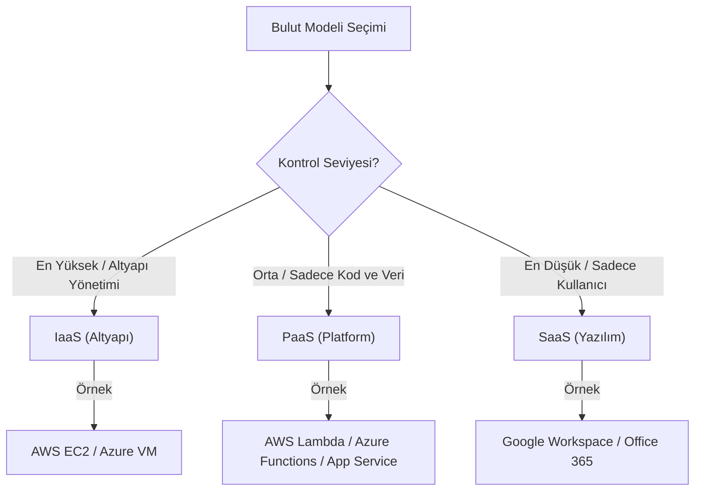

## 📌 Özet
Bulut bilişim, bilişim kaynaklarının (sunucu, depolama, veritabanı, ağ, yazılım) internet üzerinden isteğe bağlı ve "kullandıkça öde" modeliyle sunulmasıdır. Bu teknoloji, kurumların fiziksel sunucu yatırımı yapmadan ölçeklenebilir ve yüksek erişilebilirliğe sahip altyapılara anında ulaşmasını sağlayarak maliyet verimliliği ve esneklik sunar. Azure, AWS ve Google Cloud gibi global sağlayıcılar, veri biliminden yapay zekaya kadar geniş bir yelpazede hazır servisler sunarak modern uygulama geliştirme süreçlerini radikal bir şekilde hızlandırmıştır. Günümüzde bulut sistemleri, özellikle büyük veri analitiği ve model dağıtımı için gerekli olan hesaplama gücünü demokratikleştirerek her ölçekten geliştiricinin kullanımına sunmaktadır.

## 🧠 Detay

### 🏢 Bulut Dağıtım Modelleri (Public, Private, Hybrid)



### 🗺️ Bulut Servis Modelleri (IaaS, PaaS, SaaS)



### Servis Modelleri
```
IaaS (Infrastructure as a Service):
  → Sanal makineler, ağ, depolama
  → Örnek: Azure VM, AWS EC2
  → Kontrol: Yüksek, Yönetim: Fazla

PaaS (Platform as a Service):
  → Uygulama geliştirme platformu
  → Örnek: Azure App Service, AWS Elastic Beanstalk
  → Kontrol: Orta, Yönetim: Orta

SaaS (Software as a Service):
  → Hazır uygulama
  → Örnek: Microsoft 365, Salesforce
  → Kontrol: Düşük, Yönetim: Az
```

### Azure vs AWS Karşılaştırması
| Kategori | Azure | AWS |
|----------|-------|-----|
| Sanal Makine | Azure VM | EC2 |
| Nesne Depolama | Blob Storage | S3 |
| Veritabanı | Azure SQL | RDS |
| ML Platformu | Azure ML | SageMaker |
| Sunucusuz | Azure Functions | Lambda |
| Container | AKS | EKS |
| Veri Ambarı | Synapse | Redshift |
| Bildirim | Service Bus | SNS/SQS |

### Fiyatlandırma Modelleri
```
Pay-as-you-go:
  → Kullandığın kadar öde
  → Esnek, başlangıç için ideal

Reserved:
  → 1-3 yıl taahhüt
  → %40-70 indirim

Spot/Preemptible:
  → Boşta kapasiteyi ucuza kullan
  → İstediğinde kapatılabilir
  → ML eğitimi için ideal
```

### Data Science için Önemli Servisler
```
Azure:
  ✦ Azure Machine Learning  → ML platform
  ✦ Azure Databricks        → Büyük veri + Spark
  ✦ Azure Blob Storage      → Veri gölü
  ✦ Azure SQL Database      → İlişkisel DB
  ✦ Azure Cosmos DB         → NoSQL
  ✦ Azure Stream Analytics  → Gerçek zamanlı
  ✦ Power BI Premium        → Görselleştirme

AWS:
  ✦ SageMaker              → ML platform
  ✦ EMR                    → Büyük veri + Spark
  ✦ S3                     → Veri gölü
  ✦ RDS                    → İlişkisel DB
  ✦ DynamoDB               → NoSQL
  ✦ Kinesis                → Gerçek zamanlı
  ✦ QuickSight             → Görselleştirme
```

### Ücretsiz Katman
```
Azure Free:
  → 12 ay ücretsiz servisler
  → 25+ her zaman ücretsiz servis
  → $200 kredi (30 gün)

AWS Free Tier:
  → 12 ay ücretsiz servisler
  → Her zaman ücretsiz servisler
  → (Kredi yok)
```

## 💡 Bağlantılar
- [[Azure - Azure Machine Learning]]
- [[AWS - SageMaker ile ML]]
- [[Azure - Blob Storage ve Veri Gölü]]
- [[AWS - S3 ile Veri Depolama]]

## ❓ Sorular / Anlamadıklarım
- Azure mi AWS mi seçmeliyim?
- Multi-cloud strateji ne zaman mantıklı?

## 🔗 Kaynaklar
- https://azure.microsoft.com/tr-tr/free/
- https://aws.amazon.com/tr/free/
