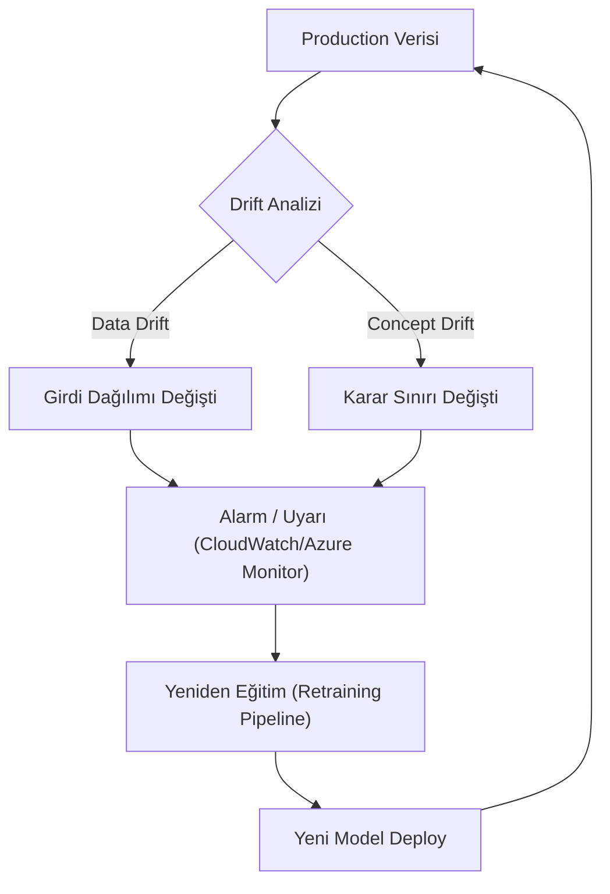

## 📌 Özet
Bulut Üzerinde Model İzleme ve Drift Tespiti, üretim ortamına (production) alınan makine öğrenmesi modellerinin zaman içindeki performans kaybını önlemek için kritik bir MLOps sürecidir. Modeller eğitildikleri veri setinin istatistiksel özelliklerine bağlıdır; ancak gerçek dünya verileri değiştikçe (Data Drift) veya girdi ile hedef değişken arasındaki ilişki koptukça (Concept Drift) modelin isabet oranı düşer. AWS SageMaker Model Monitor ve Azure Machine Learning Monitoring gibi servisler, bu değişimleri otomatik olarak tespit ederek ekiplere uyarı gönderir ve modellerin yeniden eğitilme (retraining) döngüsünü tetikler.

---

## 🧠 Detay

### 🔄 Drift ve İzleme Döngüsü



### 1. Drift Türleri
- **Data Drift (Covariate Shift):** Modelin girdi özelliklerinin ($X$) dağılımındaki değişimdir. Örneğin; bir kredi risk modelinde, kullanıcıların yaş ortalamasının aniden düşmesi.
- **Concept Drift:** Girdiler ile hedef ($Y$) arasındaki istatistiksel ilişkinin değişmesidir. Örneğin; pandemi döneminde tüketici harcama alışkanlıklarının tamamen değişmesi (eski veriler artık geleceği temsil etmez).
- **Label Drift:** Hedef değişkenin ($Y$) dağılımındaki değişimdir.

### 2. Bulut Çözümleri
- **AWS SageMaker Model Monitor:** S3'e kaydedilen tahmin verilerini eğitim verileriyle karşılaştırarak istatistiksel sapmaları (K-S testi, Chi-square vb.) raporlar.
- **Azure Machine Learning Monitoring:** Veri setleri arasında "Data Drift Monitor" oluşturarak temel metrikleri görselleştirir ve olasılık dağılım farklarını hesaplar.

### 3. İzleme Metrikleri
- **PSI (Population Stability Index):** Dağılımın ne kadar değiştiğini ölçen en popüler metriklerden biridir. (0.1 altı stabil, 0.25 üstü ciddi drift).
- **KL Divergence:** İki olasılık dağılımı arasındaki farkın entropi bazlı ölçümü.
- **Model Performansı:** Accuracy, Precision, Recall ve F1 skorlarının gerçek zamanlı (ground truth geldikçe) takibi.

### 🛠️ Örnek: AWS SDK ile Drift Konfigürasyonu (Kavramsal)
```python
from sagemaker.model_monitor import DefaultModelMonitor
from sagemaker.model_monitor.dataset_format import DatasetFormat

my_monitor = DefaultModelMonitor(
    role=role,
    instance_count=1,
    instance_type='ml.m5.xlarge',
    volume_size_in_gb=20,
)

my_monitor.suggest_baseline(
    baseline_dataset='s3://bucket/training_data.csv',
    dataset_format=DatasetFormat.csv(header=True),
)
```

---

## 💡 Bağlantılar
- [[AWS - SageMaker Pipelines (MLOps)]]
- [[Azure - Azure Machine Learning Pipelines]]
- [[FE - Data Leakage ve Pipeline Doğruluğu]]

## ❓ Sorular / Anlamadıklarım
- Drift tespit edildikten sonra otomatik retraining ne zaman risklidir?
- "Feature Attribution Drift" (özellik önem derecesi değişimi) nasıl izlenir?

## 🔗 Kaynaklar
- AWS Documentation - Monitoring In-production Models
- Microsoft Learn - Detect data drift on datasets
