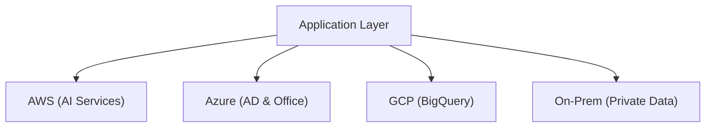

## 📌 Ozet
Multi-Cloud, birden fazla bulut sağlayıcısının (AWS, Azure, GCP) aynı anda kullanılmasıdır. Hybrid-Cloud ise kurum içi (On-premise) altyapı ile bulutun birleştirilmesidir. Temel amaç "Vendor Lock-in" (Tedarikçi bağımlılığı) riskini azaltmak ve her bulutun en iyi olduğu servisi kullanmaktır.

## 🧠 Detay

### 1. Neden Multi-Cloud?
- **Yedeklilik:** Bir bulut sağlayıcısı çökerse diğeri devreye girer.
- **Uyumluluk:** Verinin belirli bir bölgede veya yerel sunucuda kalma zorunluluğu.

### 2. Zorluklar
- **Karmaşıklık:** Her bulutun farklı yönetim araçları vardır.
- **Data Transfer Costs:** Bulutlar arası veri taşıma maliyetli olabilir (Egress fees).

## 💡 Baglantilar
- [[Cloud - Bulut Bilişime Giriş]]
- [[DSO - Terraform İleri Seviye (Modules, State Management)]]
