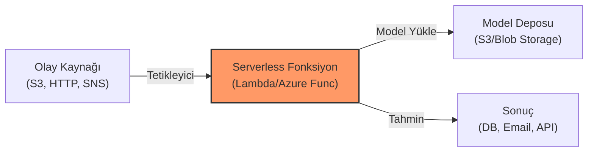

## 📌 Özet
Serverless ML ve Event-Driven Çözümler, makine öğrenmesi modellerini sunucu yönetimi gerektirmeden, sadece tetikleyicilere (event) yanıt verecek şekilde çalıştırma yaklaşımıdır. AWS Lambda veya Azure Functions gibi FaaS (Function as a Service) servisleri kullanılarak, bir S3 kovasına dosya yüklendiğinde veya bir mesaj kuyruğuna veri düştüğünde modelin anında tahmin üretmesi sağlanır. Bu mimari, düşük trafikli veya düzensiz yük alan uygulamalarda maliyet verimliliği sağlarken, otomatik ölçeklenme yeteneği sayesinde operasyonel yükü minimize eder.

---

## 🧠 Detay

### ⚡ Event-Driven ML Akış Şeması



### 1. Neden Serverless ML?
- **Maliyet:** Model çalışmadığı sürece ücret ödenmez (Pay-per-execution).
- **Ölçeklenebilirlik:** Gelen istek sayısına göre bulut sağlayıcısı binlerce fonksiyonu paralel çalıştırabilir.
- **Bakım Yok:** İşletim sistemi güncellemesi veya sunucu provizyonu ile uğraşılmaz.

### 2. Zorluklar ve Çözümler
- **Cold Start:** Fonksiyon ilk çalıştığında modelin belleğe yüklenmesi zaman alabilir.
  - *Çözüm:* "Provisioned Concurrency" kullanmak veya modeli hafifletmek (Quantization).
- **Paket Boyutu:** Lambda'nın 250MB (unzipped) sınırı büyük kütüphaneler (TensorFlow, PyTorch) için yetersiz kalabilir.
  - *Çözüm:* **Container Image** desteği ile 10GB'a kadar Docker imajlarını Lambda üzerinde çalıştırmak.

### 3. Kullanım Senaryoları
- **Resim İşleme:** Kullanıcı bir fotoğraf yüklediğinde nesne tespiti yapılması.
- **Gerçek Zamanlı Metin Analizi:** Bir chatbot mesajına anında duygu analizi uygulanması.
- **Veri Boru Hatları:** Gelen verilerin temizlenip anomali tespiti yapıldıktan sonra veritabanına kaydedilmesi.

### 🛠️ Örnek: AWS Lambda Tahmin Fonksiyonu (Python)
```python
import json
import boto3
import joblib

# Model yükleme (Global alanda tutarak 'warm' fonksiyon avantajı sağlar)
s3 = boto3.client('s3')
s3.download_file('my-bucket', 'model.joblib', '/tmp/model.joblib')
model = joblib.load('/tmp/model.joblib')

def lambda_handler(event, context):
    # Event'ten veriyi al
    data = json.loads(event['body'])
    prediction = model.predict([data['features']])
    
    return {
        'statusCode': 200,
        'body': json.dumps({'prediction': int(prediction[0])})
    }
```

---

## 💡 Bağlantılar
- [[AWS - Lambda ile Serverless]]
- [[Azure - Azure Functions ve Event Grid]]
- [[API - ML Modeli Servis Etmek]]

## ❓ Sorular / Anlamadıklarım
- Ağır derin öğrenme modelleri (LLM vb.) için serverless uygun mudur?
- Azure Functions "Consumption Plan" vs "Premium Plan" arasındaki farklar ML için neden önemlidir?

## 🔗 Kaynaklar
- AWS Lambda Container Image Support
- Azure Functions for Machine Learning Documentation
