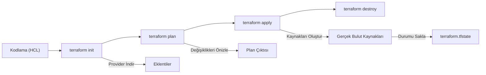

## 📌 Özet
Altyapı olarak Kod (Infrastructure as Code - IaC) yaklaşımının en güçlü araçlarından biri olan Terraform, bulut kaynaklarının bildirimsel (declarative) bir dille tanımlanmasını ve yönetilmesini sağlar. Bu yöntem, manuel yapılandırma süreçlerinde (click-ops) oluşabilecek insan hatalarını minimize ederek AWS, Azure ve GCP gibi farklı sağlayıcılarda tutarlı, tekrarlanabilir ve versiyonlanabilir bir mimari sunar. Veri bilimi projelerinde karmaşık veri işleme kümelerini, depolama alanlarını ve model sunucu uç noktalarını saniyeler içinde standartize bir şekilde ayağa kaldırmayı mümkün kılar. Terraform'un sunduğu durum yönetimi (state management) sayesinde, altyapı üzerindeki her değişiklik titizlikle izlenebilir ve ekipler arası işbirliği güvenli bir şekilde yürütülebilir.

## 🧠 Detay

### 🔄 Terraform İş Akışı



### Temel Kavramlar
```
Provider   → AWS, Azure, GCP bağlantısı
Resource   → Oluşturulacak kaynak (VM, S3, SQL)
Variable   → Parametre
Output     → Çıktı değeri
State      → Mevcut altyapı durumu
Module     → Yeniden kullanılabilir blok
```

### Kurulum
```bash
# Mac
brew install terraform

# Windows
choco install terraform

# Versiyon kontrol
terraform version
```

### AWS S3 + Lambda (ML Servisi)
```hcl
# main.tf
terraform {
  required_providers {
    aws = {
      source  = "hashicorp/aws"
      version = "~> 5.0"
    }
  }
  backend "s3" {
    bucket = "terraform-state-bucket"
    key    = "ml-project/terraform.tfstate"
    region = "eu-west-1"
  }
}

provider "aws" {
  region = var.region
}

# S3 bucket
resource "aws_s3_bucket" "ml_veri" {
  bucket = "${var.proje_adi}-veri-golum-${var.ortam}"
  tags   = local.ortak_etiketler
}

resource "aws_s3_bucket_versioning" "ml_veri" {
  bucket = aws_s3_bucket.ml_veri.id
  versioning_configuration { status = "Enabled" }
}

# Lambda fonksiyonu
resource "aws_lambda_function" "ml_api" {
  filename         = "lambda_package.zip"
  function_name    = "${var.proje_adi}-tahmin-${var.ortam}"
  role             = aws_iam_role.lambda_role.arn
  handler          = "lambda_function.lambda_handler"
  runtime          = "python3.11"
  timeout          = 30
  memory_size      = 512

  environment {
    variables = {
      MODEL_BUCKET = aws_s3_bucket.ml_veri.bucket
      MODEL_KEY    = "models/rf_model.pkl"
    }
  }

  tags = local.ortak_etiketler
}

# API Gateway
resource "aws_apigatewayv2_api" "ml_api" {
  name          = "${var.proje_adi}-api-${var.ortam}"
  protocol_type = "HTTP"
}

resource "aws_apigatewayv2_integration" "lambda" {
  api_id           = aws_apigatewayv2_api.ml_api.id
  integration_type = "AWS_PROXY"
  integration_uri  = aws_lambda_function.ml_api.invoke_arn
}

resource "aws_apigatewayv2_route" "tahmin" {
  api_id    = aws_apigatewayv2_api.ml_api.id
  route_key = "POST /tahmin"
  target    = "integrations/${aws_apigatewayv2_integration.lambda.id}"
}
```

### Variables
```hcl
# variables.tf
variable "region" {
  description = "AWS bölgesi"
  type        = string
  default     = "eu-west-1"
}

variable "ortam" {
  description = "Ortam: dev, staging, prod"
  type        = string
  validation {
    condition     = contains(["dev", "staging", "prod"], var.ortam)
    error_message = "Ortam dev, staging veya prod olmalı"
  }
}

variable "proje_adi" {
  type    = string
  default = "kredi-onay"
}

locals {
  ortak_etiketler = {
    Proje   = var.proje_adi
    Ortam   = var.ortam
    Ekip    = "veri-bilimi"
    Tarih   = formatdate("YYYY-MM-DD", timestamp())
  }
}
```

### Azure Kaynakları
```hcl
provider "azurerm" {
  features {}
}

# Resource Group
resource "azurerm_resource_group" "ml_rg" {
  name     = "${var.proje_adi}-rg-${var.ortam}"
  location = "West Europe"
}

# Storage Account
resource "azurerm_storage_account" "ml_storage" {
  name                     = "${var.proje_adi}storage${var.ortam}"
  resource_group_name      = azurerm_resource_group.ml_rg.name
  location                 = azurerm_resource_group.ml_rg.location
  account_tier             = "Standard"
  account_replication_type = "LRS"
}

# Azure ML Workspace
resource "azurerm_machine_learning_workspace" "ml_ws" {
  name                = "${var.proje_adi}-ml-${var.ortam}"
  resource_group_name = azurerm_resource_group.ml_rg.name
  location            = azurerm_resource_group.ml_rg.location
  storage_account_id  = azurerm_storage_account.ml_storage.id
  key_vault_id        = azurerm_key_vault.ml_kv.id
  application_insights_id = azurerm_application_insights.ml_ai.id
  sku_name = "Basic"
}
```

### Terraform Komutları
```bash
# Başlat (provider indir)
terraform init

# Planla (neyin değişeceğini göster)
terraform plan -var="ortam=dev"

# Uygula
terraform apply -var="ortam=dev" -auto-approve

# Belirli kaynak
terraform apply -target=aws_lambda_function.ml_api

# Yok et
terraform destroy -var="ortam=dev"

# State
terraform state list
terraform state show aws_s3_bucket.ml_veri

# Import (mevcut kaynağı Terraform'a al)
terraform import aws_s3_bucket.ml_veri bucket-adi
```

### tfvars ile Ortam Yönetimi
```hcl
# dev.tfvars
ortam     = "dev"
region    = "eu-west-1"
proje_adi = "kredi-onay"

# prod.tfvars
ortam     = "prod"
region    = "eu-west-1"
proje_adi = "kredi-onay"
```

```bash
terraform apply -var-file="prod.tfvars"
```

## 💡 Bağlantılar
- [[Cloud - Bulut Bilişime Giriş]]
- [[AWS - S3 ile Veri Depolama]]
- [[AWS - Lambda ile Serverless]]
- [[MLOps - GitHub Actions ile CI-CD]]

## ❓ Sorular / Anlamadıklarım
- Terraform state remote nasıl yönetilir?
- Terraform vs Pulumi ne zaman hangisi?

## 🔗 Kaynaklar
- https://developer.hashicorp.com/terraform/docs
