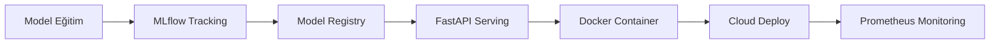

## 📌 Özet

Bu harita, sıfırdan Data Science & ML uzmanına giden yolu adım adım gösterir. Her kutucuk bu vault'taki notlara bağlıdır — tıklayarak doğrudan ilgili konuya git.

---

## 🗺️ Yol Haritası

```
╔══════════════════════════════════════════════════════════╗
║          DATA SCIENCE & ML ÖĞRENME YOL HARİTASI         ║
║                   The Tech Cortex                        ║
╚══════════════════════════════════════════════════════════╝

AŞAMA 0 — TEMEL (1-2 Ay)
─────────────────────────
  ┌─────────────┐   ┌─────────────┐   ┌─────────────────┐
  │   Python    │   │  Git & CLI  │   │   İstatistik    │
  │  Programla  │   │   Temelleri │   │  & Olasılık     │
  │  ★☆☆☆☆     │   │   ★☆☆☆☆   │   │    ★★☆☆☆       │
  └─────────────┘   └─────────────┘   └─────────────────┘

AŞAMA 1 — VERİ BECERİLERİ (2-3 Ay)
─────────────────────────────────────
  ┌──────────────┐   ┌──────────────┐   ┌──────────────┐
  │  pandas &    │   │     SQL      │   │  Veri Görsel │
  │   NumPy      │   │ (PostgreSQL) │   │  leştirme    │
  │  ★★☆☆☆      │   │   ★★☆☆☆    │   │   ★★☆☆☆     │
  └──────────────┘   └──────────────┘   └──────────────┘
         │                  │                  │
         └──────────────────┴──────────────────┘
                            │
                    ┌───────▼───────┐
                    │  Keşifsel     │
                    │  Veri Analizi │
                    │  (EDA)        │
                    └───────────────┘

AŞAMA 2 — MAKİNE ÖĞRENMESİ (3-4 Ay)
──────────────────────────────────────
  ┌──────────────┐   ┌──────────────┐   ┌──────────────┐
  │   Feature    │   │   Sklearn    │   │  Model Değer │
  │  Engineering │   │  Algoritma   │   │  lendirme    │
  │  ★★★☆☆      │   │   ★★★☆☆    │   │   ★★★☆☆     │
  └──────────────┘   └──────────────┘   └──────────────┘
         │                  │
         ▼                  ▼
  ┌──────────────┐   ┌──────────────┐
  │  Denetimli  │   │ Denetimsiz   │
  │  Öğrenme    │   │  Öğrenme     │
  │  (Sınıf./   │   │  (Kümeleme,  │
  │  Regr.)     │   │  Boyut Azalt)│
  └──────────────┘   └──────────────┘

AŞAMA 3 — UZMANLAŞMA (4-6 Ay) — Birini Seç
─────────────────────────────────────────────
  ┌────────────┐  ┌────────────┐  ┌────────────┐  ┌──────────────┐
  │   Derin    │  │    NLP     │  │  Computer  │  │    MLOps     │
  │  Öğrenme   │  │ & LLM Eng. │  │  Vision    │  │ & Production │
  │  ★★★★☆    │  │   ★★★★☆  │  │   ★★★★☆  │  │    ★★★★☆   │
  └────────────┘  └────────────┘  └────────────┘  └──────────────┘

AŞAMA 4 — ÜRETİME ALMA (Sürekli)
───────────────────────────────────
  ┌──────────┐  ┌──────────┐  ┌──────────┐  ┌──────────┐
  │  Docker  │  │  FastAPI │  │  MLflow  │  │  Cloud   │
  │  ★★★☆☆  │  │  ★★★☆☆  │  │  ★★★☆☆  │  │  ★★★★☆  │
  └──────────┘  └──────────┘  └──────────┘  └──────────┘

AŞAMA 5 — KARİYER (Paralel Yürü)
───────────────────────────────────
  ┌────────────────┐   ┌────────────────┐   ┌───────────────┐
  │    Portfolio   │   │    Mülakat     │   │    Kaggle     │
  │    Projeleri   │   │    Hazırlığı   │   │    & Yarışma  │
  └────────────────┘   └────────────────┘   └───────────────┘
```

---

## 🧠 Detay

### Aşama 0 — Temel Araçlar

#### Python
- Değişkenler, döngüler, fonksiyonlar, OOP
- List comprehension, generator, decorator
- Sanal ortam: `venv` veya `uv`

**Bu vault'taki notlar:** [[Python - Giriş ve Kurulum]] → [[Python - OOP Prensipleri]] → [[Python - İleri Python Teknikleri]]

#### Git & Linux CLI
- `git init/add/commit/push/pull/branch/merge`
- Temel Linux komutları: `ls, cd, grep, awk, sed, curl`

**Bu vault'taki notlar:** [[Git - Temel Komutlar ve Workflow]] → [[Linux - Temel Komutlar]]

#### İstatistik & Olasılık
- Merkezi eğilim, dağılım, korelasyon
- Hipotez testi, p-değeri, güven aralığı
- Olasılık dağılımları: Normal, Poisson, Binomial

**Bu vault'taki notlar:** [[STAT - Temel İstatistik Kavramları]] → [[STAT - Olasılık Dağılımları]]

---

### Aşama 1 — Veri Becerileri

#### pandas & NumPy
```python
# Temel pandas operasyonları bilmen gerekenler
df.groupby().agg()          # gruplama
df.merge()                   # birleştirme
df.pivot_table()             # pivot
df.apply(lambda x: ...)     # satır/sütun dönüşümü
```

#### SQL (PostgreSQL)
```sql
-- Bilmen gereken SQL yapıları
SELECT, WHERE, GROUP BY, HAVING, ORDER BY
JOIN (INNER, LEFT, RIGHT, FULL)
Window Functions: ROW_NUMBER(), RANK(), LAG(), LEAD()
CTE: WITH cte AS (...)
```

**Bu vault'taki notlar:** [[PG - İleri SQL — Window Functions ve CTE]] → [[PG - PostgreSQL ile Python]]

---

### Aşama 2 — Makine Öğrenmesi

| Algoritma Grubu | Başlangıç | İleri |
|-----------------|-----------|-------|
| **Sınıflandırma** | Logistic Regression, Decision Tree | Random Forest, XGBoost, LightGBM |
| **Regresyon** | Linear Regression, Ridge, Lasso | Gradient Boosting Regressor |
| **Kümeleme** | K-Means | DBSCAN, Hierarchical |
| **Boyut Azaltma** | PCA | t-SNE, UMAP |

**Bu vault'taki notlar:** [[ML - Scikit-learn Pipeline]] → [[FE - Feature Engineering Temelleri]] → [[ML - Gradient Boosting (XGBoost & LightGBM)]]

---

### Aşama 3 — Uzmanlaşma Yolları

#### 🤖 Derin Öğrenme Yolu
```
PyTorch Temelleri → CNN → RNN/LSTM → Transformers → Fine-tuning
```
**Bu vault:** [[DL - PyTorch Temelleri]] → [[DL - Transformer Mimarisi]] → [[DL - LoRA ve Parameter-Efficient Fine-Tuning]]

#### 💬 NLP & LLM Engineering Yolu
```
NLP Temelleri → Hugging Face → Prompt Engineering → RAG → Agent
```
**Bu vault:** [[GenAI - Prompt Engineering İlkeleri]] → [[GenAI - RAG Mimarisi]]

#### 🖼️ Computer Vision Yolu
```
OpenCV Temelleri → CNN → YOLO → Segmentasyon → Deployment
```

#### ⚙️ MLOps Yolu
```
Docker → FastAPI → MLflow → CI/CD → Kubernetes → Monitoring
```
**Bu vault:** [[Docker - Container Temelleri]] → [[MLOps - CI-CD Pipeline]] → [[K8s - Kubernetes Temelleri]]

---

### Aşama 4 — Production Araçları



---

### Aşama 5 — Kariyer

**Portfolio için minimum 3 proje:**
1. **EDA Projesi** — gerçek veri seti, iş sorusu, görselleştirme
2. **ML Projesi** — uçtan uca pipeline, deployment
3. **NLP veya CV Projesi** — özelleşmiş alan

**Bu vault'taki notlar:** [[Kariyer - Data Science Portfolio Proje Fikirleri]] → [[Kariyer - GitHub Profil Optimizasyonu]] → [[Kariyer - CV ve LinkedIn Hazırlama]]

---

## ⏱️ Önerilen Çalışma Planı

| Süre | Hedef | Ölçüm |
|------|-------|-------|
| Ay 1-2 | Python + Git + İstatistik | İlk GitHub repo |
| Ay 3-4 | pandas + SQL + EDA | Kaggle notebook |
| Ay 5-7 | ML algoritmaları + Feature Eng. | Kaggle Bronze medal |
| Ay 8-10 | Seçilen uzmanlaşma alanı | Portfolio projesi #2 |
| Ay 11-12 | MLOps + Production | Deploy edilmiş uygulama |
| Sürekli | Mülakat hazırlığı + networking | İş başvuruları |

---

## 💡 Bağlantılar
- [[Kariyer - Data Science Portfolio Proje Fikirleri]]
- [[Kariyer - Mülakat Süreci ve Hazırlık Stratejisi]]
- [[00 - ML Mülakat Hazırlık Rehberi]]
- [[Python - Giriş ve Kurulum]]

## ❓ Sorular / Anlamadıklarım

## 🔗 Kaynaklar
- [Kaggle Learn](https://www.kaggle.com/learn)
- [fast.ai](https://www.fast.ai/)
- [Made With ML](https://madewithml.com/)
- [roadmap.sh/ai-data-scientist](https://roadmap.sh/ai-data-scientist)
