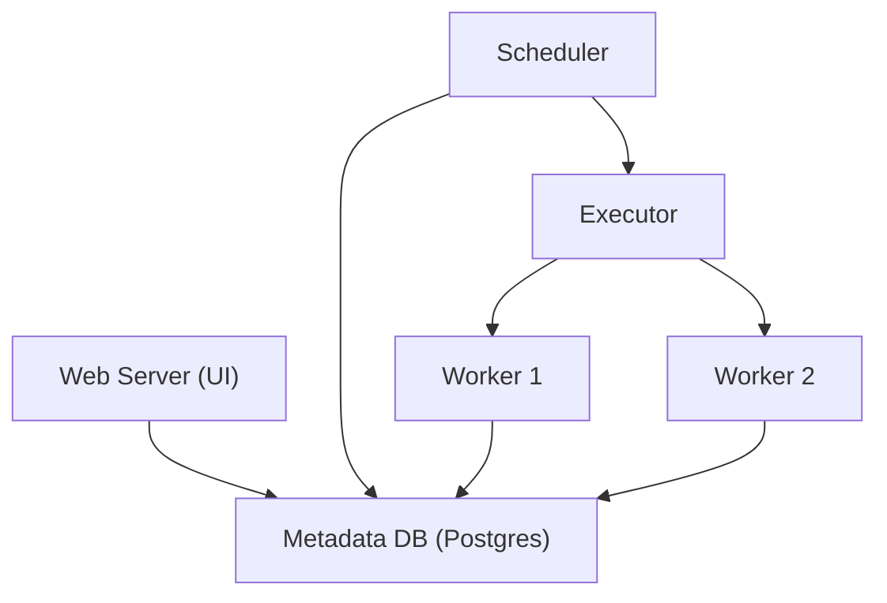

# DE - Airflow ile Boru Hattı Orkestrasyonu

📌 **Özet**
Apache Airflow, karmaşık veri işleme süreçlerini (pipeline) programatik olarak planlamak, izlemek ve yönetmek için kullanılan bir orkestrasyon aracıdır. İş akışlarını Python koduyla tanımlanan **DAG (Directed Acyclic Graph)** yapısı üzerine kurar. Airflow, bir veri mühendisine işler arasındaki bağımlılıkları yönetme, hatalı işleri otomatik olarak tekrar deneme (retry) ve görsel bir arayüz üzerinden tüm süreçleri takip etme imkanı sunar. Sadece bir zamanlayıcı (scheduler) değil, aynı zamanda verinin akış mantığını yöneten merkezi bir kontrol kulesidir. Bu bölümde DAG yapısını ve operatör türlerini ele alacağız.

🧠 **Detay**



### 1. Airflow Bileşenleri
- **Web Server:** DAG'ları görselleştiren ve yöneten kullanıcı arayüzü.
- **Scheduler:** Hangi işin ne zaman çalışacağını belirleyen ve Executor'a gönderen beyin.
- **Metadata DB:** İşlerin durumu, geçmişi ve konfigürasyonlarını saklayan veritabanı.
- **Executor/Worker:** Görevlerin fiziksel olarak çalıştırıldığı birimler. (Local, Celery veya Kubernetes)

### 2. DAG ve Operatörler
- **DAG:** İşlerin birbirine nasıl bağlı olduğunu gösteren yönsüz ve döngüsüz grafiktir.
- **Operators:** Bir görevde neyin yapılacağını tanımlayan şablonlardır.
    - `PythonOperator`: Python kodu çalıştırır.
    - `BashOperator`: Bash komutları çalıştırır.
    - `S3ToSnowflakeOperator`: Veriyi S3'ten Snowflake'e taşır.

### Örnek DAG Tanımı
```python
from airflow import DAG
from airflow.operators.python import PythonOperator
from datetime import datetime, timedelta

def process_data():
    print("Veri işleniyor...")

default_args = {
    'owner': 'data_eng',
    'retries': 2,
    'retry_delay': timedelta(minutes=5)
}

with DAG(
    dag_id='gunluk_temizlik_v1',
    default_args=default_args,
    start_date=datetime(2026, 6, 1),
    schedule_interval='@daily',
    catchup=False
) as dag:

    task_extract = PythonOperator(
        task_id='extract',
        python_callable=lambda: print("Extracting...")
    )

    task_transform = PythonOperator(
        task_id='transform',
        python_callable=process_data
    )

    # Bağımlılık Tanımlama
    task_extract >> task_transform
```

### 3. XComs ve Variables
- **XCom (Cross-Communication):** Görevler arasında küçük veri parçacıklarını transfer etmek için kullanılır.
- **Variables:** DAG içinde kullanılacak genel konfigürasyon ayarlarıdır.

💡 **Bağlantılar**
- [[DE - Giriş ve Veri Yaşam Döngüsü]]
- [[DE - ETL vs ELT Stratejileri]]
