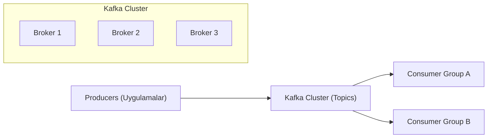

# DE - Apache Kafka ile Streaming Veri

📌 **Özet**
Apache Kafka, yüksek performanslı ve dağıtık bir olay akış (event streaming) platformudur. Verileri "yayınla-abone ol" (pub-sub) modeline göre işleyerek sistemler arasındaki veri akışını decouple eder, yani birbirinden bağımsız hale getirir. Kafka, saniyede milyonlarca mesajı düşük gecikme süresiyle işleyebilir ve verileri disk üzerinde kalıcı olarak saklayarak hata toleransı sağlar. Modern veri mimarilerinde "sinir sistemi" görevi görerek mikroservisler ve veri ambarları arasındaki gerçek zamanlı bağı kurar. Bu notta, Kafka'nın bileşenlerini ve mesaj iletim mekanizmalarını inceleyeceğiz.

🧠 **Detay**



### 1. Temel Kavramlar
- **Producer:** Veriyi Kafka topic'lerine gönderen kaynaklardır.
- **Consumer:** Topic'lerden veriyi okuyan istemcilerdir.
- **Broker:** Veriyi saklayan ve istemcilere sunan sunuculardır.
- **Topic:** Verilerin kategorize edildiği kanallardır.
- **Partition:** Topic'lerin alt parçalarıdır; paralellik ve ölçeklenebilirlik sağlar.

### 2. Partition ve Ofset Mekanizması
Kafka, her mesajı bir **offset** numarasıyla saklar. Consumer'lar hangi ofsette kaldıklarını takip ederek veri kaybı olmadan okumaya devam ederler. Ofsetlerin yönetimi Kafka'nın yüksek hızdaki başarısının temelidir.

### 3. Replication (Kopyalama)
Veri güvenliği için her partition birden fazla broker üzerinde kopyalanır. Bir "Leader" partition yazma/okuma işlemlerini yönetirken, "Follower"lar veriyi senkronize eder. Leader broker çökerse, follower'lardan biri otomatik olarak yeni leader seçilir.

### Örnek Kafka Producer (Python)
```python
from kafka import KafkaProducer
import json

producer = KafkaProducer(
    bootstrap_servers=['localhost:9092'],
    value_serializer=lambda v: json.dumps(v).encode('utf-8')
)

# Olay verisi gönderme
event = {"user_id": 123, "action": "click", "timestamp": "2026-06-04T10:00:00"}
producer.send('user-activities', value=event)
producer.flush()
```

### Örnek Kafka Consumer (Python)
```python
from kafka import KafkaConsumer

consumer = KafkaConsumer(
    'user-activities',
    bootstrap_servers=['localhost:9092'],
    auto_offset_reset='earliest',
    group_id='analytics-group'
)

for message in consumer:
    print(f"Alınan mesaj: {message.value}")
```

💡 **Bağlantılar**
- [[DE - Apache Spark ile Büyük Veri İşleme]] (Spark Streaming entegrasyonu için)
- [[DE - Veri Kalitesi ve Gözlemlenebilirlik]]
