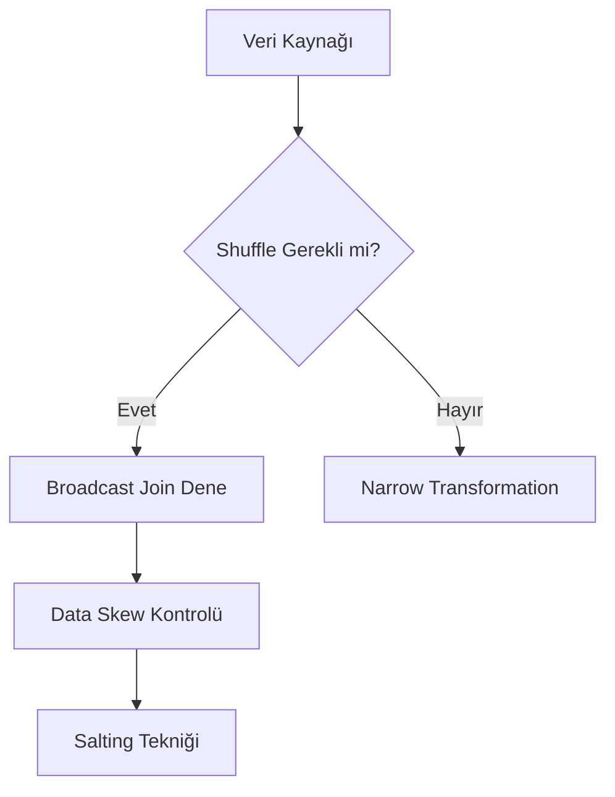

---
tarih: 2026-06-06
konu: Spark Tuning
etiket: [data-engineering, spark, big-data, performance, optimization]
kaynak: Gemini CLI
zorluk: Uzman
---

## 📌 Ozet
Apache Spark ile petabaytlarca veriyi işlerken sadece kodu yazmak yetmez; donanım kaynaklarını ve veri dağılımını optimize etmek gerekir. Performansın önündeki en büyük engeller "Data Skew" (Veri Kayması) ve gereksiz "Shuffle" (Veri Takası) işlemleridir.

## 🧠 Detay

### 1. Optimizasyon Teknikleri
- **Broadcast Join:** Küçük tabloların tüm worker lara kopyalanarak shuffle ın önlenmesi.
- **Salting:** Belirli bir anahtar üzerinde toplanan (skewed) veriyi, anahtara rastgele sayılar ekleyerek dağıtma.
- **Caching/Persist:** Tekrar kullanılan DataFrame leri hafızada tutma.

### 2. Monitoring
- **Spark UI:** İşlerin (jobs) ve aşamaların (stages) takibi için en kritik araçtır.

## 💡 Baglantilar
- [[DE - Apache Spark ile Büyük Veri İşleme]]
- [[İleri Dağıtık Sistemler & Veritabanları - Giriş]]
