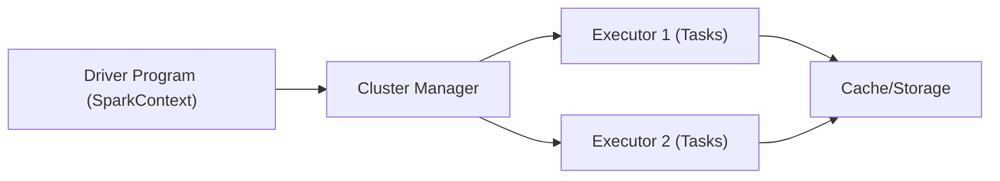

# DE - Apache Spark ile Büyük Veri İşleme

📌 **Özet**
Apache Spark, çok büyük ölçekli veri kümelerini paralel ve dağıtık bir şekilde işlemek için tasarlanmış açık kaynaklı bir motorudur. Bellek içi (in-memory) işlem yapabilme yeteneği sayesinde geleneksel MapReduce modellerinden 100 kata kadar daha hızlı çalışabilir. Spark, SQL sorguları, akış işleme (streaming), makine öğrenmesi ve grafik analitiği için birleşik bir platform sunar. Veri mühendisleri için Spark, veri temizleme ve karmaşık dönüşüm süreçlerinin vazgeçilmez aracıdır. Bu dokümanda Spark'ın temel mimarisi ve PySpark kullanımına odaklanacağız.

🧠 **Detay**



### 1. Spark Mimarisi
- **Driver:** Uygulamanın `main` fonksiyonunu çalıştıran ve SparkContext'i oluşturan birimdir. İşleri görevlere (tasks) böler.
- **Cluster Manager:** Kaynakları (CPU, RAM) yönetir. (YARN, Mesos, Kubernetes veya Standalone)
- **Executors:** Driver tarafından gönderilen görevleri çalıştıran ve veriyi saklayan işçi düğümlerdir.

### 2. Temel Soyutlamalar
- **RDD (Resilient Distributed Dataset):** Spark'ın temel düşük seviyeli veri yapısıdır. Hata toleranslı ve değişmezdir.
- **DataFrame:** RDBMS tablolarına benzeyen, adlandırılmış sütunlara sahip yapılandırılmış veri kümesidir.
- **Dataset:** DataFrame'in tip güvenliği (type-safe) olan versiyonudur (Scala/Java).

### 3. Catalyst Optimizer ve Tungsten
Spark, yazdığınız kodu optimize etmek için **Catalyst** motorunu kullanır. Sorgu planlarını analiz eder, mantıksal ve fiziksel planlar oluşturarak en verimli çalışma yolunu seçer. **Tungsten** ise bellek yönetimini optimize ederek Java objelerinin yarattığı yükü azaltır.

### PySpark Örneği
```python
from pyspark.sql import SparkSession
from pyspark.sql.functions import col, sum

# Spark oturumu başlatma
spark = SparkSession.builder \
    .appName("SatisAnalizi") \
    .getOrCreate()

# Veri okuma
df = spark.read.csv("s3://bucket/sales.csv", header=True, inferSchema=True)

# Dönüşüm ve Analiz
result_df = df.filter(col("amount") > 100) \
    .groupBy("category") \
    .agg(sum("amount").alias("total_sales")) \
    .orderBy(col("total_sales").desc())

# Sonucu yazma
result_df.write.parquet("s3://bucket/output/category_summary.parquet")
```

💡 **Bağlantılar**
- [[DE - Delta Lake ve Lakehouse Mimarisi]]
- [[DE - Giriş ve Veri Yaşam Döngüsü]]
