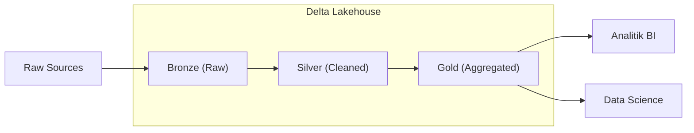

# DE - Delta Lake ve Lakehouse Mimarisi

📌 **Özet**
Lakehouse mimarisi, Data Lake'in esnekliği ve düşük maliyeti ile Veri Ambarı'nın (Data Warehouse) veri yönetimi ve ACID garantilerini tek bir platformda birleştiren yeni nesil bir veri mimarisidir. Bu mimarinin temel taşı olan Delta Lake, açık kaynaklı bir depolama katmanı olarak Spark ve diğer motorlara "Time Travel" (geçmişe dönük sorgulama), şema zorlama (schema enforcement) ve işlem günlüğü (transaction log) gibi özellikler kazandırır. Lakehouse sayesinde organizasyonlar, BI ve Makine Öğrenmesi iş yüklerini aynı veri havuzu üzerinde çalıştırabilirler. Bu notta, Madalyon Mimarisi (Bronze, Silver, Gold) ve Delta Lake'in teknik detaylarını inceleyeceğiz.

🧠 **Detay**



### 1. Delta Lake'in Temel Özellikleri
- **ACID İşlemleri:** Okuma ve yazma işlemlerinin birbirini bozmasını engeller.
- **Schema Enforcement:** Beklenmedik sütunların veritabanını bozmasını engeller.
- **Time Travel:** Verinin eski versiyonlarına erişim sağlar (Hata ayıklama için kritik).
- **Unified Batch/Streaming:** Aynı tabloya hem batch hem streaming veri yazılabilir.

### 2. Madalyon Mimarisi (Medallion Architecture)
1. **Bronze (Ham):** Verinin kaynaktan geldiği gibi saklandığı ilk katman. "Do no harm" prensibi geçerlidir.
2. **Silver (Temizlenmiş):** Filtreleme, temizleme ve join işlemlerinin yapıldığı, analize hazır katman.
3. **Gold (İş Birimi):** İş birimlerinin ihtiyaçlarına göre özetlenmiş (aggregate) tablolar.

### PySpark Delta Lake Örneği
```python
# Delta tablosuna yazma
df.write.format("delta").save("/mnt/delta/orders")

# Veriyi güncelleme (Merge/Upsert)
from delta.tables import *

deltaTable = DeltaTable.forPath(spark, "/mnt/delta/orders")

deltaTable.alias("old").merge(
    new_df.alias("new"),
    "old.id = new.id"
).whenMatchedUpdateAll() \
 .whenNotMatchedInsertAll() \
 .execute()

# Time Travel: Eski bir versiyonu okuma
df_v1 = spark.read.format("delta").option("versionAsOf", 1).load("/mnt/delta/orders")
```

### 3. Neden Lakehouse?
Geleneksel mimaride veriler önce Data Lake'e, sonra DWH'a taşınırdı (çift depolama ve karmaşık ETL). Lakehouse bu karmaşıklığı ortadan kaldırarak veriyi tek bir yerde tutar ve tüm ekiplerin aynı "gerçeğin tek kaynağına" (single source of truth) erişmesini sağlar.

💡 **Bağlantılar**
- [[DE - Apache Spark ile Büyük Veri İşleme]]
- [[DE - Veri Ambarı ve Modern Veri Yığını (BigQuery, Snowflake)]]
