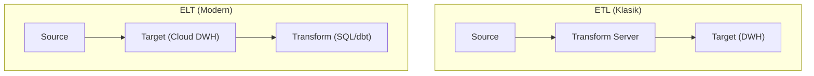

# DE - ETL vs ELT Stratejileri

📌 **Özet**
ETL (Extract, Transform, Load) ve ELT (Extract, Load, Transform), verinin kaynaktan hedefe taşınması ve işlenmesi için kullanılan iki temel mimari yaklaşımdır. Geleneksel ETL modelinde veri, hedef sisteme yüklenmeden önce ayrı bir işlem sunucusunda dönüştürülürken; modern ELT modelinde veri önce ham haliyle hedef sisteme (genellikle bir Cloud DWH) yüklenir ve dönüşüm hedefin işlem gücü kullanılarak gerçekleştirilir. Bulut bilişimin depolama ve işlem gücünü birbirinden ayırması, ELT yaklaşımını modern veri yığınının standartı haline getirmiştir. Bu dokümanda her iki yöntemin avantajlarını ve dbt (data build tool) gibi modern araçların bu süreçteki rolünü inceleyeceğiz.

🧠 **Detay**



### 1. ETL: Geleneksel Yaklaşım
- **Nasıl Çalışır:** Veri çıkarılır, staging alanında temizlenir ve yapılandırılır, ardından ambarına yüklenir.
- **Avantajı:** Veri ambarına sadece temiz ve yapılandırılmış veri girer; gizlilik (maskeleme) işlem sırasında yapılabilir.
- **Dezavantajı:** Ayrı bir işlem sunucusu gerektirir ve veri hacmi arttıkça darboğaz oluşturabilir.

### 2. ELT: Modern Yaklaşım
- **Nasıl Çalışır:** Veri çıkarılır ve ham haliyle bulut tabanlı bir veri ambarına (Snowflake, BigQuery) yüklenir. Dönüşümler SQL kullanılarak ambar içinde yapılır.
- **Avantajı:** Daha esnektir; ham veri ambarında olduğu için gelecekte farklı analizler için tekrar işlenebilir.
- **Modern Araç:** **dbt (data build tool)**, ELT sürecinin "Transform" kısmını yönetmek için kullanılan en popüler araçtır.

### 3. Karşılaştırma Tablosu

| Özellik | ETL | ELT |
| :--- | :--- | :--- |
| **Dönüşüm Yeri** | İşleme Sunucusu | Hedef Sistem (DWH) |
| **Veri Esnekliği** | Düşük (Sadece işlenmiş veri) | Yüksek (Ham veri mevcut) |
| **Maliyet** | Sunucu maliyeti yüksek | Ölçeklenebilir bulut maliyeti |
| **Popülerlik** | Geleneksel/On-premise | Bulut/Modern Data Stack |

### Örnek dbt Modeli (ELT Transform)
```sql
-- models/stg_orders.sql
with source as (
    select * from {{ source('raw_data', 'orders') }}
),
renamed as (
    select
        id as order_id,
        user_id,
        order_date,
        status as order_status
    from source
)
select * from renamed
```

💡 **Bağlantılar**
- [[DE - Veri Ambarı ve Modern Veri Yığını (BigQuery, Snowflake)]]
- [[DE - Giriş ve Veri Yaşam Döngüsü]]
