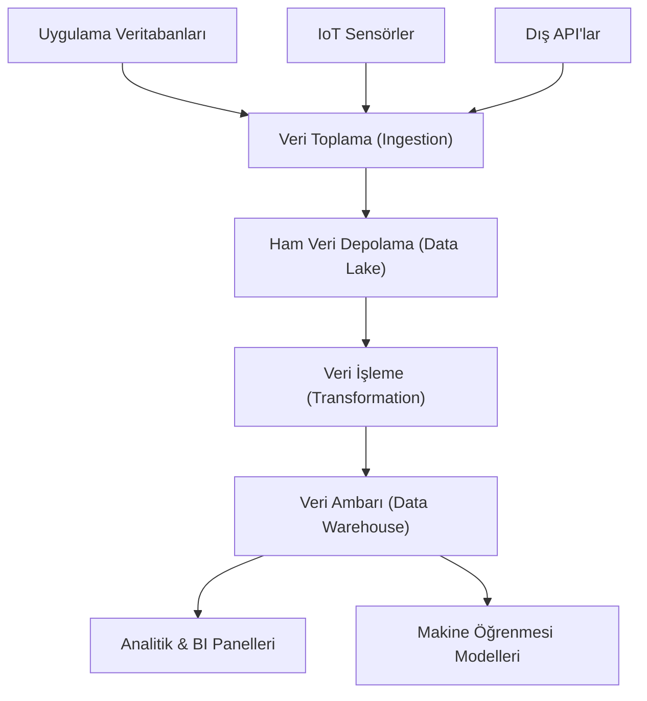

# DE - Giriş ve Veri Yaşam Döngüsü

📌 **Özet**
Veri mühendisliği, verinin ham kaynaktan alınarak anlamlı bir içgörüye dönüştürülmesini sağlayan sistemlerin tasarımı ve inşasıdır. Bu süreç, verinin yaşam döngüsü olarak adlandırılan ve toplama, depolama, işleme, analiz ve arşivleme aşamalarından oluşan bir bütündür. Veri mühendisi, bu döngü içerisindeki "boruları" (pipelines) inşa ederek verinin güvenli, hızlı ve ölçeklenebilir bir şekilde akmasını sağlar. Başarılı bir veri stratejisi, sadece veriyi toplamakla kalmaz, aynı zamanda verinin kalitesini ve erişilebilirliğini de garanti eder. Bu notta, verinin ham halden karar destek mekanizmalarına uzanan yolculuğunu detaylandıracağız.

🧠 **Detay**



### 1. Veri Toplama (Ingestion)
Verinin çeşitli kaynaklardan (RDBMS, NoSQL, Loglar, API'lar) sisteme dahil edildiği aşamadır.
- **Batch Ingestion:** Verinin belirli zaman aralıklarında (saatlik, günlük) toplu olarak taşınmasıdır. (Örn: Sqoop, Airflow)
- **Streaming Ingestion:** Verinin üretildiği anda gerçek zamanlı olarak sisteme alınmasıdır. (Örn: Kafka, Flink)

### 2. Depolama (Storage)
Verinin tipine ve kullanım amacına göre saklandığı katmandır.
- **Data Lake:** Yapılandırılmamış (unstructured) verilerin ham halde saklandığı devasa havuzlardır. (S3, Azure Blob Storage)
- **Data Warehouse:** Analitik sorgular için optimize edilmiş, yapılandırılmış veri depolarıdır. (Snowflake, BigQuery)

### 3. İşleme ve Dönüşüm (Processing)
Ham verinin temizlenmesi, normalize edilmesi ve iş kurallarına göre dönüştürülmesi sürecidir.
- **ETL (Extract, Transform, Load):** Veri ambarına yüklenmeden önce dönüştürülür.
- **ELT (Extract, Load, Transform):** Veri önce yüklenir, dönüşüm hedef sistemin gücüyle yapılır.

### Örnek Veri Akış Kodu (Python Concept)
```python
def data_pipeline(source_api):
    # 1. Extract
    raw_data = fetch_from_api(source_api)
    
    # 2. Transform
    clean_data = [d for d in raw_data if d['status'] == 'active']
    for item in clean_data:
        item['processed_at'] = datetime.now()
        
    # 3. Load
    save_to_warehouse(clean_data)
```

💡 **Bağlantılar**
- [[DE - ETL vs ELT Stratejileri]]
- [[DE - Veri Ambarı ve Modern Veri Yığını (BigQuery, Snowflake)]]
