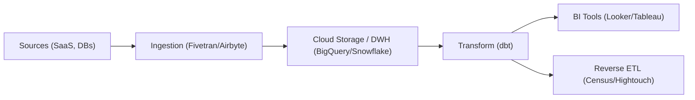

# DE - Veri Ambarı ve Modern Veri Yığını (BigQuery, Snowflake)

📌 **Özet**
Modern Veri Yığını (Modern Data Stack - MDS), bulut tabanlı veri ambarlarını merkeze alan ve "tak-çalıştır" (SaaS) araçlardan oluşan bir ekosistemdir. Bu mimarinin kalbinde yer alan Snowflake ve BigQuery gibi sistemler, depolama (storage) ve işlem (compute) kaynaklarını birbirinden ayırarak devasa ölçekteki verileri saniyeler içinde sorgulama imkanı tanır. MDS, veri mühendislerinin altyapı yönetmek yerine veri modelleme ve analize odaklanmasını sağlar. Bu dokümanda bulut tabanlı veri ambarlarının mimarisi ve MDS bileşenlerini ele alacağız.

🧠 **Detay**



### 1. Bulut Veri Ambarı Mimarisi
- **Storage & Compute Separation:** Snowflake mimarisinde veriler S3 gibi ucuz depolama alanlarında saklanır. Bir sorgu çalıştırıldığında, geçici işlem güçleri (Virtual Warehouses) ayağa kalkar, işi bitirir ve kapanır. Bu "pay-as-you-go" modeli sağlar.
- **BigQuery (Serverless):** Google'ın sunduğu bu sistemde sunucu kavramı yoktur. Sorgu başına taranan veri üzerinden ücretlendirilirsiniz.

### 2. Modern Data Stack Bileşenleri
- **Ingestion:** Veriyi çekmek için özel kod yazmak yerine Fivetran veya Airbyte kullanılır.
- **Storage:** Snowflake, BigQuery veya Databricks.
- **Transformation:** SQL tabanlı modelleme için dbt.
- **Observability:** Veri kalitesini izlemek için Monte Carlo veya Great Expectations.

### 3. BigQuery ML Örneği (DWH içinde ML)
BigQuery, veriyi dışarı çıkarmadan SQL ile model kurmanıza olanak tanır:
```sql
CREATE OR REPLACE MODEL `my_project.my_dataset.logistic_model`
OPTIONS(model_type='logistic_reg') AS
SELECT
  label,
  feature1,
  feature2
FROM
  `my_project.my_dataset.training_table`;
```

### 4. Snowflake "Zero-Copy Cloning"
Snowflake, veriyi fiziksel olarak kopyalamadan, sadece metadata üzerinden verinin bir kopyasını anında oluşturabilir. Bu, test süreçlerinde (Dev/Prod ayrımı) inanılmaz hız ve maliyet avantajı sağlar.

💡 **Bağlantılar**
- [[DE - ETL vs ELT Stratejileri]]
- [[DE - Delta Lake ve Lakehouse Mimarisi]]
