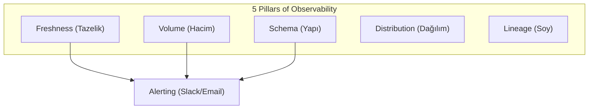

# DE - Veri Kalitesi ve Gözlemlenebilirlik

📌 **Özet**
Veri kalitesi ve gözlemlenebilirlik (observability), bir veri mühendisinin inşa ettiği boru hatlarının ne kadar güvenilir olduğunu belirleyen kritik bir disiplindir. Sadece verinin "akması" yetmez; verinin doğru, tam, zamanında ve tutarlı olması gerekir. Gözlemlenebilirlik; verinin tazeliği (freshness), hacmi (volume), şeması (schema) ve dağılımı (distribution) gibi boyutları izleyerek bir sorun oluştuğunda henüz iş birimleri fark etmeden müdahale edilmesini sağlar. "Garbage in, garbage out" prensibi gereği, kalitesiz veriyle yapılan tüm analizler yanıltıcıdır.

🧠 **Detay**



### 1. Veri Kalitesinin 5 Temel Taşı
1. **Freshness:** Veri ne kadar güncel? (Örn: Son 2 saat içinde yeni veri geldi mi?)
2. **Volume:** Beklenen miktarda veri geldi mi? (Örn: Düne göre %50 düşüş var mı?)
3. **Schema:** Sütun isimleri veya tipleri değişti mi? (Breaking changes)
4. **Distribution:** Veri değerleri mantıklı mı? (Örn: Yaş sütununda negatif değer var mı?)
5. **Lineage:** Bu veri nereden geldi ve nereye gidiyor? (Hata durumunda etki analizi)

### 2. Test Türleri
- **Unit Tests:** Küçük kod parçacıklarının (transformasyonlar) testi.
- **Data Tests:** Verinin kendisi üzerindeki kurallar. (Null olamaz, Unique olmalı vb.)

### Great Expectations Örneği (Python)
```python
import great_expectations as ge

df = ge.read_csv("data/raw_orders.csv")

# Kuralları belirle
df.expect_column_values_to_not_be_null("order_id")
df.expect_column_values_to_be_between("order_amount", min_value=0, max_value=1000000)
df.expect_column_to_exist("customer_id")

# Testleri çalıştır
results = df.validate()
if not results["success"]:
    print("Veri kalitesi hatası!")
```

### 3. Data Contracts (Veri Sözleşmeleri)
Veri üreten ekipler (Yazılım Geliştiriciler) ile veri tüketen ekipler (Veri Mühendisleri) arasındaki anlaşmadır. Şema değişiklikleri bu sözleşmelerle yönetilir ve boru hatlarının kırılması önlenir.

💡 **Bağlantılar**
- [[DE - Airflow ile Boru Hattı Orkestrasyonu]] (Alerting için)
- [[DE - Veri Ambarı ve Modern Veri Yığını (BigQuery, Snowflake)]]
