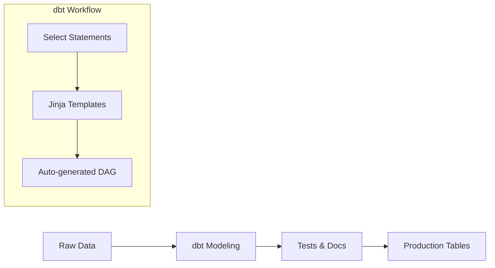

## 📌 Özet
dbt (data build tool), veri ambarı (Data Warehouse) içindeki verileri dönüştürmek (transform) için kullanılan, sadece "T" (Transform) adımına odaklanan bir araçtır. Veri mühendislerinin ve analistlerin yazılım mühendisliği disipliniyle (versiyon kontrolü, test, dökümantasyon) SQL kodu yazmasını sağlar. "Select" ifadeleri yazarsınız, dbt bunları tablo veya view lara dönüştürür.

## 🧠 Detay



### 1. dbt Temel Kavramları
- **Models:** Veriyi dönüştüren SQL dosyalarıdır.
- **Materialization:** Modelin nasıl kaydedileceği (table, view, incremental, ephemeral).
- **Ref Function:** `{{ ref("model_adi") }}` ile modeller arası bağımlılık kurulur. dbt bu sayede otomatik bir DAG oluşturur.
- **Tests:** Veri kalitesini ölçmek için (unique, not_null vb.) kullanılır.

### 2. Örnek Model (stg_customers.sql)
```sql
with source_data as (
    select * from {{ source("raw_data", "customers") }}
)

select
    id as customer_id,
    first_name,
    last_name,
    email
from source_data
where _fivetran_deleted = false
```

### 3. Neden dbt?
- **Versiyon Kontrolü:** Tüm dönüşüm mantığı Git üzerindedir.
- **Modülerlik:** Tekrar kullanılabilir SQL parçaları.
- **Otomatik Dökümantasyon:** Veri kataloğunu kendisi oluşturur.
- **Dry (Dont Repeat Yourself):** Jinja kullanarak dinamik SQL yazımı.

## 💡 Bağlantılar
- [[DE - ETL vs ELT Stratejileri]]
- [[DE - Veri Ambarı ve Modern Veri Yığını (BigQuery, Snowflake)]]

## ❓ Sorular / Anlamadıklarım
- dbt Core ve dbt Cloud arasındaki farklar nelerdir?
- Incremental modellerde "late arriving data" sorunu nasıl çözülür?

## 🔗 Kaynaklar
- dbt Documentation
- dbt Learn (Fundamentals)
