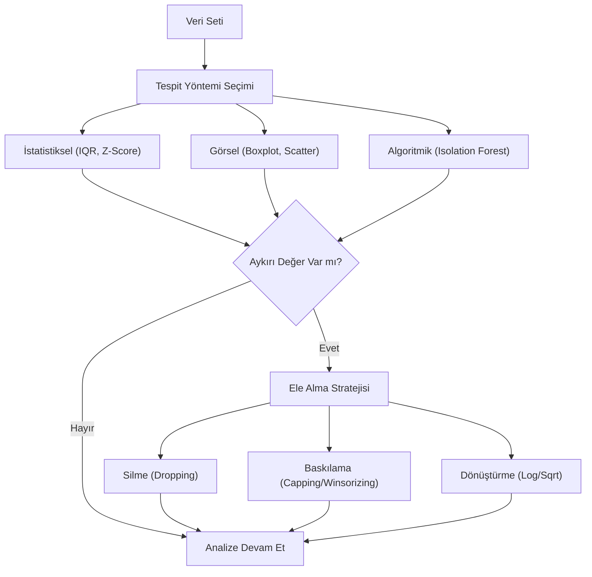

## 📌 Özet
Aykırı değer (outlier) analizi, veri ön işleme sürecinin en kritik aşamalarından biridir ve istatistiksel modellerin güvenilirliğini doğrudan etkiler. Aykırı değerler, veri setindeki genel örüntünün belirgin şekilde dışına sapan; ölçüm hatalarından, veri giriş yanlışlıklarından veya sistemdeki doğal aşırı değişkenlikten kaynaklanabilen gözlemlerdir. Bu değerlerin tespiti için IQR (Interquartile Range) ve Z-skoru gibi klasik istatistiksel yöntemlerin yanı sıra Isolation Forest veya Local Outlier Factor gibi modern makine öğrenmesi yaklaşımları da etkin bir şekilde kullanılmaktadır. Tespit edilen aykırı değerlerin silinmesi, belirli eşik değerlere baskılanması (capping/winsorizing) veya logaritmik dönüşümlerle etkisinin azaltılması, veri bilimcinin verinin doğasına ve çözüm aranan iş problemine göre vereceği kritik kararlardır.

## 🧠 Detay

### Aykırı Değer İş Akışı


### IQR Yöntemi
```python
import numpy as np
import pandas as pd

Q1 = df["gelir"].quantile(0.25)
Q3 = df["gelir"].quantile(0.75)
IQR = Q3 - Q1

alt_sinir = Q1 - 1.5 * IQR
ust_sinir = Q3 + 1.5 * IQR

# Aykırı değerleri bul
aykiriler = df[(df["gelir"] < alt_sinir) | (df["gelir"] > ust_sinir)]
print(f"Aykırı değer sayısı: {len(aykiriler)}")

# Temizle
temiz = df[(df["gelir"] >= alt_sinir) & (df["gelir"] <= ust_sinir)]
```

### Z-Score Yöntemi
```python
from scipy import stats

z_skorlari = np.abs(stats.zscore(df["gelir"]))
# |z| > 3 → aykırı değer

temiz = df[z_skorlari < 3]
```

### Box Plot ile Görselleştirme
```python
import seaborn as sns
import matplotlib.pyplot as plt

fig, axes = plt.subplots(1, 2, figsize=(12, 5))
sns.boxplot(y=df["gelir"], ax=axes[0])
axes[0].set_title("Önce")

sns.boxplot(y=temiz["gelir"], ax=axes[1])
axes[1].set_title("Sonra")
plt.show()
```

### Isolation Forest (ML Tabanlı)
```python
from sklearn.ensemble import IsolationForest

iso = IsolationForest(contamination=0.05, random_state=42)
df["aykiri"] = iso.fit_predict(df[["gelir", "yas"]])

# -1 aykırı, 1 normal
temiz = df[df["aykiri"] == 1]
```

### Aykırı Değer Stratejileri
| Strateji | Ne Zaman |
|----------|----------|
| Sil | Az sayıda, gerçek hata |
| Kapat (cap) | Uç değerleri sınırla |
| Dönüştür | Log, sqrt uygula |
| Tut | Gerçek veri ise |

### Winsorizing (Kırpma)
```python
from scipy.stats.mstats import winsorize

# %5 altını ve %5 üstünü kırp
df["gelir_kirpilmis"] = winsorize(df["gelir"], limits=[0.05, 0.05])
```

## 💡 Bağlantılar
- [[DS - Pandas Veri Temizleme]]
- [[DS - EDA - Keşifsel Veri Analizi]]
- [[DS - Betimsel İstatistik]]

## ❓ Sorular / Anlamadıklarım
- IQR mı Z-score mı? Hangisi ne zaman daha güvenilir?
- Aykırı değeri silmek yerine kırpmak ne zaman daha iyi?

## 🔗 Kaynaklar
- https://scikit-learn.org/stable/modules/outlier_detection.html
